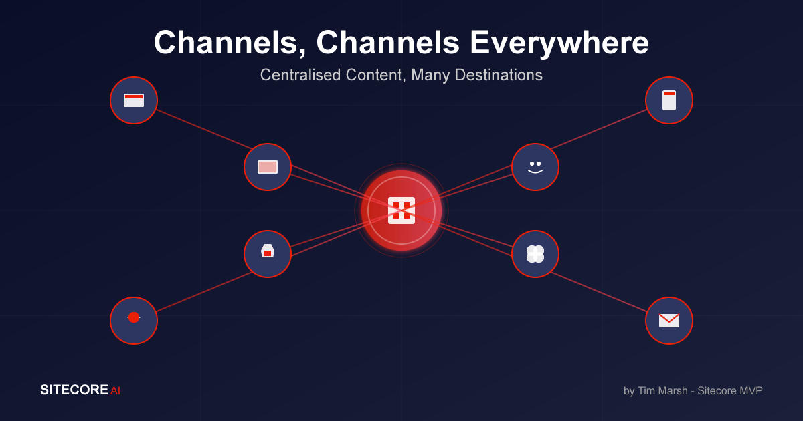

## Introduction

Content no longer lives in a single channel.

Teams publish for websites, apps, social media, marketplaces, signage, chatbots and in-store screens. Each channel has its own quirks, formats and expectations.

The message, however, must stay consistent.

Most organisations find this hard.

Copy gets duplicated. Images are stored in multiple places. Updates are missed. Before long, each channel tells a slightly different story.

The problem isn’t the number of channels. It’s how to manage them without multiplying work.

## From Distinct Channels to Consumers of Content

> Instead of thinking about each channel as a separate place to publish, it’s time to flip the model

Your website, your app, your email tool and your kiosks shouldn’t each hold their own version of content. They should all draw from one structured source of truth that understands your business.

With the new SitecoreAI platform, that foundation is much clearer:

- Content Hub (SitecoreAI Assets/DAM) stores and enriches content, assets, product information, metadata and rights.
- CMS (SitecoreAI Content/CMS) provides a cloud-native, headless content management layer using the XM Cloud technology underneath.
- Experience Edge distributes approved, structured content to any destination.

You create content once and let every channel subscribe to it.

## Product Content, Many Destinations

A simple example - a manufacturing company has a new product launch coming up.

1. The product is created in Content Hub with descriptions, specs, variants, rights and imagery (data from a PIM).
2. The CMS (SitecoreAI Content) uses the same structured content to power web experiences.
3. A mobile app consumes the same product through the same APIs.
4. Social platforms, marketplaces and partner feeds draw directly from the same source.
5. AI can generate channel-specific text, summaries or variants when needed. Including all the localisations out of the box.

No copy-paste. No duplication. No rework.

## Building for Change, Not Channels

Teams often design content models around today’s output - "this field is for the homepage," "this block is for the mobile app." That approach worked years ago. It doesn’t today.

> Channels change. Content stays.

If you model content around meaning and not around layouts you create something durable. A single "Product" or "Story" entity should support your website, app, signage, email journeys, partners and even AI assistants.

CMS (SitecoreAI Content) and Content Hub make this possible. They provide a unified model that channels can consume through APIs and webhooks. With SitecoreAI enhancements, the platform now understands relationships, tags, metadata, variants, translations and enrichment.

This shifts Sitecore from a traditional CMS mindset into a true content operations model.

## Governance and Consistency at Scale

Centralising content brings structure and discipline to the process.

- Content Hub workflows ensure everything is reviewed and approved before going live.
- Rights, variations and localised versions stay tied to the same source.
- Role based access control makes ownership clear.
- Because the CMS (SitecoreAI Content) consumes structured content, consistency is guaranteed across every channel that connects to it.

This is how large enterprises maintain a unified message across hundreds of touchpoints without slowing down.

## The Payoff: Faster, Smarter Content Operations

When channels stop owning content and start consuming it, everything becomes easier.

New channels become easy to add:

- A partner portal plugs into the same content feed.
- A signage network consumes content directly from Content Hub through Edge.
- A chatbot or voice assistant uses structured fields and AI-generated summaries.
- A mobile app adapts the same content through a single API call.

Your team stops recreating work. Time to market improves. Quality improves with it.

## A Connected Future

Today, Content Hub, CMS (SitecoreAI Content), Experience Edge and SitecoreAI form a single content platform. One place to plan, create, enrich and deliver content everywhere it needs to go.

AI is now part of the workflow: generating variations, enriching metadata, preparing channel-specific versions and ensuring consistency. Content becomes smarter, not just reusable.

When you create once and distribute everywhere, you’re not just managing channels. You’re orchestrating a connected content ecosystem that scales with your business.

<!-- markdownlint-disable MD033 -->
<aside class="about-the-author">
  Tim Marsh is a Senior Solution Architect & <a href="https://mvp.sitecore.com/en/Directory/Profile?id=a58079099c1c4bb5863808dabc0d0539" target="_blank">Sitecore MVP</a> who spends most of his time helping companies untangle content challenges and plan what comes next. He works across all Sitecore products, CMS and Asset platforms that are non Sitecore and the wider composable stack, with a focus on real world use, not theory. Tim leads technical direction on large programmes, speaks at community events, and shares ideas, diagrams and code on his blog. He is passionate about raising the bar for content operations and helping teams get more value from their platforms.
</aside>
<!-- markdownlint-enable MD033 -->
