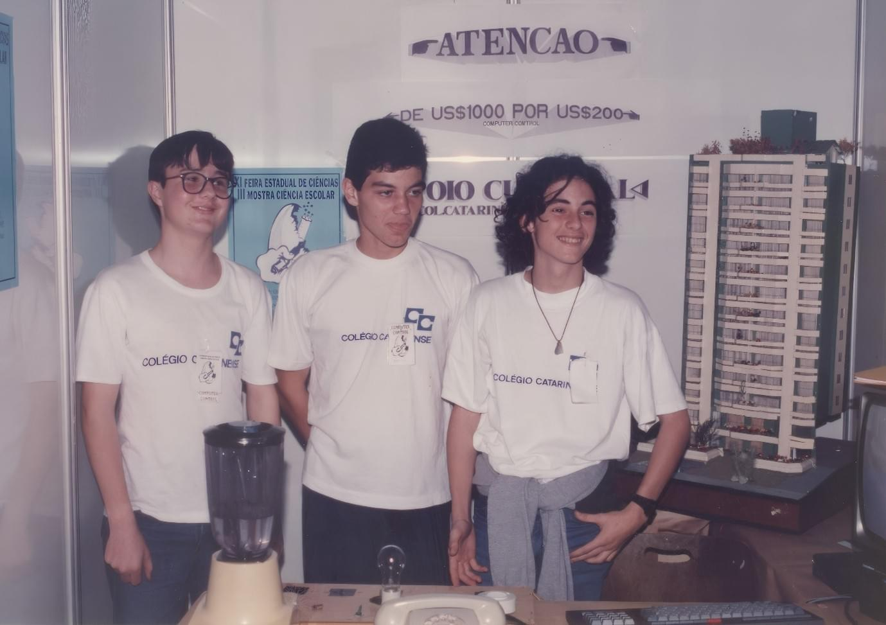
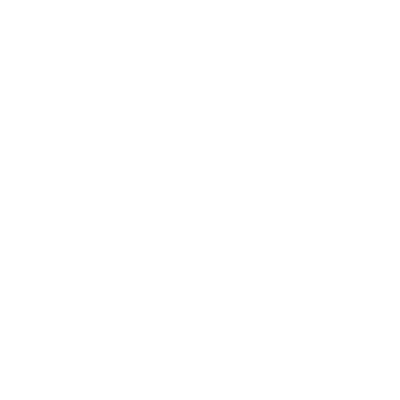
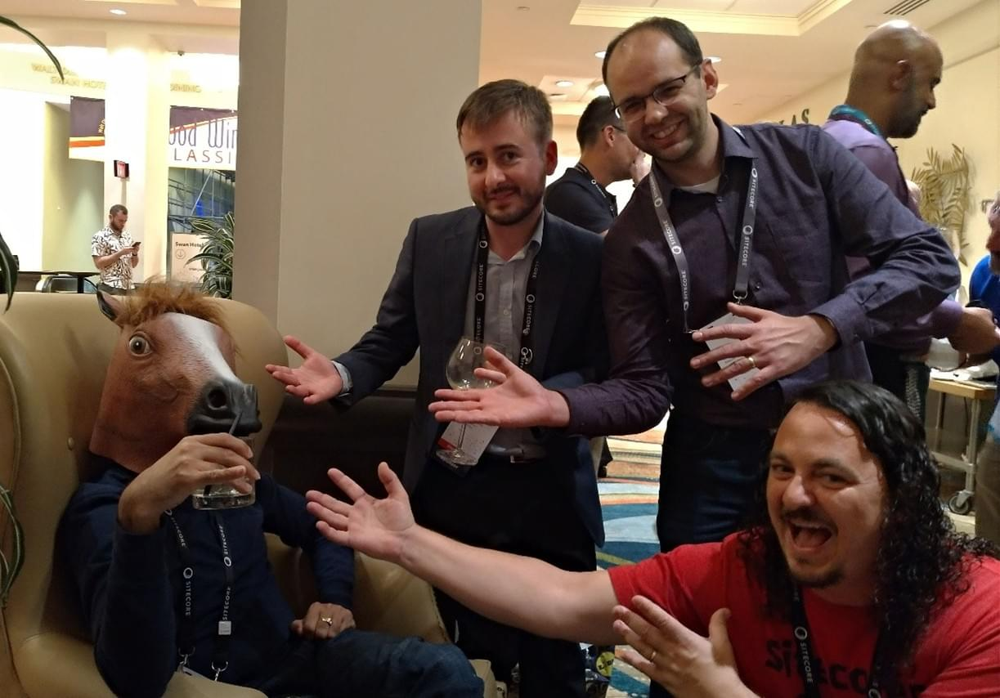
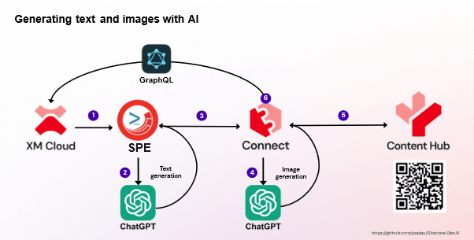
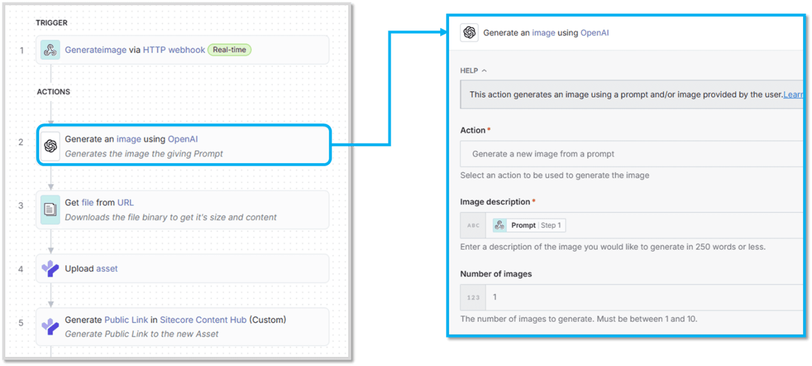
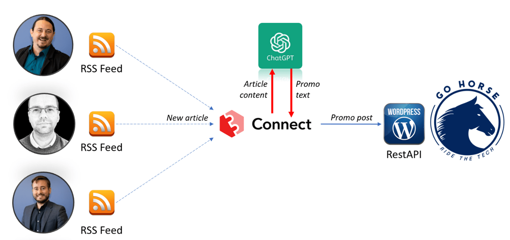
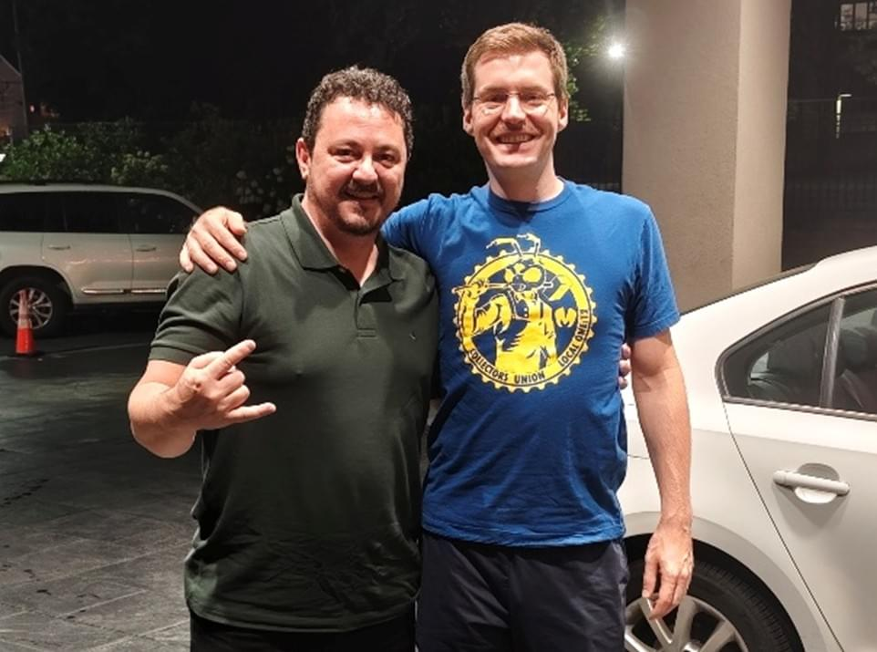

When I started to work with Sitecore fifteen years ago, documentation was scarce, and experimentation was our only guide. Back in those days, we used to spend countless hours exploring, breaking, fixing, and pushing Sitecore further, line by line.

I’ve witnessed a fascinating evolution since then: the early days of XSLT, Webforms, custom C# pipelines and monoliths, to the modern, composable, and cloud-native ecosystem we live in today. Each chapter brought its own lessons, rewired my mindset, and reshaped what it means to "build software".

And indeed today, the way we "push further" looks very different. With [**Sitecore Connect**](https://doc.sitecore.com/connect/en/users/sitecore-connect/introduction-to-sitecore-connect.html), for instance, I find myself implementing complex business logic visually, without a single line of code. At least, not in the traditional sense.

This post is a reflection on what it means to be a developer today, in the era of AI code generation and no-code automation tools. On the long road, you will also learn how Sitecore Connect and its [**API Platform**](https://doc.sitecore.com/connect/en/users/sitecore-connect/api-platform.html) extend our reach as software developers.

## A Developer’s Dilemma: Am I still cool when I’m "No Coding"?

For most of my career, I believed that being a developer meant writing code. Lines and lines of logic, put together through the night, where each bug fixed felt like a small personal victory. The clacking of the keyboard was the sound of building software. That was how I measured my coolness: in keystrokes.

But then tools like Sitecore Connect came along, allowing you to build complex logic without a single line of code. And suddenly, I felt this strange tension. Was I still developing? Was I still the same person who once obsessed over syntax and compiler error messages? How could dragging and dropping actions on a visual canvas possibly replace the beauty of code?

---

Back in the 80s, in Brazil, owning a personal computer was an expensive dream. Encouraged by my sister Adriana, our father sold his car so I could have my first computer: an 8-bit [**MSX Expert**](https://en.wikipedia.org/wiki/Gradiente_Expert). That decision shaped my entire life! I still remember the excitement of typing code line by line from computer magazines. Hours spent debugging, searching for the one missing character that could make everything work. That was magic to me. That was _software development_!


_From left to right, my friends Gustavo Wiggers, Rogério Monteiro and myself, presenting in a science fair with my MSX computer. And our project was about home automation! How many dreams can fit into the minds of young kids?_

When robots started replacing manual work in factories, my father, an automotive mechanics teacher, feared the loss of control and purpose. "The loss of art". But what really happened was transformation. The essence of creation didn’t vanish; it moved to a new layer of abstraction.

I used to believe the value of a developer was measured in **lines of code**. But today, I see it should be measured in **lines of thought**.

## The Heart of Modern Middleware

Sitecore Connect brings the concept of _visual logic_ to life. Instead of compiling code, we compose **Recipes** - visual workflows made of **actions** and **triggers**, each representing the small, modular steps that once lived inside our codebases.

A recipe can be triggered in different ways. It can transform data, call external APIs, and update content inside Sitecore. When you look closer, each of those actions is a line of logic. It’s still code, just expressed differently.

The API Platform extends Sitecore Connect by exposing any recipe as a WebAPI endpoint, with authentication, versioning, rate limiting, analytics, and monitoring out of the box. You can deploy your integrations as secure, scalable services without managing infrastructure, certificates, or API gateways.

This is where Sitecore Connect becomes a middleware factory for the composable era: a layer that sits between systems, shaping and translating data as it flows. In a world where we no longer host monolithic servers, **middleware is the new backend**.

The essence of backend logic has moved to a higher plane, where structure is visual and the execution is instant.

## Community, Hackathons and Friendship

If there’s one thing that has kept my passion for Sitecore alive through all these years, it’s the community and, to a good extent, my team [**Go Horse**](https://gohorse.tech/).



For the past nine years, we’ve shared together [**Sitecore Hackathon**](https://sitecorehackathon.org/) as a tradition. Every year, we tell ourselves we won’t join this time, that maybe it’s time to rest. And yet, a few days before the registration closes, someone says: _"So... are we doing this again?"_

And of course, we are!



Our team began as a small group of colleagues, **José Neto**, **João Neto**, and me, working at the same company. Other members joined the team: **Anderson Fortaleza**, **Eduardo Tonon**, **Roberto de Almeida**…

Life also scattered us across continents: João moved to the Netherlands, José to Poland. Different time zones, different routines. We still connect daily and, every year, even though we promise not to do it again, we always end up reconnecting for those "last 24 hours". Maybe this time to celebrate a full decade!

We’ve built all kinds of crazy things, with no reason to exist other than the joy of creation. Sometimes we won, sometimes we didn’t, but every time we delivered something we were proud of…

"Go Horse: The team that always delivers!"

## When Hackathons Become Innovation Labs

Over the years, our hackathon projects evolved as much as the Sitecore ecosystem itself. What started as nights spent buried in C#, XML, and pipelines, slowly became experiments in no-code orchestration and AI-driven automation. Somewhere along that journey, Sitecore Connect became a central character in our creations.

In our first encounter with Connect during a hackathon, we were looking for a quick way to automate part of our project: a content generation system that produced articles and images in parallel. It sounded like something that would take days of backend coding but Connect gave us a visual playground to wire it all together.

We used **webhooks** as triggers and Connect’s asynchronous workflows to handle image generation. Minutes later, magic happened: articles started populating with images automatically.



AI models, data processing, and API orchestration, all running outside of the Sitecore instance, in compliance with the modern days’ architectures!

We also plugged in [**Sitecore PowerShell Extensions**](https://doc.sitecorepowershell.com/) to trigger recipes directly from within Sitecore, without compiling a single DLL.

Massive shout-out to **Adam Najmanowicz** and **Michael West** for building that masterpiece!

Below is the PowerShell code snippet that calls a Webhook in Sitecore Connect, used in our module to generate images asynchronously:

```powershell
function Generate-ImageAsync(){
  param( $itemId, $imagePrompt, $dimensions, $fieldName, $settings)
  $headers = @{
    "Content-Type" = "application/json"
  }
  $requestData = @{
    itemId = $itemId
    prompt = $imagePrompt
    dimensions = $dimensions
    fieldName = $fieldName
    graphQlBaseUrl = $settings.graphQlBaseUrl
    graphQlClientId = $settings.graphQlClientId
    graphQlClientSecret = $settings.graphQlClientSecret
  }
  $body = $requestData | ConvertTo-Json -Depth 3
  try {
    $response = Invoke-RestMethod -Uri $settings.generateImageEndpoint -Method Post -Headers $headers -Body $body
    $success = ($response -ne $null -and $response.status -eq "ok")
    return $success
  }
  catch {
    Write-Host $_.Exception.Message
    return $null
  }
}
```

And here’s a screenshot of the recipe used to generate images with AI:



In the most recent hackathon (2025), our project was pretty much a "lite version" of **Sitecore Stream**: a tool that analyzes content for brand consistency using AI. We wanted to build something that could evaluate whether an article’s tone and visuals matched a brand’s voice.

Ambitious for 24 hours? Yes! But honestly, that’s what makes hackathons special: they’re about exploring what’s possible. For us, Sitecore Connect turned those 24-hour sprints into small-scale innovation labs, where experimentation meets friendship (and creativity meets Red Bulls).

Our team didn’t stop building after the hackathons were over. We took the same spirit and turned it into something bigger: a living experiment in connection. Every time one of us publishes a new blog post, Sitecore Connect listens. It gathers the post through RSS, generates a short teaser using AI, and shares it across our community channels automatically.



## The Beauty of Visual Logic

I’d spend hours copying code from computer magazines, line after line, not always knowing what they did, but desperate to see them come alive. Sometimes, a single mistyped character would crash everything. And fixing it taught me more about logic and patience than any book could teach.

Back then, I thought those lines of code were the essence of creativity. But today, when I look at a recipe, I see a structured representation of how our minds organize logic. I’m not losing the essence of development but seeing it more clearly.

In fact, by removing the noise of syntax, Sitecore Connect amplifies what truly matters: the thinking. You start focusing on design, flow, and impact. You stop thinking in code and start thinking in abstract logic.

It’s ironic, really. We once believed that abstraction distanced us from the machine. But in truth, it brings us closer to the idea, to the intention behind the machine.

And I no longer feel the need to touch every bracket or semicolon to prove my craft.

## When Code Writes Code

Just when I thought the idea of "no-code" was already a massive shift, **AI** came in and changed the conversation entirely. Tools like **v0**, **n8n**, and **OpenAI’s Agent Builder** are now reshaping the very foundation of how we create software. I used v0 to build the front-end of the demo presented in the Symposium 2025. It took me ten minutes to build what used to take a day. I wrote good prompts, the tool understood what I meant, and consequently I became faster.

That got me thinking: If an AI can generate code that works, and if a no-code tool can handle logic that used to demand hours of backend engineering… then what’s left for us, the developers? And who is a developer now?

AI can produce code, but it doesn’t know why something should exist. It doesn’t feel the tension between elegance, practicality and maintainability. It doesn’t understand the joy of a clever solution or the responsibility of one that scales. It doesn’t dream up new patterns but only rearranges old ones.

The syntax might be written by a model, but **architecture**, **vision**, **intent** — those remain profoundly human. We’re being elevated, not replaced! Those new tools, while enabling us to build faster, are also challenging us to focus on real value, on what we build and why.

In the end, someone still must design the system, imagine the flow, and understand the problem worth solving. To me, that is where our true value continues: not in typing, but in thinking. Not in the syntax of creation, but in its purpose.

## Bringing It All Together

When I look back at everything, I realize that the story has never been about tools, but about connections. That word "Connect" couldn’t be more symbolic. It’s the name of a product, yes, but it’s also the invisible thread that runs through everything we build and everything we are as developers.

Sitecore Connect also connects people, transforming complex logic into something anyone can visualize and expand. And most importantly, it connects time: the past and the future of how we create.

To me, that’s the perfect metaphor for what technology should do. It shouldn’t replace us. It should **amplify** us, our collaboration, our creativity, our reach.

Yes, Sitecore has changed, but the heart remains the same: a group of people trying to build, learn, and grow together.

## Looking ahead and beyond

It’s impossible to predict the future with certainty, but it’s part of our nature to try. We always look forward: curious, skeptical, hopeful, imagining what technology might look like in the coming years.

And here’s what I see: AI will not replace the developer; it will become the interface between humans and technology. The ultimate UI. Why should you still memorize shortcuts, or spend time searching through endless menus to find the right setting?

Take my car, for instance. Every time I drive past a speed radar, it makes this annoying noise. I know I could browse the web and find a way to turn it off, but when I park the car, I just want to leave it, so the noise stays. Imagine if I could simply say: "Hey, I hate this sound, please disable it", and the car would listen, understand and adjust.

That, to me, is where we’re heading with software. We’ll build systems that understand intent, applications that can reconfigure themselves, adapt to the user, and respond to natural commands, via voice, gestures, or even emotion.

That’s the direction we’re heading: toward a world where technology adapts to us, instead of the other way around. And just as technology evolves, we must evolve too. Developers, architects, and makers, we’ll have to keep learning, unlearning, and connecting.

A few months ago, I had dinner with Corey, and we talked about this exact topic. He manifested uncertainty about the future, but I could see again in his eyes that same spark that defines a true developer: flexibility and ability to adapt. Corey gets it!



And to the **Sitecore community**, thank you! For fifteen years, you’ve been my home, a place of creativity, generosity, and shared curiosity. We’ve written blog posts, debugged nightmares, built projects, and survived upgrades together. We’ve grown as professionals and as people.

As we stand on the edge of this next technological wave, I have one simple wish: Keep your heart open! Keep building, keep sharing, keep helping each other. The tools will change, the architectures will shift, but the spirit of collaboration and kindness is what makes us truly powerful.

Thank you, **Sitecore Community**, for every line of thought, every sleepless night, and every connection that made this journey worth it.

We’re still building. Just... differently!

<!-- markdownlint-disable MD033 -->
<aside class="about-the-author">
  Rodrigo Peplau (<a href="https://x.com/sitecoresinger" target="_blank">@SitecoreSinger</a>) is the Head of <a href="https://arke.com/" target="_blank">Arke Brazil</a>. He works with Sitecore since 2010, and due to community initiatives such as the co-foundation of the <a href="https://kommunity.com/sugbr" target="_blank">Sitecore Usergroup Brazil (SUG-BR)</a>, multiple Sitecore modules, and <a href="http://blog.peplau.com.br/" target="_blank">blog posts</a>, Rodrigo is proudly recognized as a <a href="https://mvp.sitecore.com/en/Directory/Profile?id=8efaf521bfbe4efe7d8408dbe2eb2e82" target="_blank">Sitecore Technology MVP</a> since 2016 (10x in a row!).
</aside>
<!-- markdownlint-enable MD033 -->
