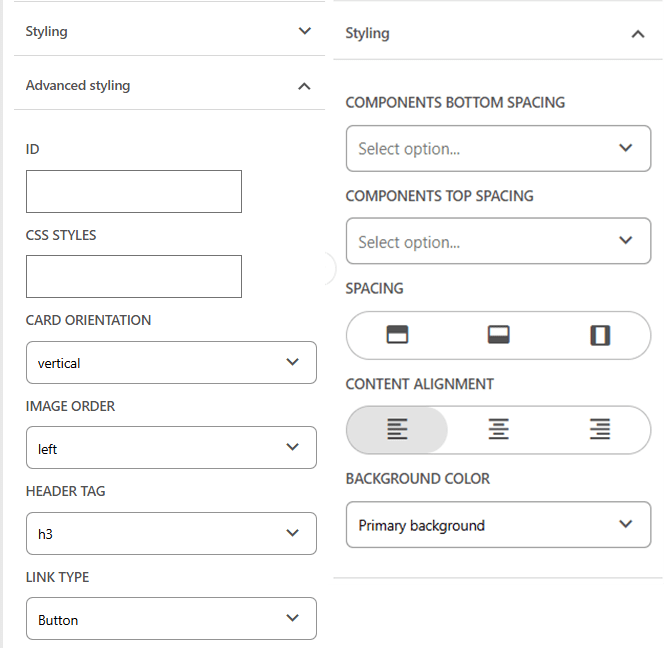
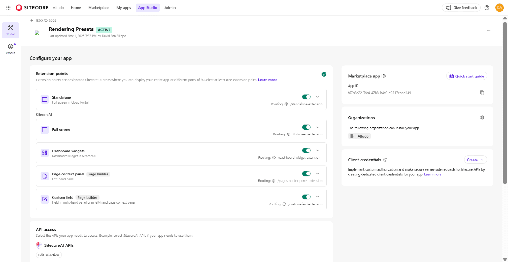
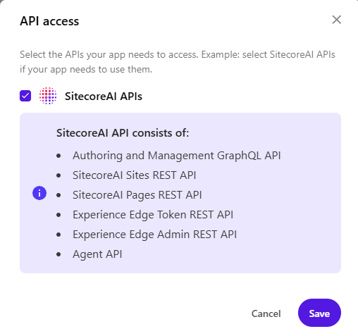

One of the challenges in Sitecore projects is the constant tension between flexibility and simplicity when it comes to component styling. Rendering parameters give authors a wide range of options: spacing, alignment, backgrounds, and other visual controls, but in practice, this often requires far more manual effort than it should. Every component behaves a little differently, and authors are left to remember the right combination of settings to achieve a consistent design.

 To make this easier, teams sometimes create additional rendering variants or entirely new component versions. But variants tend to proliferate quickly, and they're usually introduced to solve very small differences: a slightly different margin, a centered layout, a theme color change. Instead of empowering marketers, this can add noise and complexity to the component library.

That led me to explore a different approach:

**What if authors could save a set of rendering parameter values as a reusable preset and apply it to any component of the same type with a single click?**

Not a new variant.

Not another React component.

Just a small, repeatable "design shortcut" that captures the exact styling choices authors are already making.
With SitecoreAI's renewed focus on the Marketplace and the availability of the Marketplace SDK for building UI extensions inside SitecoreAI, it felt like the right time to investigate whether this concept could be delivered as an actual Marketplace module.

This post is about that exploration.

What's possible, what isn't, and how a rendering-parameter preset system might be designed using the Marketplace SDK. In a follow-up post, I'll walk through the working implementation.

## The Marketplace Is Becoming Central to SitecoreAI

Earlier this year, Sitecore introduced the Marketplace SDK: a set of tools that finally allowed developers to build UI extensions that plug directly into XM Cloud. At that point, these extensions were primarily something you could experiment with inside your own tenant. Useful, but not broadly accessible, and not something customers could easily discover or install.

With the launch of SitecoreAI, that changed. Sitecore opened up a public Marketplace where customers can browse, install, and use extensions created by Sitecore, partners, and the wider community. It's still early and the catalog is small, but its role has already shifted from an internal capability to a core piece of the platform's extensibility story.

And they're positioning it as the place for a wide spectrum of add-ons:

- Page editor extensions that enhance the XM Cloud authoring experience
- Productivity tools that streamline editor workflows
- Analytics utilities that surface insights in context
- Human-in-the-loop interfaces for AI-driven features
- Connectors into other marketing, data, and governance systems
- Partner-built add-ons delivering specialized capabilities

This is a major evolution. Before the Marketplace and its SDK, there was effectively no supported way to deliver custom UX inside the XM Cloud interface. Anything you built had to live outside the product or rely on private APIs.

A Rendering Parameter Preset module simply wasn't possible to build in the Pages editor before.

Now it is and the Marketplace provides the distribution model to make it accessible for teams who want smarter, more consistent styling workflows.

## Understanding the Marketplace SDK

Once I started exploring whether a rendering-parameter preset system could realistically live inside XM Cloud, the first thing I needed to understand was what the Marketplace SDK actually makes possible. Sitecore made the SDK available earlier this year, and it gives developers the client-side tools to build extensions that plug directly into the authoring experience. The Marketplace Starter project complements it with working examples for each extension type—essentially a hands-on reference implementation.

All of that comes together inside App Studio, which defines the shape of your app. When you create a new Marketplace app, you select the extension points you want to enable, map them to routes within your running application (including localhost during development), and specify which Sitecore APIs the app is allowed to access.

Marketplace apps run in a secure sandbox, so API access is explicitly controlled—today that typically means turning on the SitecoreAI APIs, which include the authoring GraphQL API, the Sites and Pages REST APIs, the Pages editor API, token services for Experience Edge, and the Agent API used by SitecoreAI features. As the platform expands, we'll likely see future bundles for Content Hub, Search, and other services.

Before digging into how presets might work, it's worth briefly grounding the discussion in the available extension types the SDK supports:

- **Standalone App** — A self-contained application that lives in the Cloud Portal. This is ideal for tools that run outside the page-editing context but still need tight integration with Sitecore data or workflows.
- **Fullscreen App** — Similar in spirit to a standalone app, but presented in a fullscreen workspace within Sitecore. This is often used for more immersive tools or utilities that need more horizontal space, such as admin dashboards, migration helpers, or reporting interfaces.
- **Dashboard Widget** — A modular widget that surfaces insights or functionality directly inside Sitecore dashboards. These are best suited for analytics, reports, small utilities, or context-aware helpers.
- **Page Context Panel** — An extension that appears in the left-hand panel of the Pages editor. This is the closest you can get to embedding custom functionality directly alongside the authoring experience, making it a natural candidate for tools that help editors work with components or page structure.
- **Custom Field** — An extension that enhances the right-hand editing panel by providing a custom UI for editing the value of a specific field. These are powerful for enriching content editing workflows but, importantly, they operate at the item field level, not at the rendering or component instance level.

These are the building blocks the Marketplace SDK provides. Each one fits into a different part of the XM Cloud interface, and choosing the right one is critical because each type comes with its own constraints around context, capabilities, and what kind of information it can access.

Understanding those differences becomes especially important when evaluating where a rendering-parameter preset system could realistically live. Before this SDK existed, none of these extension points were available and there was no supported way to embed custom UX into the XM Cloud editor at all. Now there is, and that shift is what makes the entire exploration possible.

## Finding the Right Extension Point for the Presets Module

After becoming familiar with the Marketplace SDK, the next challenge was identifying where a rendering-parameter preset tool could actually live inside XM Cloud. The SDK provides several extension points, each designed for a different area of the product, but most of them simply don't have the context needed for something that interacts with component-level styling.

A standalone app, for example, runs in the Cloud Portal and has no awareness of what an author is doing on a page. A fullscreen app offers more real estate but still lives outside the editing flow. Dashboard widgets surface information in SitecoreAI dashboards, not where the author is working. Even the custom field extension, despite appearing in the right-hand editing panel only operates on a single item field. Rendering parameters aren't item fields; they're stored in the layout, tied to a specific rendering instance. That immediately rules custom fields out. ( Note - I tried adding an app id to a datasource on a rendering parameter template field. It didn't work.)

The Pages context panel is the only extension point that places an extension directly inside the Page Builder environment. It appears in the left-hand sidebar and is the closest thing the SDK offers to interacting with the authoring surface. It doesn't expose an event like "tell me which rendering is currently selected," and it can't read the editor's selection state directly, but it does have access to the Page Builder APIs. And those APIs allow us to retrieve the full list of renderings on the page, including their IDs, data sources, and, most importantly, their rendering-parameter values.

That capability fundamentally shapes how this module needs to work.

Instead of attaching to a single selected component, the experience has to operate at the page level, giving authors visibility into every rendering on the page. From there, authors can choose a component from the list, inspect its current settings, save those settings as a preset, or pick an existing preset and apply it back to that rendering. Because rendering updates are supported through the API, the module can safely overwrite those values and update the page in real time.

Once I realized this, another idea emerged almost immediately: if we can retrieve all renderings and all of their settings, nothing stops us from treating the entire collection as a preset. In other words, a page preset, a snapshot of every component's styling configuration that can be saved and reapplied in one click. That opens the door to powerful patterns: design-system-driven layouts, one-click landing-page modes, brand-themed presets, or even a "reset page to defaults" option.

In a way, the constraints of the SDK make the solution more interesting. What began as a component-level utility naturally expands into something broader and potentially more valuable. By anchoring the module in the Pages context panel and using the rendering APIs to work at the page level, presets become more than a convenience, they become a mechanism for enforcing consistency, accelerating authoring, and aligning page-level design with system-level intent.

## The Last Piece of the Puzzle: Where to Store Presets

This is the last major piece of the puzzle, and it's where several architectural paths open up.

The simplest option is local storage. It requires no backend, no Sitecore items, and no additional configuration. For prototyping, it's incredibly convenient: you can test the core experience quickly and iterate on the UI without thinking about infrastructure. The problem, of course, is that local storage is tied to a single browser on a single machine. That works for early development but not for real teams, and definitely not for a Marketplace extension.

The next logical place is Sitecore itself. Rendering presets feel conceptually similar to themes or design tokens, so storing them as items has some real advantages: they're centralized, versioned, secured by Sitecore roles, and naturally shared across the team. They also travel with the content model, which is important for multi-environment workflows. The challenge is creating the item structure. The Marketplace SDK doesn't give you a way to create templates programmatically, and while you can certainly use existing templates or store JSON in a generic item, a custom template would be cleaner. That means defining the structure ahead of time or packaging it as part of an installation step, both possible, but requiring some creativity.

There's also the option of using an external data store. This is the most flexible approach and offers the most room for growth, especially if presets become part of a broader design-system workflow or a commercial SaaS extension. An external service could store every preset across every customer, support richer metadata, and integrate with other systems. The trade-off is complexity: customers would need to configure the connection, and you'd need to decide how to handle authentication, provisioning, and perhaps even pricing if it becomes a hosted service.

Each of these options is viable, depending on where this module goes. For now, the important realization is simply that preset storage isn't a blocker; it's a design choice. And that means the path forward is open, whether the module stays lightweight and local, becomes a shared Sitecore resource, or evolves into a platform-level capability with its own backing service.

## Wrapping Up

What began as a simple idea: making it easier for authors to reuse styling choices, quickly turned into a deeper exploration of what the new Marketplace SDK can unlock inside XM Cloud. The constraints and capabilities of each extension point shaped the direction, and while the Pages context panel wasn't the path I initially expected, it ultimately opened the door to something far more powerful than a single-component preset tool.

The ability to retrieve every rendering on a page, inspect their parameters, and overwrite them through the API means this module can evolve well beyond the original concept. Component-level presets are still at the heart of it, but page-level presets: snapshots of an entire layout's styling, introduce entirely new possibilities around consistency, design systems, and rapid authoring. That wasn't the initial goal, but it's a compelling direction that emerged directly from the SDK's model.

There are still decisions to finalize around where presets should be stored and how best to structure them for real-world use. But none of those questions are blockers; they're simply choices that depend on how far this module should go and how broadly it should be shared. The Marketplace finally gives us a supported, first-class way to build experiences inside XM Cloud, and this feels like the right moment to take advantage of it.

I'm now moving forward with the actual implementation. In the next post, I'll share how the working module comes together: how the APIs behave in practice, how presets are structured, and what the authoring experience looks like inside the Pages editor.

If you're interested in following along or want early access to the prototype, connect with me on [LinkedIn](https://www.linkedin.com/in/david-san-filippo/). I'm hoping to have a first working version ready to share before Christmas.

<!-- markdownlint-disable MD033 -->
<aside class="about-the-author">
  David San Filippo is the Senior Vice President of Digital Content and Experience at <a href="https://www.altudo.co/" target="_blank">Altudo</a>. He is focused on helping clients get more value out of their digital experience platform investments. He has been recognized as a <a href="https://mvp.sitecore.com/en/Directory/Profile?id=5a5a7b5b61fe47ba863608dabc0d0539" target="_blank">Sitecore MVP</a> six times and has spoken at Sitecore's flagship conference, <a href="https://symposium.sitecore.com/" target="_blank">Sitecore Symposium</a>, four times. David has written articles for MSDN magazine and the Microsoft architecture journal. He also co-organizes the <a href="https://www.meetup.com/central-florida-sitecore-user-group/" target="_blank">Central Florida Sitecore User Group</a>.

  David has also been active in the open-source community, managing several Sitecore and marketing related projects including several Sitecore modules and an A/B testing framework. He also launched and marketed Snip-It Pro, a code snippet manager targeted at developers using multiple development tools.
</aside>
<!-- markdownlint-enable MD033 -->
