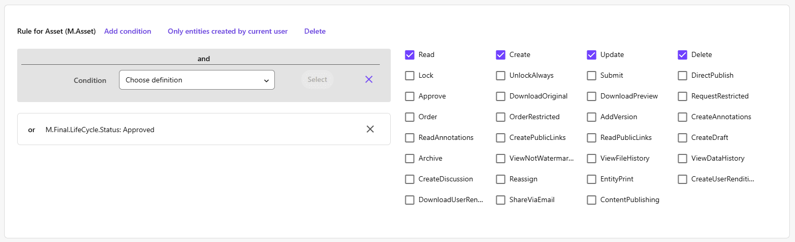
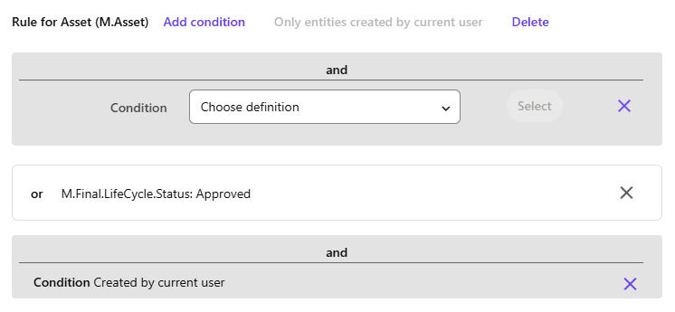
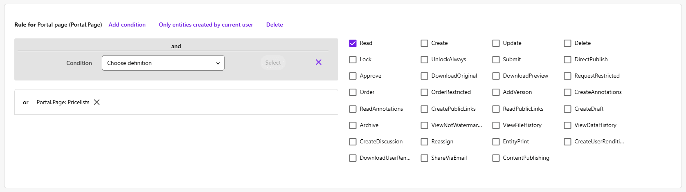
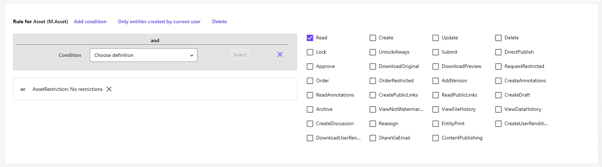

**In Sitecore Content Hub, securing content goes beyond external delivery. It also means managing who among your DAM users can view, edit, or publish specific assets. In this blog post, we’ll explore how to design a flexible, scalable security model using layered user groups and metadata-driven rules, utilizing all the configuration and customization possibilities Content Hub offers.**

*Note: this blog post presumes basic knowledge about how Content Hub works from a developer or administration level, and does not explain how to make configurations exactly, but rather explains the concept and mechanism to get more out of your user group configuration.*

Within Content Hub, you design user rights based on group policies, and those group policies can be layered. Opposed to other rights management systems, like Sitecore Content Management in XP, you cannot deny specific rights, only allow. This might be a challenge if you want to exclude one specific type of content (or assets) from a certain group of users, and that's exactly what this blog post is about. But first, let's take a look at how User group policies work in Content Hub.

## Understanding user group policies

You have built-in group policies that apply by default, and you want to define additional group policies that match your use case: for example, photographers or content creators, reviewers or publishers, data stewards to manage and enrich content, and readers or external users to consume the content for external use. But you can also define a group policy for content specific scenarios, like 'Sales brochures' or 'Price lists', or for managing content that includes personal sensitive data.

Per user group policy, you can add rules and build custom conditions that together define the cumulative rights of each user in that group. The default configuration for the 'Everyone' group policy to allow everyone to work with assets (M.Asset) that are approved, is:



In general though, it is a good idea to think of your group policies as increasingly elevated user rights, as this helps configure the layered approach, since you cannot deny rights or break inheritance. And because you can combine group policies, it's helpful to keep them focused without too much overlap:

| Group Policy | Read | Create | Update | Delete | Approve |
| :-- | :-- | :-- | :-- | :-- | :-- |
| Everyone | X | | | | |
| Content Creator | | X | | | |
| Data Steward | | | X | X | |
| Publisher | | | | | X |

You don't want to explicitly allow 'Read' rights to every user. Why? Because if you want to add conditions to make exceptions further down the road (what this blog post is all about) you would need to update the configuration of every group policy. And that's not only labor-intensive, but also error-prone.

This setup is an important starting point for creating more elaborate user right configuration and isolating specific content later on for a certain user group, so if that's not already the case for your setup, I would advise to go back and clean up your user group policies first based on this concept. This is what I myself also encountered when I started working on an already existing implementation: all groups had a lot of duplicate configurations with multiple conditions, like a rule for M.Asset and M.File within the Standard M.Content.Repository, allowing rights such as Read or DownloadOriginal, for example. Also, there were slight variations: a certain group would not be given the DownloadOriginal rights. But this is highly deceptive and confusing. And that's where Sitecore Content Hub user group policies can be a bit confusing. You can  deselect the DownloadOriginal checkbox for a Content Creator, but if it is already checked for the Everyone policy, a user within the Content Creator policy will have this ability nonetheless and you can't take it away by unchecking the box on their own specific policy. That's exactly why you don't want any overlap in rights configuration!

To summarize: minimize the configuration per group policy, and avoid any duplicate assignments. Then, design your group policies around very specific tasks and layer them when necessary. You want your content team to be able to both create and manage content? Assign them the Content Creator and Data Steward role, and don't add Create rights to the Data Steward policy.

To make sure Content Creators are able to manage their own content, for example updating or deleting a mistakenly wrongly added asset, you can elevate the rights with the following specific condition:



Clicking the "Only entities created by current user" button creates a "**Condition** Created by current user" that allows you to give a user more rights on their own assets, which you could also limit to the LifeCycle.Status 'Created' of course, so users would only have additional control up until an asset would be under review or being approved.

## The challenge of isolating content

So now let's sketch a scenario: you have a number of asset types, like 'Stock photography', 'Product image', 'Brand asset' and 'Brochure'. You have created categories for that, labeled all of your assets, and have added a Filter in the Assets overview page so users can select a specific category of asset types to search through. Now, you also want to add 'Price lists' to Content Hub, but these contain market-sensitive information which is also possibly market specific. So you don't want all users to be able to access this type of content. You could easily exclude the latter category from the search filter on your asset page, so users won't be able to find these assets. Then you'd create a group policy called 'Commercial' and create a specific page named 'Pricelist' that searches only that category, and add a rule specifically to the 'Commercial' group policy that allows those users to see this page:



All set, right? Well, not quite. Because while it looks like you have shielded off the sensitive information, users would still be able to visit the individual asset page of a price list, which is possible when sharing links between colleagues, but also because assets have incremental IDs in Content Hub, so users could easily alter the URL of a certain asset and end up on an asset they shouldn't be viewing, opening, or downloading.

### The real challenge: protecting sensitive assets

So how do you protect assets? The answer seems simple: only allow read rights to an asset based on a specific rule that selects the asset type based on a condition. Like 'AssetType: Price list'. But the tricky thing here is you cannot allow other users all other assets types. Because there is no denial rule, you have to specifically allow other users to be able to read the other asset types 'Stock photography', 'Product image', 'Brand asset' and 'Brochure'. And here's where the maintainability and complexity of the configuration pops up again. If you would've given 'Everyone' the 'Read' permission, you can't make this exception. If you would've given every group this 'Read' permission, you would have to alter all groups to configure this. And to make it worse, whenever you want to add a new asset type, you would have to explicitly allow every group but the 'Commercial' user group policy to also see this new asset type, or else it would be hidden. To make it even more complex: if the 'Asset type' member (which holds the asset type value) isn't required, an asset would automatically disappear to everyone once it is created without setting the value for the asset type, or when removing the value on an existing asset.

And to make it even a bit more complex still, you might also want to configure access based on multiple different asset field values (schema member values) in the future, so it might not be a good idea to tie access configuration to a specific asset field value.

### Safely restricting asset access

So, the first thing you need is a proper layered group policy structure as described above, giving read access on the M.Asset entity only to the 'Everyone' role. Then, we need an attribute that links assets to the appropriate policies. In other words, we need a schema field member for M.Asset that is:

- Required
- Allows multiple values (ManyToMany cardinality)
- Contains a *default value* when no restrictions apply

The reason for the default value is that we always require a value, because that is the one we're going to assign to Everyone, in order not to have assets drop out of sight completely.

To populate this member, which is a relation to a taxonomy, we need a taxonomy to reference. For example, create a taxonomy named 'AssetRestriction' and populate it with the values:

- No restrictions
- Price lists
- ... (any other category you might want to add)

Now you can update the 'Everyone' user group policy and add a condition to the 'Rule for Asset (M.Asset), File (M.File) that says "AssetRestriction: No restrictions" for the 'Read' permission:



Then, create a new rule in the 'Commercial' user group policy and create the exact same rule with the condition "AssetRestriction: Price lists".

## One last catch: working with existing implementations

It’s very likely you won’t be configuring all of this on a clean, vanilla implementation. Most likely, you’ll encounter this requirement while working on an existing Content Hub implementation. In that case, adding required fields is difficult, and you also need to update existing content retroactively with this new restriction property before you can enforce those permissions. A good alternative to a required field then is a Script that sets the 'AssetRestriction' field to the default value when no value is set yet (to make it resilient for future use) and create an Action that triggers this Script upon each save action, so you always ensure this field is populated, which effectually equals a required field. You could even go one step further, and automatically assign the 'Price list' restriction value  if the asset type is of the category 'Price list' too. And last but not least, you can use this script to iterate over all existing assets using the SDK to populate the field retroactively for all existing assets too.

Here's an example on how to populate the Asset restriction attribute of an M.Asset object via an internal script in Content Hub:

```csharp
using System.Globalization;
using System.Linq;

var enUsCulture = CultureInfo.GetCultureInfo("en-US");

// taxonomy ids
var assetTypePriceListId = 12345;
var assetRestrictionDefault = 812000;
var assetRestrictionPriceList = 8120001;

// retrieve current asset and its attributes
var assetId = Context.TargetId;

if (assetId == null)
{
    MClient.Logger.Info($"DefaultAssetRestriction: no asset-id has been specified.");
    return;
}

var loadConfig = new EntityLoadConfiguration(
    CultureLoadOption.Default,
    new PropertyLoadOption(),
    new RelationLoadOption("AssetType", "AssetRestriction"));

var asset = await MClient.Entities.GetAsync(assetId.Value, loadConfig);

if (asset == null)
{
    MClient.Logger.Info($"DefaultAssetRestriction: asset not found.");
    return;
}

// get relations
var assetType = asset.GetRelation<IChildToManyParentsRelation>("LandalAssetType").Parents;
var assetRestriction = await GetChildToManyParentsRelation("AssetRestriction");

// set pre-configured asset restrictions or set the default if no value set
var assetRestrictionRelation = asset.GetRelation<IChildToManyParentsRelation>("AssetRestriction");

// price list asset type
if (assetType != null && assetType.Count > 0 && assetType[0] == assetTypePriceListId)
{
    assetRestrictionRelation.Clear();
    assetRestrictionRelation.Parents.Add(assetRestrictionPriceList);
}

// no restrictions (default if no value set or applies)
else
{
    if (assetRestriction == null || assetRestriction.Count == 0)
        assetRestrictionRelation.Parents.Add(assetRestrictionPriceList);
}

await MClient.Entities.SaveAsync(asset);
MClient.Logger.Info($"Updated DefaultAssetRestriction of asset {assetId}");

async Task<JArray> GetChildToManyParentsRelation(string relation)
{
    JArray relationValues = null;
    var parentIds = asset.GetRelation<IChildToManyParentsRelation>(relation).Parents;
    if (parentIds.Any())
    {
        var parents = await MClient.Entities.GetManyAsync(parentIds);
        var taxonomyLabels = parents.Select(t => t.GetPropertyValue<string>("TaxonomyLabel", enUsCulture));
        if (taxonomyLabels.Any())
        {
            relationValues = new JArray(taxonomyLabels);
        }
    }

    return relationValues;
}
```

By designing layered policies, introducing a restriction taxonomy, and keeping your configurations clean, you can create a maintainable and secure access model in Content Hub. It’s a bit of upfront work, but it pays off in long-term clarity and safety.

<!-- markdownlint-disable MD033 -->
<aside class="about-the-author">
  With over twenty years of experience in web development, Rob works on digital solutions where technology, quality and innovation come together. He guides development teams and helps organizations design and build scalable, secure and future-proof platforms. His expertise spans front-end, back-end, cloud and integrations, with a specialization in .NET, Azure and Sitecore. Rob regularly speaks and writes about software architecture, DevOps, digital security and modern development, and has been recognized as a <a href="https://mvp.sitecore.com/en/Directory/Profile?id=d46f4ed9e9544ce8358708dbd59eaf10" target="_blank">Sitecore MVP</a> for ten consecutive years for his contributions to the international Sitecore community.
</aside>
<!-- markdownlint-enable MD033 -->
