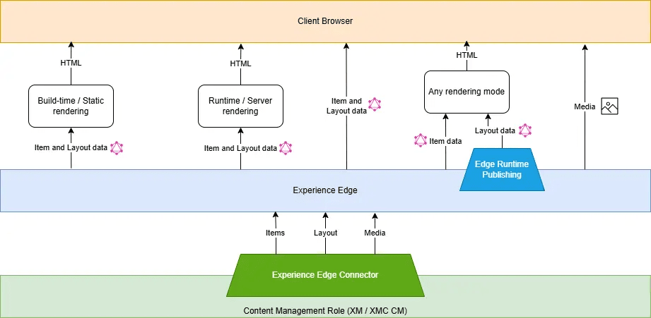
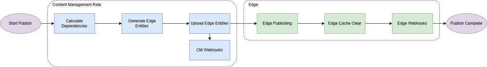

If you’ve been working with Sitecore for a while, you already know that publishing can be a complex beast. From XP to XM, and now SitecoreAI, the way Sitecore handles publishing has evolved especially with the introduction of **Experience Edge** and **Edge Runtime Publishing**.

In this post, I’ll break down how **Edge Publishing** works across the different Sitecore platforms, what’s happening behind the scenes, and why the shift from **Publishing V1 to V2** is a fundamental change in how content gets delivered.

## What Is Edge Publishing and Why It Matters

Traditionally, Sitecore publishing involved moving data from the **Content Management (CM)** database to **Content Delivery (CD)** databases. That meant maintaining infrastructure, managing replication, and dealing with performance bottlenecks especially at scale.

With **SitecoreAI** and **Experience Edge**, Sitecore has decoupled this process entirely. Instead of publishing to a delivery database, your content, layouts, and media are pushed to **Experience Edge**, a globally distributed, API-driven delivery platform.

This makes publishing:

- **Faster**, because there’s no database replication involved.
- **More scalable**, thanks to CDN-based distribution.
- **Headless-friendly**, since front-end apps fetch content via GraphQL.

In short, Edge Publishing is what enables composable architectures in Sitecore’s cloud ecosystem.

## The Experience Edge Architecture

Here’s how all the moving parts connect at a high level:



At the bottom, the **Content Management (XM/SitecoreAI CM)** role manages your items and layouts.

Through the **Experience Edge Connector**, these are pushed to the **Experience Edge delivery platform**, where they’re transformed into consumable entities.

Your front-end rendering hosts (Next.js, React, etc.) then query the **GraphQL endpoint** to pull data at build time, runtime, or even directly from the browser.

This architecture eliminates the traditional dependency on Sitecore CD servers and makes your content globally accessible in milliseconds.

## Configuring Edge Publishing

In **SitecoreAI**, Edge Publishing is the *default publishing provider*. There’s no CD database at all. Your content lives in Experience Edge once it’s published.

If you’re still on XM and running a headless architecture, you can integrate with Experience Edge using the **Experience Edge Connector** module.

## Installation & Configuration Steps

[Install the Experience Edge Connector](https://doc.sitecore.com/xp/en/developers/hd/22/sitecore-headless-development/install-and-configure-the-experience-edge-connector.html#install-the-experience-edge-connector)

[Configure the Experience Edge Connector](https://doc.sitecore.com/xp/en/developers/hd/22/sitecore-headless-development/install-and-configure-the-experience-edge-connector.html#configure-the-experience-edge-connector)

[Configure publishing targets](https://doc.sitecore.com/xp/en/developers/hd/22/sitecore-headless-development/configure-publishing-targets.html)

Once done, publishing from the Content Editor or via automation pushes data straight to Experience Edge.

## How Publishing Works in Experience Edge

**Experience Edge** is Sitecore’s scalable, CDN-backed delivery platform that powers headless architectures. When you publish, your content, layout, and media are transformed into structured entities and pushed to Experience Edge, where they’re available through a **GraphQL API** and **media CDN**.

Your front end can fetch data from this endpoint:

- **At build time** (Static Site Generation)
- **At runtime** (Server-side or Incremental Regeneration)
- **In the browser** (Client-side rendering)

This makes delivery flexible and independent of Sitecore’s databases or CD servers.

## Publishing Flow

When you hit *Publish*, Sitecore triggers a series of behind-the-scenes steps that transform your content and push it to the Edge.

Here’s the simplified flow (and you can refer to the diagram for a visual overview):



1. **Start Publish** – The process begins with Sitecore creating a queue of items to publish, based on your selection (Incremental, Smart, or Republish).
2. **Calculate Dependencies** – Sitecore figures out what else needs to be included — templates, partial designs, data sources, etc.
3. **Generate Edge Entities** – The items are converted into JSON-based "Edge entities" (items, layouts, and media).
4. **Upload to Experience Edge** – The data is sent to the Edge platform through the Experience Edge Connector.
5. **Edge Runtime Operations** – Edge processes the entities, clears relevant cache entries, and triggers any configured webhooks.
6. **Publish Complete** – Your content is now globally available through the Edge GraphQL endpoint, ready for your rendering host to consume.

## Dependency handling (and why workflows matter)

One important part of Edge publishing is dependency resolution. When you publish an item, Sitecore automatically checks for all the related components that might depend on it, for example, data sources, templates, or partial designs. These relationships can trigger a chain reaction of dependent publishes.

This is super helpful for consistency but can also lead to content being pushed live unintentionally if you’re not careful.

That’s why **workflows** are essential, even a simple *Draft* → *Approved* → *Published* workflow helps make sure only ready content reaches the Edge.

## Pipelines

The pipeline shown below plays a role in the publishing process and is added as part of the Edge Connector module:

1. edgePublishItem
2. generateEdgeSchema
3. edgePageDependencies

## Edge Runtime Publishing (V2) – Why It Matters and How It Works

With **SitecoreAI**, you can choose to use **Edge Runtime Publishing (V2)** and it’s a pretty big shift from how traditional Sitecore publishing (or even Edge Snapshot publishing) works.

In the older model, whenever you published a datasource item, Sitecore would automatically republish every item that depended on it, sometimes hundreds or even thousands of related pages. That "cascade publishing" could make a simple update take much longer than you’d expect.

With **Edge Runtime Publishing**, that’s no longer the case. When you publish a datasource, it doesn’t automatically trigger dependent pages to republish. Instead, those dependencies are handled dynamically meaning the layout is assembled at runtime, when a user requests the page, instead of at publishing time.
The result?

✅ Much faster publishing since fewer items are pushed.

⚠️ Slightly slower initial delivery the first-time content is requested, because the layout is built on the fly.

It’s a smart trade-off for speed and scalability.

**You can refer to the information below for a comparison of Snapshot vs. Edge Runtime Publishing (v1 vs. v2):**

<https://doc.sitecore.com/xmc/en/developers/xm-cloud/publishing-to-experience-edge.html#benefits-of-edge-runtime-publishing>

Edge Runtime Publishing (V2) trades a little runtime performance for massive publishing efficiency gains. It’s ideal for cloud-first setups where fast publishing and scalability matter more than slightly slower first renders.

If your Sitecore solution is modern, API-driven, and doesn’t depend on content resolvers, **Edge Runtime Publishing** is the way forward.

**Follow the steps in the article below to enable V2 publishing:**

<https://developers.sitecore.com/changelog/xm-cloud/18042024/faster-publishing-in-xm-cloud>

## Making Edge Publishing Faster (Real-world Tweaks)

In practice, even V2 publishing can get slow especially when a single item triggers hundreds of dependencies.

A few settings play a big role here:

### `ExperienceEdge.IncludeDependencyAncestors`

By default, this is set to true. It means when you publish a single item, Sitecore also publishes *ancestor items* of your data-sources. This can add dozens or even hundreds of extra items. If your goal is to publish just one page or component, that’s overkill.

You can disable it by adding a config patch:

```xml
<setting name="ExperienceEdge.IncludeDependencyAncestors" value="false" />
```

### `Publishing.DeepScanRelatedItems`

This setting controls how deeply Sitecore checks related items. When it’s true, it recursively scans related items of related items again, more thorough but much slower.

Setting it to false helps reduce the publishing chain:

```xml
<setting name="Publishing.DeepScanRelatedItems" value="false" />
```

Disabling both can drastically cut down the number of items processed, especially for smart publishes through Page Editor.

## When to Adopt Edge Publishing

If you’re on SitecoreAI, you’re already using it and that’s a good thing.

If you’re still on XP or XM, integrating Experience Edge is worth considering if:

- You’re running a headless site with Next.js or JSS.
- You’re planning a migration toward SitecoreAI or composable architecture.
- You need global scalability and CDN-backed delivery.
- You want to reduce infrastructure costs (no more multiple CD servers).

## Before You Go – Know the Limitations

Sitecore has documented a few **limitations and restrictions** for Experience Edge that are worth reviewing before you roll it out in production.

If you’re working with **XM**, check the official guide here:

🔗 [Limitations and restrictions of Experience Edge for XM](https://doc.sitecore.com/xp/en/developers/hd/22/sitecore-headless-development/limitations-and-restrictions-of-experience-edge-for-xm.html)

For **SitecoreAI** implementations, you’ll find the corresponding list here:

🔗 [Limitations and restrictions of Experience Edge for SitecoreAI](https://doc.sitecore.com/xmc/en/developers/xm-cloud/limitations-and-restrictions-of-experience-edge.html)

These pages outline important details around publishing behavior and supported features so it’s worth bookmarking them as a reference during your setup and deployment planning.

## Conclusion

Edge Publishing represents the future of how Sitecore delivers content moving from database-heavy publishing to a lightweight, globally distributed API model. It’s faster, more predictable, and built for modern headless architectures.

Whether you’re migrating from XP/XM or building fresh on SitecoreAI, understanding how Experience Edge handles publishing (and what’s happening under the hood) will help you design cleaner, more scalable solutions.

<!-- markdownlint-disable MD033 -->
<aside class="about-the-author">
  Khushboo Sorthiya is honored to be a <a href="https://mvp.sitecore.com/en/Directory/Profile?id=343342ebbff748aab4fe08dad96faec9" target="_blank">4x Sitecore Technology MVP</a>. Currently, she works as a Technology Lead at <a href="https://www.horizontaldigital.com/" target="_blank">Horizontal</a>, bringing 11 years of Sitecore expertise to the table. With a keen interest in technology, she's always eager to learn and tackle new challenges head-on. Sharing knowledge is something she truly enjoys, and you can find insights from her on her blog: <a href="https://sitecorecorner.wordpress.com/" target="_blank">https://sitecorecorner.wordpress.com/</a>.
</aside>
<!-- markdownlint-enable MD033 -->
