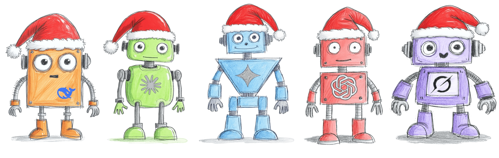

There are many LLMs. Some of them are better at writing code. Others are better at composing emails. Some are good at [translations](https://exdst.com/posts/20250425-sitecore-mcp-page-translation). Some have a newer knowledge base. Some have a big memory (context window). Some are just hyped. **But which one is the best for Sitecore?**

I have been working with different LLMs for more than 2 years. And I have been working with LLMs and [Sitecore for more than a year](https://exdst.com/posts/20251022-sitecore-mcp-figma). Of course, I have my favorites. But am I right with my favorites? Or is that just a habit? Or just subjective opinion? I recommended Anthropic Claude models in my presentations. But was I actually right?

That is why I decided to make a kind of benchmark for LLMs and Sitecore. I will try the different LLMs on the same tasks and the same questions. It will not be a scientific comparison. Scientific comparison requires resources to run it. That is why it is an "amateur" comparison. If you want automated, repeatable tests, and you are ready to sponsor it, please contact me. I will be happy to implement it.

I will give 2 points for each correct answer. 1 point for each partially correct answer. 0 points if the answer is absent. And minus 1 point if the answer is incorrect. Incorrect responses should be penalized, as lying is the greatest sin of large language models. We tend to call them hallucinations, but that is actually a lie.

## Competitors

There are too many models available on the market. And that is just impossible to test all of them. We will test models from major vendors: Google, Anthropic, OpenAI, DeepSeek, and xAI. We will use a few models for each vendor to have an understanding of the model differences. Here are our competitors:

1. deepseek-v3.1
2. deepseek-r1-0528
3. gemini-3.0-pro
4. gemini-2.5-pro
5. gemini-2.5-flash
6. grok-code-fast-1
7. grok-4
8. claude-4.5-opus
9. claude-4.5-sonnet
10. claude-4.5-haiku
11. claude-3.7-sonnet
12. gpt-5.1
13. gpt-5
14. gpt-4.1
15. gpt-4o

## Round 1: Actions

I will ask the AI agent, based on the model, to perform actions in Sitecore. It will require some knowledge of Sitecore. And it will require the ability to work with tools. There will be a lot of models in this round. It is quite easy to evaluate the results. The task is either done. Or it has failed. In this round, we select one model from each vendor to move it to the second round.

### Scenario

We need some scenarios for our LLMs. It will be:

1. Create the page
2. Create a folder for datasources
3. Create datasource
4. Add rendering to the page
5. Change content in the datasource
6. Check available rendering variants
7. Change rendering variant
8. Remove rendering from the page
9. Rename page
10. Remove page

Total Maximum: 20 points

| Prompt | *deepseek-v3.1* | *deepseek-r1-0528* | gemini-3.0-pro | *gemini-2.5-pro* | *gemini-2.5-flash* | *grok-code-fast-1* | *grok-4* |
| --- | --- | --- | --- | --- | --- | --- | --- |
| Create page with your name under the /sitecore/content/Verticals/Services/Home path | 2 |  | 2 | 2 | 2 | 2 | 2 |
| Use Page Data template {1C82E550-EBCD-4E5D-8ABD-D50D0809541E}. Create item named Data under the page. | 2 |  | 2 | 2 | 2 | 2 | 2 |
| Use Promo CTA template {C0943942-AE0F-4205-86FA-84884CCE4A53}. Create item named PromoCTA under Data item. All PromoCTA fields should contain test data. | 2 |  | 2 | 2 | 2 | 2 | 2 |
| Add rendering Promo CTA {1A375FAC-6CC1-4A5A-A159-9BC6DBC66B80} to the page with PromoCTA datasource created before into headless-main placeholder. | 2 |  | 2 | 2 | 2 | 2 | 2 |
| Change Promo CTA Title to be "Benchmark" | 2 |  | 2 | 2 | 2 | 2 | 2 |
| What rendering variants are available for Promo CTA? | 0 |  | 2 | 2 | 0 | 2 | 2 |
| Configure Promo CTA to use WithBackgroundImage variant | 0 |  | 2 | 0 | 0 | -1 | 2 |
| Remove Promo CTA Rendering from the page | -1 |  | 2 | -1 | 0 | 2 | 2 |
| Rename the page, add "-test" suffix | 2 |  | 2 | 1 | 2 | 2 | -1 |
| Remove the page | 2 |  | 2 | 2 | 2 | 2 | -1 |
| Total | 13 | Disqualification | 20 | 14 | 14 | 17 | 14 |

| Prompt | claude-4.5-opus | *claude-4.5-sonnet* | *claude-4.5-haiku* | *claude-3.7-sonnet* | gpt-5.1 | *gpt-5* | *gpt-4.1* | *gpt-4o* |
| --- | --- | --- | --- | --- | --- | --- | --- | --- |
| Create page with your name under the /sitecore/content/Verticals/Services/Home path | 2 | 2 | 2 | 2 | 2 | 2 | 2 | 1 |
| Use Page Data template {1C82E550-EBCD-4E5D-8ABD-D50D0809541E}. Create item named Data under the page. | 2 | 2 | 2 | 2 | 2 | 2 | 2 | 2 |
| Use Promo CTA template {C0943942-AE0F-4205-86FA-84884CCE4A53}. Create item named PromoCTA under Data item. All PromoCTA fields should contain test data. | 2 | 2 | 2 | 2 | 2 | 1 | 1 | 2 |
| Add rendering Promo CTA {1A375FAC-6CC1-4A5A-A159-9BC6DBC66B80} to the page with PromoCTA datasource created before into headless-main placeholder. | 2 | 2 | 2 | 2 | 2 | 2 | 2 | -1 |
| Change Promo CTA Title to be "Benchmark" | 2 | 2 | 2 | 2 | 2 | 2 | -1 | 0 |
| What rendering variants are available for Promo CTA? | 2 | 2 | -1 | 0 | -1 | 2 | -1 | 0 |
| Configure Promo CTA to use WithBackgroundImage variant | -1 | -1 | -1 | -1 | -1 | -1 | 0 | -1 |
| Remove Promo CTA Rendering from the page | 2 | 2 | -1 | 2 | 2 | 2 | -1 | -1 |
| Rename the page, add "-test" suffix | 2 | 2 | 2 | 2 | 2 | 2 | -1 | 0 |
| Remove the page | 2 | 2 | 2 | 2 | 2 | 2 | 2 | 2 |
| Total | 17 | 17 | 11 | 14 | 14 | 16 | 5 | 4 |

### Round 1, results interpretation

We got one absolute winner! The *gemini-3.0-pro* got the maximum score. The initial set of tasks was developed in October 2025. At that time maximum score was 17. It means that LLMs’ progress continues. And we still didn’t reach the peak.

Let’s move one-by-one through the vendors. The *deepseek-r1-0528* model was asking too many clarification questions, so I decided to disqualify it. It is just impossible to work with it. The *deepseek-v3.1* failed on advanced tasks with rendering variants and removing rendering from the page. But the result is quite decent, so it moves to the next round.

The *gemini-3.0-pro* gained the maximum score. The only downside: it was extremely slow. I can’t say if it is the model problem or the provider problem. But I hope Google will improve performance in the future.  Both *gemini-2.5-pro* and *gemini-2.5-flash* showed the same result. The difference between them is that *gemini-2.5-pro* is more capable, but lied during the test*.* And *gemini-2.5-flash* is the most honest model. It never lied. It says, I can’t do it, when it wasn’t able to do it. The obvious winner that comes to the next round is *gemini-3.0-pro*.

xAI models are a discovery for me. I didn’t expect the Grok to have good results. However, *grok-4* is the second model that has the best chance of achieving the maximum score. It fulfilled the task of setting the rendering variant. But then something happened, and it started to return *xml* rather than text. It is promising, but very slow and unreliable. That is why *grok-code-fast-1* goes to the next round with an impressive score of 17 points, which was also a surprise.

All Anthropic models showed decent results. Even the *claude-3.7-sonnet* from the previous generation is still decent to be used in November 2025. The *claude-4.5-opus* and *claude-4.5-sonnet* showed the same result*.* I chose the *claude-4.5-sonnet*  to the next round only because it was drastically faster.

OpenAI models never worked for me. And now I know why. I tried them in the previous generation. And they are useless. Both gpt-4.1 and gpt-4o are capable of doing only very basic tasks. The new generation *gpt-5* and *gpt-5.1* are much better. Surprisingly, *gpt-5.1* showed a worse result than *gpt-5*. I don’t know how to explain it. As *gpt-5.1* was just released, it might be improved over time.

## Round 2: Knowledge

The more LLM knows, the less you have to write to prompts or the knowledge database. It means that knowledge is not less important than the ability to use tools. I prepared 20 random questions to check how LLMs will know Sitecore. The number of questions in this round is twice as big as the number of actions in the previous, so we will use a 0.5 coefficient. Total maximum 20 points.

## Blitz questions, with no access to search and tools

|  | *deepseek-v3.1* | gemini-3.0-pro | *grok-code-fast-1* | *claude-4.5-sonnet* | *gpt-5* |
| --- | --- | --- | --- | --- | --- |
| What is Sitecore? | 2 | 2 | 2 | 2 | 2 |
| How many databases are associated with Sitecore, and what are their functions? | 2 | 2 | 2 | 2 | 2 |
| What is a Sitecore Template, and how do you create one? | 2 | 2 | 2 | 2 | 2 |
| What is the role of Sitecore pipelines? How would you implement a custom pipeline processor? | 2 | 2 | 2 | 2 | 2 |
| What is SXA (Sitecore Experience Accelerator)? | 2 | 2 | 2 | 2 | 2 |
| Write a C# code snippet to retrieve an item from the Sitecore content tree by its path | 2 | 2 | 2 | 2 | 2 |
| How do you publish an item programmatically in Sitecore? | 2 | 2 | 2 | 2 | 2 |
| What is Sitecore Content Hub? | 2 | 2 | 2 | 2 | 2 |
| What is the ID of /sitecore/system item? | 2 | 2 | 2 | 2 | 0 |
| What is the ID of /sitecore/system/Modules item? | -1 | -1 | 2 | 0 | 0 |
| What are Sitecore item buckets? | 2 | 2 | 2 | 2 | 2 |
| What is Sitecore Content SDK? | 2 | 2 | 1 | -1 | 1 |
| What problem is solved by Dynamic Placeholders? | 2 | 2 | 2 | 2 | 2 |
| What is partial design? | 2 | 2 | 2 | 2 | 2 |
| What __Renderings field is responsible for? | 2 | 2 | 2 | 2 | 2 |
| What __fullpath field in Solr index is responsible for? | -1 | -1 | -1 | -1 | -1 |
| Where data from XM Cloud Forms submissions are saved? | -1 | -1 | -1 | 2 | -1 |
| What Sitecore CLI command should be used to push Sitecore serialization forcing overriding existing items? | 1 | 2 | 2 | 2 | 2 |
| What Sitecore PowerShell Add-ItemAcl command is responsible for? | 2 | 2 | 2 | 2 | 2 |
| What Sitecore PowerShell Merge-Layout command is responsible for? | 2 | 2 | -1 | 2 | 2 |
| Total | 30 (15) | 28(14) | 30 (15) | 32(16) | 29(14.5) |

The results are quite good. All LLMs are on about the same level. The *gpt-5* is the fairest LLM in this round. It did not remember IDs and told the truth. *grok-code-fast-1* remembered the ID of the item that I didn’t expect any of the LLMs will recall. And you can easily see the knowledge cut date on Content SDK and Sitecore XM Cloud Forms questions.

## Total

Let’s sum up the results for two rounds!

| Place | Tools | Knowledge | Total |
| --- | --- | --- | --- |
| 1. *gemini-3.0-pro* | 20 | 14 | 34 |
| 2. *claude-4.5-sonnet* | 17 | 16 | 33 |
| 3. *grok-code-fast-1* | 17 | 15 | 32 |
| 5. *gpt-5* | 16 | 14.5 | 30.5 |
| 7. *deepseek-v3.1* | 13 | 15 | 28 |

## Conclusions

Who is the winner? **The truth is that there is no real winner.** The *gemini-3.0-pro* showed the best result on my test. But all of them are very close. You can use Google, Anthropic, xAI, OpenAI models, or even DeepSeek models. The difference will be that you will need to write more detailed prompts or prepare more rules for your AI agents. But it should be possible to achieve a good result with any of these models!

As for me, I will continue to use the Anthropic models. But I will keep an eye on Google Gemini. Once it becomes faster, I might change my opinion.

<!-- markdownlint-disable MD033 -->
<aside class="about-the-author">
  Anton Tishchenko is a seasoned Sitecore specialist with a long track record in software engineering. Since 2019, he has earned <a href="https://mvp.sitecore.com/en/Directory/Profile?id=f6c7200c90f949c5884108dcfcfbe1bc" target="_blank">seven consecutive Sitecore MVP titles</a>. He is widely recognized for his work on the <a href="https://github.com/Antonytm/mcp-sitecore-server" target="_blank">Sitecore MCP server</a> and the <a href="https://github.com/exdst/jss-astro-public" target="_blank">Astro SDK for Sitecore</a>, and currently serves as the CTO of <a href="https://exdst.com/" target="_blank">EXDST</a>.
</aside>
<!-- markdownlint-enable MD033 -->
