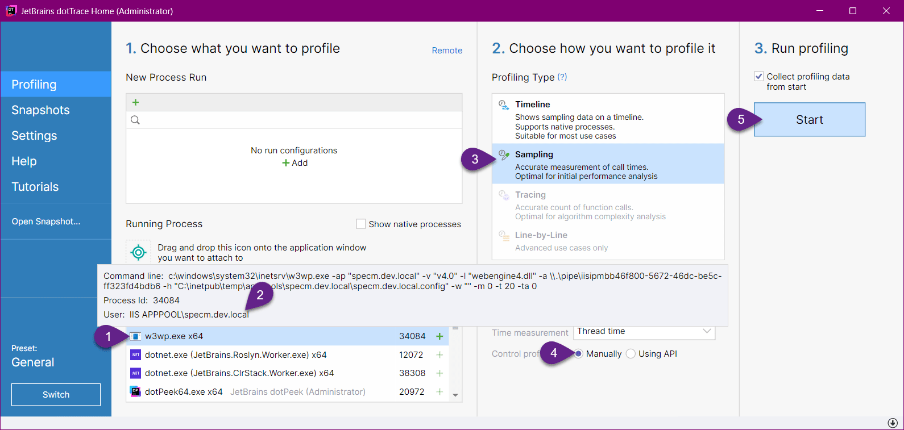
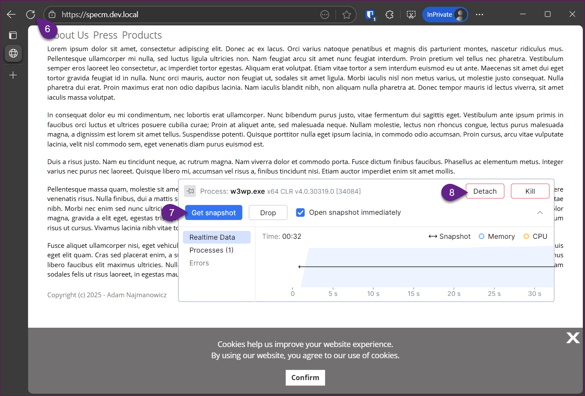
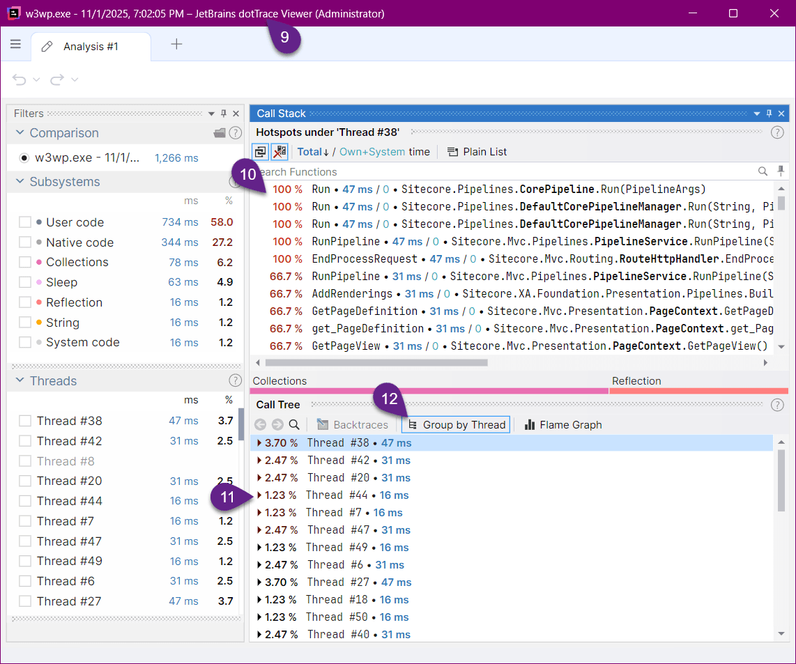
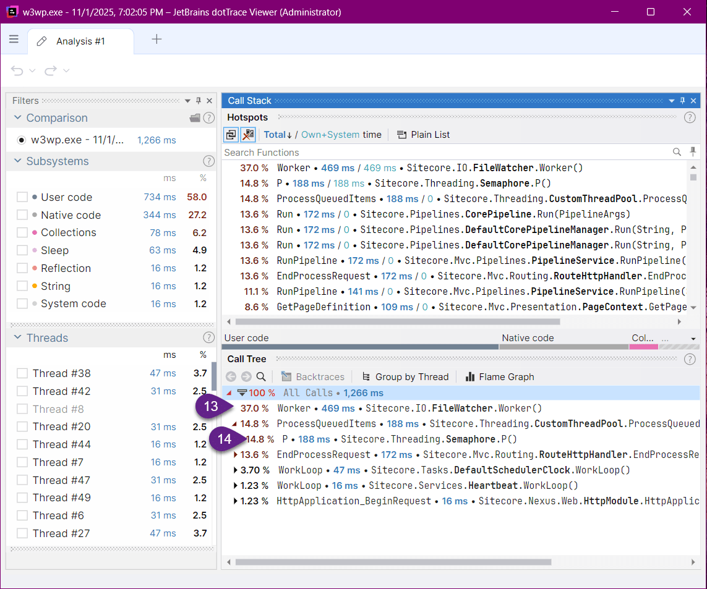
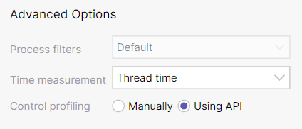
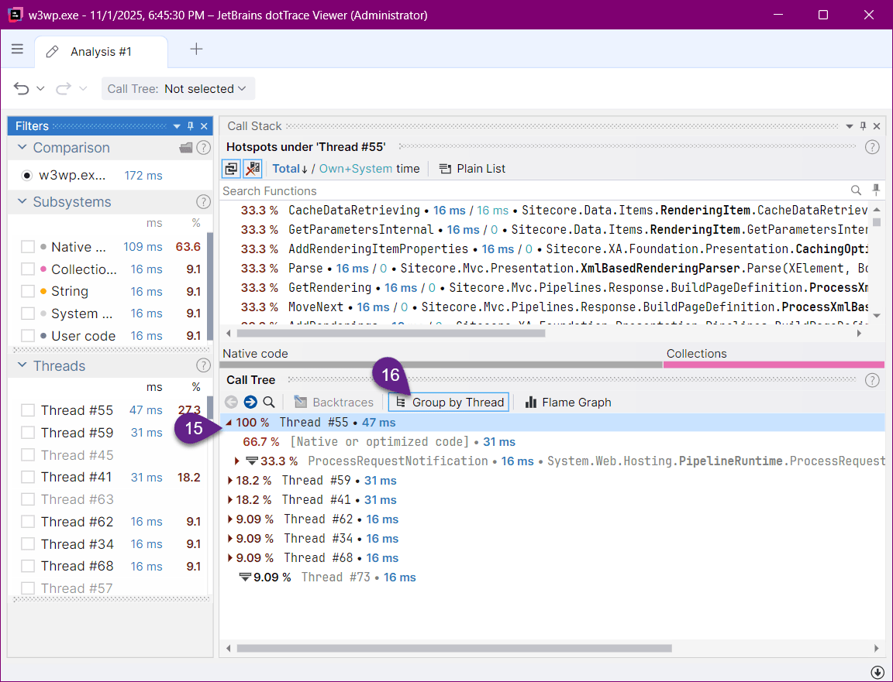
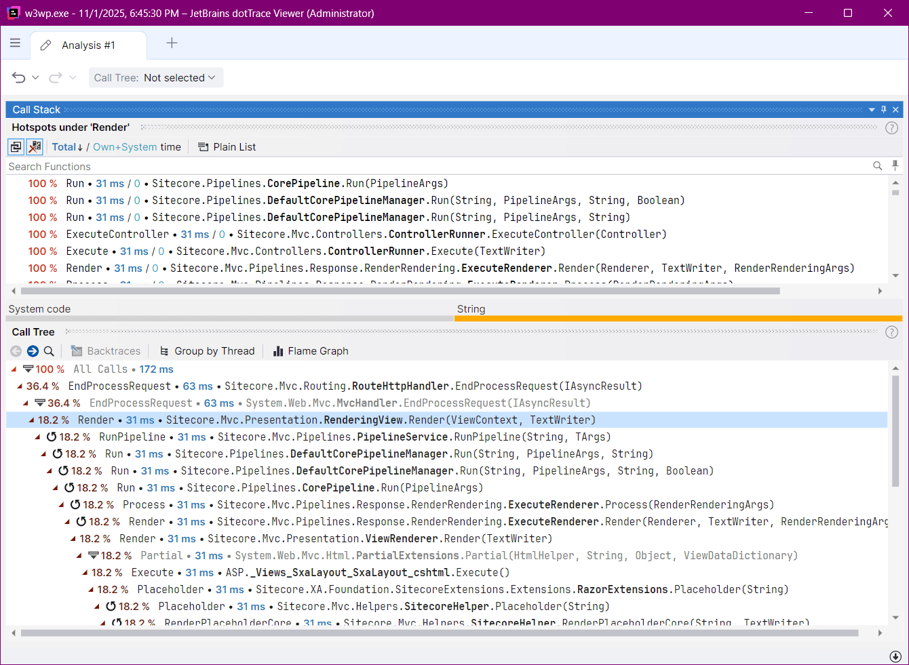

For the longtest time I was really anxious about profiling my Sitecore requests and smaller functionalities as it is quite tedious to narrow the profiling to the area you want to improve. Sitecore is a joyous mess of threads coming from various subsystems, tasks, jobs, events and everything in between. If you simply attach your profiler to the Sitecore process and let it dump everything as it flows through the system, you end up with a maze of calls that are not fun to disentangle.

So I went through a fun journey I'd like to take you on with me.

In the classic/lazy approach you go:



1. Find the process
2. Select the correct variant of the process
3. Pick the Profiling Type
4. Don't pay attention to how you control the profiling as you never gave it a second thought
5. Start the profiling and...



6. Smash the reload button as fast as you can to get the requests you want to profile so you collect as little garbage calls as possible...
7. Quickly Grab the snapshot...
8. and detach from the process while the profile log loads.



9. Now in the trace viewer window that poped up you appear to be presented with an information that shows some traces of code you may recognize...
10. The Call Stacks area generally seem to be listing the code that is vaguely related to your request although you are absolutely not sure whichpages are those Page Contexts serving and the pipelines may be running just about anything...
11. One glance at the thread window shows you that the number of them do not match the number of times you refreshed the window...
12. Disabling the grouping by thread helps to get to some roots of executed code, but...



13. why is it showing that Sitecore is spending most of its time watching files, is at best puzzling, and...
14. the Semaphone is just plain mocking you there!

There must be a better approach to filtering the debris out(!)... you cry out!

You try again and after a few more annoying sessions, you notice that there is this other option in step #4.

You decide that you finally want to understand how you can only get the information that interest is of interest to you and the API approach peaks your interest. A few Googles later you have a plan to build a couple of processors that will wrap the whole request and only the request.

Let's go ahead and build the processor that will start profiling when the request starts:

```csharp
using JetBrains.Profiler.Api;
using Sitecore.Diagnostics;
using Sitecore.Pipelines;
using Sitecore.Pipelines.PreprocessRequest;

namespace PerformantSitecore.Feature.DotTrace.Pipeline.HttpRequestBegin;

public class StartProfiling : PreprocessRequestProcessor
{
    public static int MeasuresLeftCount = 20;

    public override void Process(PreprocessRequestArgs args)
    {
        Assert.ArgumentNotNull(args, nameof (args));
        Process(args);
    }

    public void Process(PipelineArgs args)
    {
        if ((MeasureProfiler.GetFeatures() & MeasureFeatures.Ready) != 0 &&
            MeasuresLeftCount >= 0)
        {
            MeasuresLeftCount--;
            if (MeasuresLeftCount >= 0)
                MeasureProfiler.StartCollectingData();
        }
    }
}
```

In the processor we use the `JetBrains.Profiler.Api.MeasureProfiler.GetFeatures()` method to detect if the profiler is ready and if it is and you have not exceeded the number of samples defined in `MeasuresLeftCount` we keep starting the profiling process.

Consecutively at the request end:

```csharp
using JetBrains.Profiler.Api;
using PerformantSitecore.Feature.DotTrace.Pipeline.HttpRequestBegin;
using Sitecore.Pipelines.HttpRequest;

namespace PerformantSitecore.Feature.DotTrace.Pipeline.HttpRequestEnd;

public class StopProfiling : HttpRequestProcessor
{
    public override void Process(HttpRequestArgs args)
    {
        // Stop the profiler if it is running
        if (MeasureProfiler.GetFeatures().HasFlag(MeasureFeatures.Ready))
        {
            if(StartProfiling.MeasuresLeftCount >= 0)
                MeasureProfiler.StopCollectingData();
            if(StartProfiling.MeasuresLeftCount == 0)
                MeasureProfiler.SaveData();
        }
    }
}
```

We stop collecting data as we are no longer interested in what happens in the thread once the request is done, and if the number of samples taken is exceeded we instruct the profiler that we are now done and it can show us the results of the profiling proces.

We still need to include those processors in the relevant pipelines, so we add a `zzz.PerformantSitecore.Feature.DotTrace.config` that will place the processors as the very start of the `httpRequestBegin` pipeline and finish as the last processor in the `httpRequestEnd`:

```xml
<?xml version="1.0" encoding="utf-8"?>
<configuration xmlns:patch="http://www.sitecore.net/xmlconfig/">
    <sitecore>
        <pipelines>
            <httpRequestBegin>
                <processor
                    patch:before="processor[@type='Sitecore.Pipelines.PreprocessRequest.CheckIgnoreFlag, Sitecore.Kernel']"
                    type="PerformantSitecore.Feature.DotTrace.Pipeline.HttpRequestBegin.StartProfiling, PerformantSitecore.Feature.DotTrace" />
            </httpRequestBegin>
            <httpRequestEnd>
                <processor type="PerformantSitecore.Feature.DotTrace.Pipeline.HttpRequestEnd.StopProfiling, PerformantSitecore.Feature.DotTrace" />
            </httpRequestEnd>
        </pipelines>
    </sitecore>
</configuration>
```



Now when we run the profiling in step 4 for let's switch from `Manually` to `Using API`. And when the profiler window pops up, you slowly and in a completely relaxed manner press reload or load different requests up to the number defined in the `StartProfiling.MeasuresLeftCount` at which point the profile viewer will pop up automatically:



And you will be presented with:

15. A much more manageable list of threads
16. That you will want to ungroup again

At which point the call tree contains all and only the calls that are of interest to you:



Now as a bonus I would like to show you how you can do the same for your PowerShell scripts or code that is long running but you may not want to write a special wrapper around so you can trigger the profiling start and stop around it:

```powershell
[JetBrains.Profiler.Api.MeasureProfiler]::StartCollectingData();

# my long running C# code I want to optimize but am to lazy to write code to wrap around it:
$myService.MyLongRunningMethod($param1,$param2)

[JetBrains.Profiler.Api.MeasureProfiler]::StopCollectingData();
[JetBrains.Profiler.Api.MeasureProfiler]::SaveData();
```

Code in an easily compile-able form available as part of the [PerformantSitecore project available here](https://github.com/AdamNaj/PerformantSitecore).

<!-- markdownlint-disable MD033 -->
<aside class="about-the-author">
  Adam is a seasoned veteran in the Customer Experience Management space, involved with Content Management Systems from the very start of his career sometime in the previous millennium. He’s a developer at heart and was a <a href="https://mvp.sitecore.com/en/Directory/Profile?id=0980c1dbd3864cbce67008db3776f1f0" target="_blank">Sitecore MVP</a> until he joined Sitecore to spearhead SXA and a few more products, but decided to re-join <a href="https://www.vml.com/" target="_blank">VML</a> later to focus again on what he loves the most - engineering. Always in pursuit of delivering faster - hence... <a href="https://doc.sitecorepowershell.com/" target="_blank">Sitecore PowerShell Extensions</a>.
</aside>
<!-- markdownlint-enable MD033 -->
