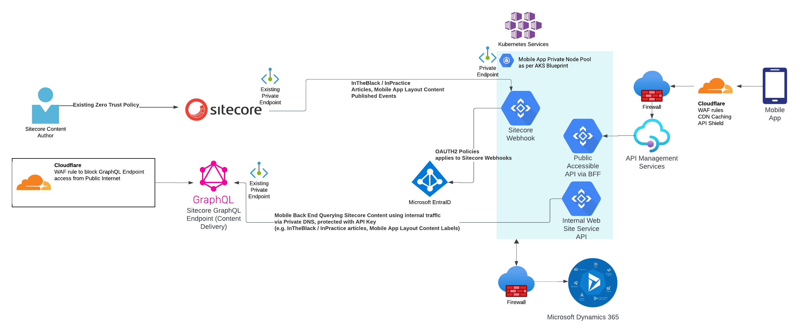
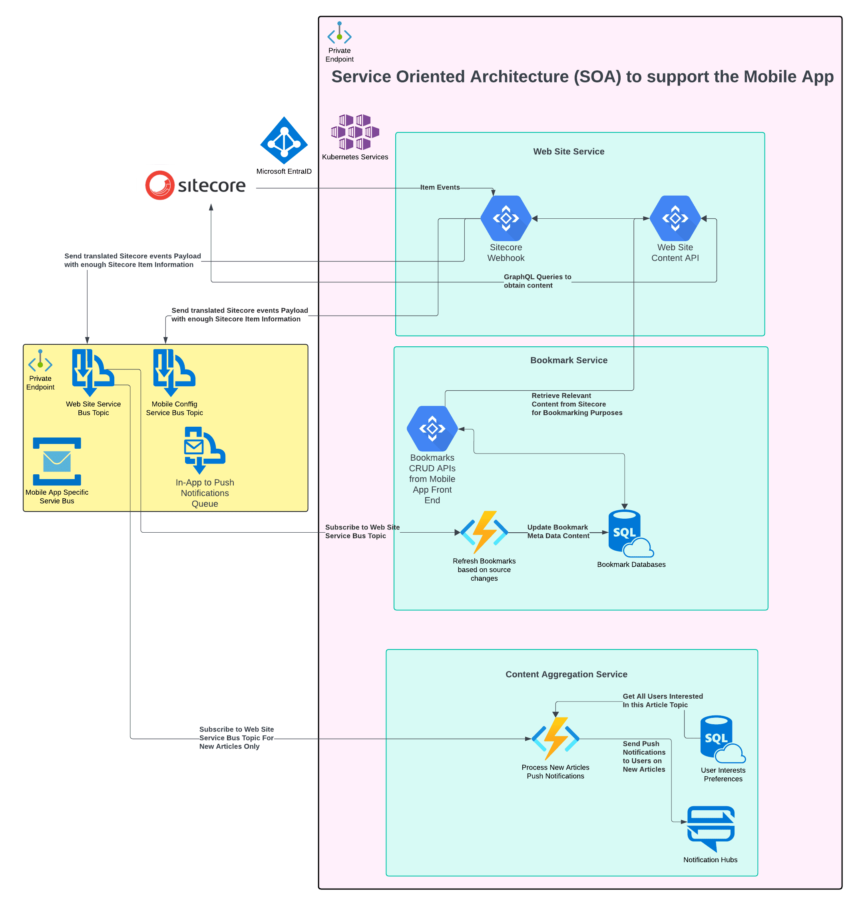

## Introduction

I work for a company, which has recently completed the first version of a mobile app. The main aim of the mobile app is all about engaging users with various content. These content are:

- 4 x Podcast Shows
- Professional Development Courses
- Events - In Person, Online
- Articles that are content pages hosted in two different web sites within the same Sitecore instance.

In this blog post, I would like to showcase the capability of Sitecore, and how I manage to architect both Sitecore and the mobile app back end to deliver a wonder user experience.

[Information of the CPA Australia Mobile App](https://www.cpaaustralia.com.au/mobile-apps), including a short video and some screenshots.

## Sitecore Specific Background Information

The Sitecore instance is running on version 10.4.0 with the latest cumulative patches installed. It contains 2 sites, and both running on the Headless ReactJS with Sitecore Experience Accelerator. There is no Sitecore XM Experience Edge, all GraphQL API endpoint resides on the Content Delivery. The infrastructure is using the Sitecore Marketplace provided installation, but modified to run in a Hub and Spoke Network Topology.
Both web sites contains articles that are curated and tailor made to our members for consumptions. In particular, one of the site is an award winning articles driven web site in the accounting and financial industries.
In addition to the above, the mobile app is also leveraging Sitecore to host static content within the mobile app. The following are some of the examples of these static content:

- Labels throughout different UIs of the app
- Various iconography management
- FAQs
- Contact information
- UI configurations. e.g. number of cards in a carousel configuration, and the associated type of content of each carousel card

## Mobile App Technical Business Requirements

The following are the Sitecore specific technical business requirements:

- Individual Users can bookmark articles
- Push Notifications sent to a user's device when a new article is published, where a user have indicated on topics that they are interested in
- All the content managed within Sitecore, if changed, should reflect quickly to the mobile app user

## Mobile App Back End Architecture

With the above technical business requirements defined, the following decisions have been made.

- The front end of the mobile app, in this case using React Native, needs to be a "dumb" client. All the data is driven from a dedicated mobile app back end system.
- Personalisation is covered by Coveo Federated Search, where a user context aware search queries will be used to deliver a personalised experience for content recommendation
- The back end of the mobile app will be run in a Service Oriented Architecture (SOA), due to a mixture of front end consumable APIs via a Backend For Frontend (BFF), and many background workers. The back end is hosted in Azure Kubernetes Services.
- The BFF APIs must be performant. It may mean that additional processes are required in the background to localised various meta data just to give it an additional performance edge
- CloudFare CDN caching must be utilised for publicly available APIs. Back end caching to be utilised at various points where applicable, mostly using Redis
- Data Security is important. Okta is the Customer Identity and Access Management (CIAM) of choice. The mobile app front end will follow the OAuth 2.0 with PKCE flow. All back end API communications that are related to the app user will attach a JWT Bearer Access Token in the `Authorization` header
- OAUTH2 application to application authorisation tokens from Microsoft EntraID is used by default.
- Sitecore GraphQL API communication is protected by a simple API Key instead. All the information from Sitecore is already publicly available information that anyone already has access to via both web sites

Mobile App Back end High Level Infrastructure. Mainly Sitecore focused.

From the diagram above, the communication between the mobile app back end and both Sitecore Content Management and Content Delivery are all via internal network communication, using Private Endpoints and Private DNS. The public access to all the GraphQL API Endpoints in Sitecore Content Delivery are blocked off by CloudFlare. There is a strong preference in the organisation to keep application communications within the private network. However, the incoming Webhook in the mobile app back end, still requires a dedicated application authorisation OAUTH2 token from Microsoft EntraID.

## Event Driven Architecture

To satisfy all the business, an Event Driven approach is required to be run inside the Service Oriented Architecture (SOA) from Azure Kubernetes Cluster. There are many background workers running in the background, enacting on the events that have been triggered from the back end systems, one of which is Sitecore, so that information can either be localised, or updated. By the time the mobile app makes that API request call via the API, the response can be quickly processed as localised as possible, which in turn, should provide a fast performing experience to users.

### Sitecore Event Driven

Sitecore has always had an event driven approach (e.g. item:saved, item:added, item:deleted, item:versionAdded, item:versionRemoved) when changes occur to Sitecore items. In 10.3, sending these event details to [External systems' Webhooks](https://doc.sitecore.com/xp/en/developers/latest/sitecore-experience-manager/webhooks.html) was introduced. This allows for a no-code / low-code approach directly from Sitecore to send these events, with enough details to an external system.
One major missing piece is that there is no way to distinguish between the `master` database and the `web` database. Luckily, community member Mark Lowe has documented [a simple way to resolve this via the Rules Engine](https://sitecoreblog.marklowe.ch/2024/03/making-item-based-webhook-events-work-on-sitecore-10-3/).

Mobile App Back end High Level Sitecore Related Workloads

#### Web Site Service

The role of the Web Site Service is to establish the connectivity, and any content query against Sitecore. The workloads are:

1. Webhook to accept the payloads of the Sitecore Item Events, then passes the relevant information into the designated Azure Service Bus Topic, so that other consumption workloads do not need to directly query Sitecore for additional content
2. A Web Site Content API specifically designed to communicate with Sitecore via designated GraphQL API endpoints
3. Return mobile app static content. This is a heavily cached set of content.

#### Bookmark Service

The role of the Bookmark Service is to manage all the Saving and Deleting Bookmarks for a user. The workloads are:

1. Bookmarks API - which performs all the CRUD operations from the mobile app user. When a user adds an article that is hosted in Sitecore into their Bookmark, the API will query the relevant content required to "index" into the Bookmark database. Saving the meta data allows for fast performance retrieval, and can also let users be aware of what type of articles have been deleted / unpublished from Sitecore, in case the content has expired.
2. If an article has changed (e.g. fixing a spelling mistake in the title), an Azure Function subscribes to the Azure Service Bus Articles topic, which loops through any existig bookmarks, to update the meta data that is indexed into the Bookmark database.

#### Content Aggregation Service

One of the main role of the Content Aggregation Service is to send out Push Notifications. There are quite a few ways to trigger Push Notifications. The sequence at a high level is as follows, do note that the real implementation is far more complicated:

1. An Azure Function subscribes to Azure Service Bus Topic when a new article is published
2. The Azure Function retrieves a list of users who has indicated that they are interested in the same topic which the article is published
3. The Azure Function then sends out Push Notification via Notification Hubs to Google Firebase, which can send push notifications to iOS and Android

## The Roles of a Developer in the new Sitecore Headless World

This mobile app is a great way for a traditional Sitecore .Net developer to move into a cloud development space, whilst still maintaining their .Net skills. In a team environment, a .Net developer who does not understand Sitecore is going to struggle to get all of this working. The traditional Sitecore developer at minimum, will require to:

- Understand and setup the Webhook to receive the messages from Sitecore
- Translate, and organise the item events payload, and store those into Azure Service Bus designated topics
- Write lots of GraphQL Queries with parameters
- Setup all the security requirements for GraphQL API Endpoints, the Webhook setup with Microsoft EntraID OAUTH2 token
- Sitecore environment connectivity with the mobile app back end alignments

## Closing

I have demonstrated how Sitecore plays in the role of a mobile app, especially with an Event Driven Serivce Oriented Architecture. It is a very interesting spin on Sitecore Headless development.

<!-- markdownlint-disable MD033 -->
<aside class="about-the-author">
  Vincent is currently a Solutions Architect at <a href="https://www.cpaaustralia.com.au/" target="_blank">CPA Australia</a>. He is also a <a href="https://mvp.sitecore.com/en/Directory/Profile?id=8a5190e6f87242bc643608dac705cb85" target="_blank">6 time Sitecore Technology MVP</a>. He is very passionate about #CleanCode and #CleanArchitecture.
</aside>
<!-- markdownlint-enable MD033 -->
