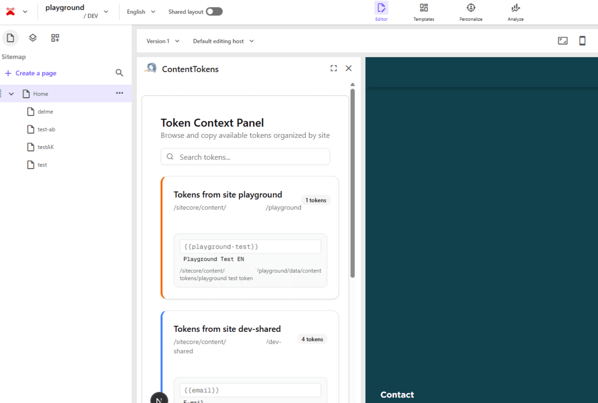
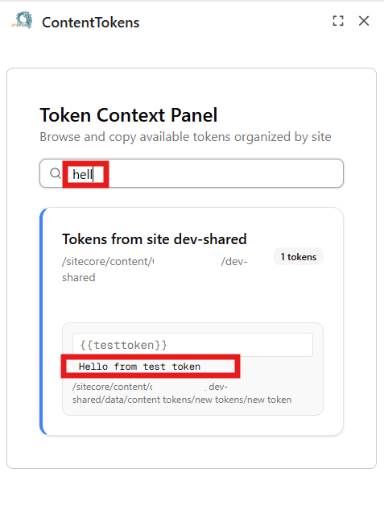

> This blogpost bases on Content Token items which are made available in the CMS. As the Content Tokens and how to replace them was already topic of a talk Christian Hahn and I held at SUGHU only a short summary of it will be part of this blogpost.

## Content Tokens - the base

Content Tokens in the sense of this post are items with a key and value, similar to Dictionary Entry items. They are used for having certain names, brands, words & phrases the same way in the texts every time. As an example think of "E-Mail", there are many different spellings like email, e-mail, E-Mail, E-mail,...

The Content Token items are stored in site's Data folder in a dedicated Content Token Folder.

The Content Tokens can be used in any text field (Single-Line, Multiline, Richtext) by putting the following:
`{{key-field-value-of-token-item}}`

> The logic how to replace the tokens in the frontend is not part of this blogpost, but basically a TokenService was implemented in the frontend app, similar to the DictionaryService. For the Text fields wrapper are provided which are responsible for calling the resolve functionality and display the values of the tokens whenever a valid key is used.

## The Marketplace app idea

The idea for the Marketplace app came up because of three things:

1. It is not possible to add custom buttons/functionality to the RTE in PageBuilder
2. The tokens should be placeable in every text field, not only Richtext
3. How does the editor know which tokens exist if he's exclusively working in the PageBuilder

With these three things in mind the idea was born: Having a context panel in Page Builder which shows all available Tokens, related to the chosen site and language.

## The Content Tokens app

As explained before the idea was to have a Marketplace app for the extension point PageBuilder Context Panel which shows all available tokens.

This is how it looks like:



As you can see the token are displayed in categories, one category per site.

And then per token the key - which the editor can copy -, value and path of the token item is displayed.

Additionally there's a search box where the user can place a search phrase and the keys, values and paths of the tokens are searched through and the tokens are filtered correctly.



And now finally let's jump into the code.

### Where to start?

I recommend to start with the [Starter Kit from Sitecore](https://github.com/Sitecore/marketplace-starter) you can find on Github. The starter contains the different extension points and the README gives a very good overview.

The starter also comes with a hook to use the MarketPlaceClient and gives you an idea on how you can use the ApplicationContext and PageContext.

Second thing you need besides the repository to start with is the Marketplace App configured in your Sitecore Portal. For the setup it's best to follow [Sitecore's guide](https://doc.sitecore.com/mp/en/developers/marketplace/create-a-custom-marketplace-app.html) on it as it explains the process step by step.

Once you configured the app you can run  `npm install` followed by `npm run dev`and connect your local app.

### Getting the sites

To retrieve the Token items I had to do a couple of things. First thing I implemented getting the sites including the id of the Content Token Folder(to retrieve later on the tokens).

To retrieve the sites I implemented a hook `useExtendedSites` and defined the ExtendedSite interface as the following:

```typescript
export interface ExtendedSite {
  site: Site;
  rootItemId: string;
  globalDataItemId: string;
  contentTokensFolderId: string;
  isShared: boolean;
}
```

I used the common `useSites` hook which uses the standard query for sites from Marketplace app context:

```typescript
const { data } = await client.query("xmc.xmapp.listSites", {
  params: {
    query: {
      sitecoreContextId: previewContextId,
    },
  },
});
```

Now in my `useExtendedSites` hook I wanted to map those sites to my interface, so I also needed functionality to get an item by a path (relative from site's root).

In the end my hook includes this:

```typescript
await Promise.all(
  // eslint-disable-next-line @typescript-eslint/no-explicit-any
  sites?.map(async (site: any) => {
    const rootPath = site.properties.rootPath + "/Home";
    const item = await GetItemByPath(rootPath, "en", []);
    const globalItemRootPath = site.properties.rootPath + "/Data";
    const globalItemRootItem = await GetItemByPath(
      globalItemRootPath,
      "en",
      []
    );
    const contentTokensFolder = await GetItemByPath(globalItemRootPath + "/Content Tokens", "en", []);
    customSites.push({
      site,
      rootItemId: item?.id ?? "",
      globalDataItemId: globalItemRootItem?.id ?? "",
      contentTokensFolderId: contentTokensFolder?.id ?? "",
      isShared : site?.properties?.sharedSite == "true"
    });
  })
);
setExtendedSites(customSites);
```

Now, to retrieve an item by path I implemented an `itemService` which retrieves the item by using graphQL query as well. Nothing fancy to highlight this here.

### Getting the tokens, finally

Now that we have the sites and the Content Token Folder ids, we have everything we need to get the actual tokens.

I implemented a `tokenService`, similar to the itemService, which retrieves the token items.

```typescript
const { data } = await client.mutate("xmc.authoring.graphql", {
  params: {
    query: {
      sitecoreContextId: PREVIEW_CONTEXT_ID,
    },
    body: {
      query: GetTokensQuery,
      variables: {
        itemId: itemId,
        language: language,
        template: "Content Token"
      },
    },
  },
});
const mappedTokens = await mapToTokens(data?.data?.search);
```

I then mapped the graphQL data to my `Token` interface.

In my `token-panel` component I implemented a couple of things, next to rendering the list of tokens and providing the search possibility.

First of all I set the language and current site based on the `pagesContext`. In that way I make sure that if I change the site or language in the PageBuilder the app reacts correctly.

Next thing is to search for the tokens in the language I set. First I call my search function for my current site, in case it has a Content Token Folder and then I filter the sites I got from my `useExtendedSites` hook, checking for not the current Site, but shared sites which have a Content Token Folder. For each of those I also search the tokens.

And then I render a category per site and inside the category the tokens with their key, value and path. And that's all, basically.

Now the editors can look up the added tokens directly from Page Builder and copy the key to put into a textfield and can be sure it is correct.

### Outlook

I also had a nice copy button in the UI in the first try to copy the key of the token by click, but unfortunately the access to the clipboard is not (yet) allowed from Page Builder. Since the app runs in an iframe a CSP header needs to be added, which we as app-developer can't do. I hope the access will be allowed in the future.

For a version two I am already working on an AddToken functionality which is dependant on the user's permissions.

### Sourcecode

And finally [here](https://github.com/anbrue/marketplace-app-tokens) you can find the code. Please keep in mind that this is just a base and I am happy to discuss different approaches and ideas.

## Resume

As you can see from this post it is quite easy to come up with a working marketplace app and I am sure a lot of us will come up with different app ideas and implementations.

Let's extend SitecoreAI!

<!-- markdownlint-disable MD033 -->
<aside class="about-the-author">
  Anna is a <a href="https://mvp.sitecore.com/en/Directory/Profile?id=451bc7ec36bf4d2e15a408dabc3b97c1" target="_blank">5-times MVP</a> located in Germany who comes with 17+ years experience with the Sitecore products from a tech side (development, architecture, ..). She worked formerly for partners and has been an independent as Sitecore Consultant and Architect for 2+ years. She's active in the Sitecore Community and is part of the board of <a href="https://www.sitecore-usergroup.de/" target="_blank">SUGDE</a> and part of the organizing committee for <a href="https://europe.sugcon.events/" target="_blank">SUGCON Europe</a>.
</aside>
<!-- markdownlint-enable MD033 -->
