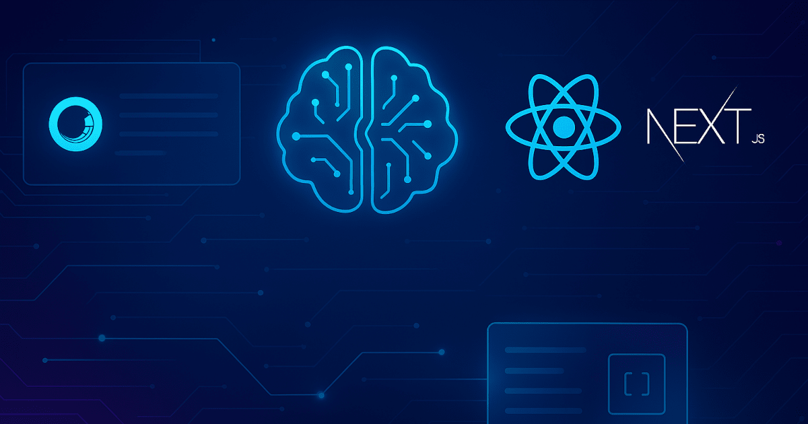

I've "only" been developing for Sitecore since 2015 starting with version 8.0. I know there are plenty of people that go back to version 6 and earlier. But in my time as a Sitecore developer, the process of building a website on Sitecore has changed greatly. From ASP.NET MVC, to SXA, to headless, to Headless SXA, to XM Cloud. From controller renderings, Razor and Glass Mapper, to Angular and Vue, to React, to Next.js. From the wild west of project organization to Helix. From Experience Editor, to Horizon, to Pages. What it means to be a Sitecore developer has shifted as well. From a specialized skill understood by "few" to a developer friendly environment accessible to "many". Even the line between backend development and frontend development is blurring. People that used to identify primarily as one type of developer or the other are expected to do both. With the help of AI any developer can easily create Next.js components, create Sitecore items and build responsive CSS that matches designs.

## Traditional Sitecore Development

It's difficult to think back almost 10 years ago. Developing for Sitecore was drastically different from today. Every developer had to have a local install of Sitecore and Visual Studio. This was a challenge for some front end developers that often had less powerful laptops. Everything was focused on experienced "programmers". You had to create a controller rendering and a view model. You registered services and used dependency injection to pass objects into controllers. You had to use an ORM like Glass Mapper to map the fields on your template to properties on an object. You had to create a Razor View that mixed C# with HTML. It was difficult for a front end developer to understand this code and make changes without having compile errors. Every change required you to rebuild the solution in Visual Studio and deploy to your local environment. Gulp was introduced to create a watcher that tried to save time by only compiling what had changed. Backend work was typically completed before frontend work could start. This often leads to issues sequencing work item and a "developer handoff".

## Modern Headless Sitecore Development

With modern Sitecore development, many of these issues have faded into history. Headless development eases the burden of running a local environment. While you can run the full Sitecore CM in a container, that is not required. You can run a simple Node.js server for the frontend website and connect to the CM instance in the cloud for the data. For local development, React can run in watch mode to enable fast browser reloading. No need to compile the entire application to test a small change. React and Next.js have won the "format" war for the most part. While each framework/library has its merit, having one framework as the standard makes life easier. It is easier to find information, examples and blogs because everyone is using the same framework. Using React with GraphQL makes it fast and easy to create new components. Renderings are mapped to source code by name. Data fields on templates only need to be defined in the React code and they are automatically wired up. Utility classes are available to support both in page editing as well as normal display for users.

## AI allows us to develop even faster!

Adding AI into our developer's toolbox is like having an assistant that can help us do our work faster.

- AI can speed development by creating components straight from designs. There are tools like Kajoo.ai and connectors for Figma. Some tools can even connect directly into Sitecore and create templates, renderings and items. Many people and companies are creating their own proprietary tools to give them a competitive edge.
- AI helps backend developers create HTML and CSS and frontend developers create Sitecore templates, renderings and items. This gives teams flexibility on staffing projects and picking up tickets to keep user stories flowing through the board by reducing dependencies. One developer can do both chunks of work and submit one PR.
- AI helps us solve problems and resolve bugs. We can write a text based description of the problem or issue, then AI can analyze the code suggest ideas and fixes. This is more than just "vibe coding", it is learning how to write successful prompts that leverage what AI is good at and helping us work more effectively.

## AI isn't a silver bullet!

Even though AI is great and can help us save time, it isn't a silver bullet that can solve all our development issues. It has its own challenges and creates its own problems. Some of these problems can take more time to solve than you save using AI.

- There can be some logistical issues to using AI on a project. You have to make sure you are allowed to use it on your project. You have to make sure you have access. You have to make sure you know how to use the tools. You have to follow company policies. You have to make sure you don't share secret information or PII data.
- As much as everyone wants to use AI for everything, we have to remember that AI doesn't know everything. It can hallucinate to create the answers we are expecting to see. This can lead to code that doesn't work or completely false information. I recently had a developer come to me with an issue about dynamic placeholders. AI created a placeholder key `label-1`. This won't work in practice because dynamic placeholders append `-#-#` to the end of the label. It is important to know when to use AI and when to trust your own skills.
- It can be a struggle to get AI to do the work you want it to do. AI is still a computer and can only do what you tell it to do. Writing good prompts is essential. The more detail you can provide about what you are trying to accomplish, the better.
- AI can create unoptimized code that is long and hard to debug. On a recent project, AI created a code file that was over 700 lines long. It worked and produced the desired results. But the code was hard to follow. Which means that any future bugs that come up will be hard to resolve without the help of AI.
- Similarly, A backend developer can create unintended UI bugs because they lack the knowledge to validate the UI code that AI created (and vice versa with front end developers). It is easy to accept the changes AI suggests if you don't have a basis to know if the code is correct.
- AI can undo work that other developers did because it lacks the context of history. This can cause work that was previously complete to have new bugs or reopen existing bugs.

## What's Next?

As AI improves its capabilities, the potential for how it can help us solve problems and work faster increases. How are you using AI today? What problems is AI helping you solve? What challenges are you facing when using AI?

<!-- markdownlint-disable MD033 -->
<aside class="about-the-author">
 Eric Sanner is a <a href="https://mvp.sitecore.com/en/Directory/Profile?id=bc74485743e8429bc5c808db4d9ac26d" target="_blank">2x Sitecore Technology MVP (2024–2025)</a> and Solutions Architect at <a href="https://blogs.perficient.com/author/esanner/" target="_blank">Perficient</a>. He has been using Sitecore since 2015. He is an active member of the Sitecore community and loves sharing his knowledge with others. He has written over 100 blogs on Sitecore and Sitecore-related topics.
</aside>
<!-- markdownlint-enable MD033 -->
