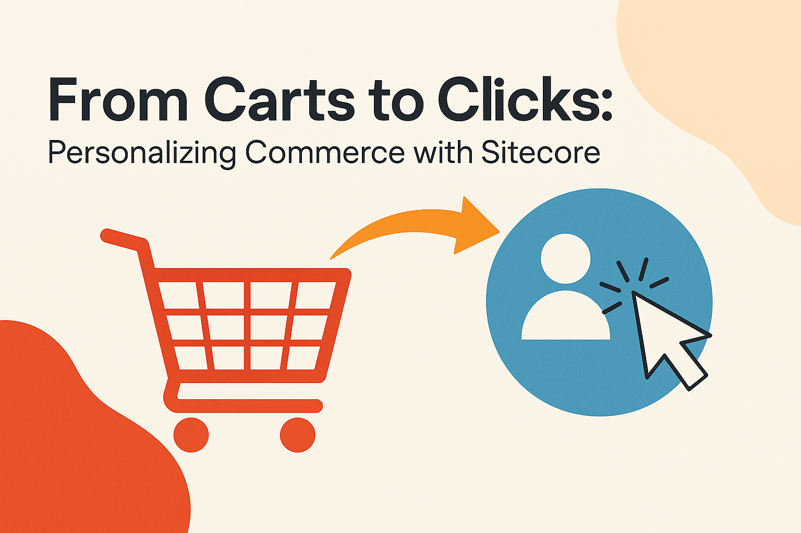
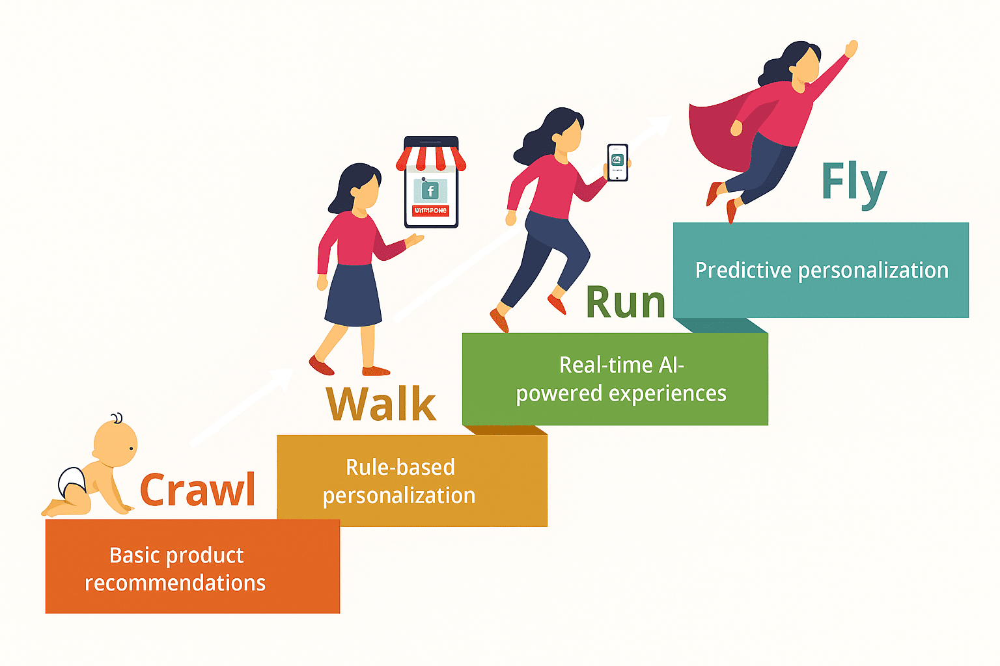

If you're running a business - online or brick-n-mortar, you already know that your customers expect and love things to feel tailored to them. If your business or eCommerce website still treats every visitor/customer the same, you're probably leaving money on the table.

That's why personalization is not an "extra feature" anymore - it's how you compete and stand out. Sitecore Personalize provides you tools that make that a whole lot easier & efficient.

This post is basically a cheat sheet you can start from:

- What problems most eComm teams face
- How Sitecore Personalize solves them
- What kind of ROI you can actually expect
- And a practical matrix to get started (Crawl → Walk → Run)

The post explores how brands can strategically use personalization to unlock tangible ROI—by mapping Sitecore Personalize's core features to real-world eCommerce challenges and illustrating the payoff that businesses can expect.

## Real Problems. Real Fixes.

Let's keep it real. These are the pain points I hear over and over — and how to fix them using Sitecore Personalize:

### People abandon carts.

You did all the work to get them there. They do visit, browse around, maybe even add a few items to their cart/basket…and then they leave - without the items from the cart!!!

- **Possible action you can take -** Trigger popups or reminder emails with small incentives like free shipping, 10% off. Use real-time behavior tracking.
- **Outcome:** You save the sale.

### Average Order Value is low.

Your customers are buying, but what they are buying on average is not as exciting for the
business as you would like….only the bare minimum.

- **Possible action you can take -** Use real-time suggestions to show bundles or "You might
also like" add-ons.
- **Outcome:** You average order value (eventually) goes up.

### New products are not getting the traction you expected.

You roll out new line of products and you wait for the crowds….but…crickets.

- **Possible action you can take -** Target the right audience with personalized content blocks or
send emails based on your customers' past behavior.
- **Outcome:** More visibility, more clicks, more buys.

### Repeat purchases aren't happening.

If they bought the first time, why they are not coming back to purchase more???

- **Possible action you can take -** Send personalized follow-ups with loyalty offers or useful reorder nudges based on their past purchases or new products that might interest them to come back. Find the right motivation.
- **Outcome:** Better retention, better and more repeat customers, better Customer Lifetime Vaue
achieved.

### Same content for everyone.

Just generic call-to-action blocks, banners, offers - that does not work well! So don't be surprised.

- **Possible action you can take -** Provide personalized content based on who's visiting and what they've done before, what they purchased before.
- **Outcome -** for customers when it feels personally catered - it converts to better for the
business.

### Campaigns aren't working.

You are running so many campaigns that hould have worked. You are sending email blasts on regular basis - but the return on your efforts is not as promising.

- **Possible action you can take -** Design and target your campains and personalized offers
based on proper segmentation based on real behavior. In short - aim for a better target.
- **Outcome -** Better spend. Better results. Happy customers. Happy businesses.

### You're guessing what works.

Your marketing team could use better tools to test their strategies against valid data….not just
guess based on their gut and hope for results.

- **Possible action you can take -** A/B test everything. - layouts, headlines, timing, images,
buttons placement - everything.
- **Outcome -** You learn fast and optimize smarter.

## Sitecore Personalize Feature-to-ROI Matrix

Below is a high-level mapping of Sitecore Personalize features to their most impactful business outcomes:

| **Feature**                 | **What It Helps With**                                      |
|-----------------------------|-------------------------------------------------------------|
| Real-time Decisioning       | Show the right offer or message at the right time           |
| A/B & Multivariate Testing  | Find out what *actually* works                              |
| Behavioral Targeting        | Change content based on what users are doing                |
| AI Segmentation             | Group users based on behavior, not guesswork                |
| Journey Orchestration       | Keep experience consistent across email, site, mobile, etc. |
| Offer Management            | Control your promos without breaking everything             |
| Web/App Personalization     | Make pages feel like they're built *just* for them          |

## Crawl → Walk → Run: Practical Starting Points

The table below maps business goals to real-world capabilities in Sitecore Personalize—along with relevant documentation links for your team to dig deeper in a crawl-walk-run roadmap.

| **Goal**                   | **Crawl**                            | **Walk**                        | **Run**                                               | **Feature(s)**                    |
|----------------------------|--------------------------------------|---------------------------------|-------------------------------------------------------|-----------------------------------|
| **Boost AOV**              | Show upsell banners                  | Add crosssells in cart          | Use AI for realtime bundles                           | Decision Models, Experiences      |
| **Fix Abandoned Carts**    | Exit popups                          | Reminder emails                 | In-session nudges to motivate customers/visitors      | Triggers, Experiences             |
| **Increase LTV**           | Simple loyalty CTA                   | Tiered loyalty offers           | Smart, efficient re-engagement customer journeys      | Audiences, Decision Models        |
| **Launch New Products**    | Add homepage blocks                  | Email blasts                    | AI learns and picks who sees what                     | Web Experiences, Variants         |
| **Improve Conversion s**   | Static Call To Action banners/blocks | Condition-based Call-To-Actions | Real-time behavior based personalized Call-To-Actions | Experiences, Variants, Data Views |
| **Bring Back Lost Users**  | Discount email                       | Countdown offers                | Intelligent Reconnect                                 | Decision Models, Offers           |
| **Make Marketing Smarter** | Manual targeting                     | Behaviorbased segments          | AI-based targeting                                    | Audiences, Data Views             |

Here are key resources to help your team explore and implement personalization effectively:

- [Introduction to Sitecore Personalize](https://doc.sitecore.com/personalize/en/users/sitecore-personalize/introduction-to-sitecore-personalize.html) - Overview of the platform's capabilities and business value.
- [Introduction to Decisioning in Sitecore Personalize](https://doc.sitecore.com/personalize/en/users/sitecore-personalize/introduction-to-decisioning-in-sitecore-personalize.html) - Details on business rules, decision models, and real‑time offers.
- [Introduction to Experiments in Sitecore Personalize](https://doc.sitecore.com/personalize/en/users/sitecore-personalize/introduction-to-experiments-in-sitecore-personalize.html) - Guide to A/B and multivariate testing within the platform.
- [Call the Personalize API](https://doc.sitecore.com/personalize/en/developers/api/call-the-personalize-api.html) - Developer documentation for triggering personalization flows via API.
- [Personalization Tips & Real-Life Use Cases](https://www.sitecore.com/solutions/topics/omnichannel-personalization/personalization-tips-real-life-usecases) - Practical examples of strategies that drive measurable impact

## Final Thoughts

Bottom line? Personalization works — when it's done right. And Sitecore Personalize gives you a toolkit that grows with you. You don't have to launch 50 tests on Day 1. Start small. Learn. Then scale. Decide the goal you want to go after, develop your strategy and then….

**Crawl → Walk → Run.**

<!-- markdownlint-disable MD033 -->
<aside class="about-the-author">
  Hetal Dave is an Enterprise Commerce Architect with 20+ years of experience in developing, designing and delivering enterprise e-Commerce ecosystems. She has deep expertise across the modern Sitecore and Azure stack, including but not limited to Sitecore XM Cloud (aka SitecoreAI), OrderCloud, Content Hub DAM/PCM, Sitecore Search & Personalize, Sitecore Commerce, and Sitecore XP.

  Hetal specializes in solving complex enterprise challenges - multi-channel catalog architecture, large-scale product synchronization, high-volume integrations, and modernization of legacy systems into scalable, composable and efficient solutions. Her work powers digital experiences across multiple industries ranging from flowers, pajamas and papers to coffee, chocolates, insurance, school supplies and windmills.

  A <a href="https://mvp.sitecore.com/en/Directory/Profile?id=5b5af409ac5442c9263408dad25dc9f8" target="_blank">7-time Sitecore MVP</a>, Hetal is known for her practical, do-it-right approach to engineering and her passion for sharing real-world insights with the community.
</aside>
<!-- markdownlint-enable MD033 -->

