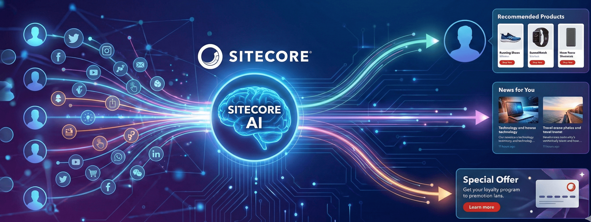

Sitecore XP has been a leader in the DXP space for over a decade and was thus one of the most widely used Enterprise CMSs. But it does more than a CMS, it provides a solution for the entire Digital Journey of a user. SitecoreAI, Sitecore's newer offering, is more user friendly, has next Gen features like Gen AI for content creation, is flexible, fast, and continues to be innovative. But the question for most Enterprises is can they have a DXP and most importantly a seamless Personalization engine when they make their move from XP to SitecoreAI. In this post, we peek at the Personalization present and future of SitecoreAI focusing on 4 areas:

## 1. Out-of-the-box Personalization:

### Harness SitecoreAI’s built-in rules and segmentation to quickly deliver targeted experiences

SitecoreAI was built from the ground up with an easy to use interface. While the organization, Content Editor, and Experience Editor will seem extremely familiar to any Sitecore XP/XM user, the main piece that is considerably different is that Sitecore has gotten rid of xDB and all the processing, storage, and integration that came along with it. This especially means all the profile, analytics, experimentation and personalization capabilities that users and organizations associated with Sitecore.

SitecoreAI has added back some basic Personalization capability out-of-the-box. With just generating your own analytics ID, even without the purchase of Personalize, you have the ability to create simplistic in/near session page based personalization and experimentation with basic rules.

Additionally, SitecoreAI has page analytics to display how your variants are performing, and you can easily compare them against each other.

## 2. Extending with Sitecore Personalize:

### Enable advanced decisioning, personalization, and experimentation with a seamless SitecoreAI to Sitecore Personalize integration

Where SitecoreAI limits Personalization features, Sitecore Personalize goes above and beyond to create as custom and scalable a Personalization as you can imagine. A separate product offering from Sitecore, Personalize enables a robust decision engine, with rules based Personalization using a Decision Table, or custom bring your own algorithm using Programmables. Additionally, Personalize allows both customer data and content to be easily pulled in from any sources within your ecosystem.

With Sitecore Personalize, you can have all the existing personalization capabilities with Sitecore XP and more. The one drawback of Personalize as compared to Sitecore XP is a duplication of efforts, where existing SitecoreAI components need to be recreated/reconstructed in Sitecore Personalize in order to Personalize a component.

The biggest win for Sitecore Personalize is the rules integration with SitecoreAI, discussed in the next section.

## 3. Custom Rules for Deeper Control:

### Define and implement custom rules within SitecoreAI using Sitecore Personalize

The biggest boon of combining SitecoreAI with Personalize is the ability to use SitecoreAI, rather than Personalize, to customize your content, components, or layouts via the custom rules engine. Within Personalize, you can create any custom condition using server-side JavaScript to filter your audience. You also have access to your user’s context, all the data associated with your user, stored in CDP/Personalize, and the decision models within Personalize. These rules can then be accessed in SitecoreAI’s rule engine to display the appropriate content/component to the user, just as any out-of-the-box rule displays. With this method, you can eliminate the need to duplicate or integrate components or content from SitecoreAI into Sitecore Personalize.
This duality also allows for more advanced users and personalization developers to use Sitecore Personalize while marketing and business users create experiences for their customers in SitecoreAI's easy to use interface.

## 4. Bringing in AI:

### Extend Personalization journey in SitecoreAI and Personalize with AI and Agents

#### Out-of-the-box AI with SitecoreAI and Sitecore Stream API:

As of November 1, 2025, Sitecore Stream is limited to generating content. As such, A/B testing and personalization are limited to the same. However, the content barrier to personalization is now officially diminished. You can generate and test specific content for specific audiences using AI, and officially decide how users respond to AI generated content with a combination of SitecoreAI and Stream.

#### Sitecore Personalize and Bring Your Own Algorithm:

Via Sitecore Personalize, you are able to connect to APIs of any AI algorithm, including agents, that can then be used to dynamically generate recommendations and next best actions flowing user data from CDP and content from Content Hub, SitecoreAI, or any other content engine. This all can be compiled in the Decision Model in Sitecore Personalize.

#### Gradial + Sitecore:

When you have Gradial integrated with SitecoreAI and Content Hub, you are able to prompt the Gradial engine for the creation of a specific campaign for a specific audience via a campaign brief in Sitecore. The Gradial agent is then able to use data in CDP to generate specific landing pages in SitecoreAI for specific audiences and even make changes to the landing pages using Gradial prompting within minutes, making Personalization in SitecoreAI truly scalable.

## In Summary

Personalization has always been one of Sitecore’s biggest selling points. Sitecore XP's Personalization suite made Sitecore stand out and hold the leading DXP position for over a decade. With SitecoreAI, Personalization has taken a different form, becoming more user-friendly, easier to generate, and more scalable. For those already on SitecoreAI, you can start your crawl step today with in session Personalization. As you are ready to invest more in your Personalization and AI journeys, consideration should be given to Sitecore Personalize, Gradial, and your own AI algorithms within your decision models to enhance and complement that journey.

For more resources and materials on these and other Sitecore Personalization related topics visit <www.pixleration.com>, follow me on LinkedIn at <https://www.linkedin.com/in/jainasangtani/> or watch my videos for step-by-step tutorials on the above at: <https://www.youtube.com/@pixleration102>

<!-- markdownlint-disable MD033 -->
<aside class="about-the-author">
 Part strategist, part architect, Jaina is a Personalization expert and a <a href="https://mvp.sitecore.com/en/Directory/Profile?id=d7390f1e8a3f47442cb608daced6fccc" target="_blank">7x Sitecore Strategy MVP</a> with over 12 years of Sitecore experience, as a client leading a team of over 30 for the largest staffing and recruiting firm in America, and as the Director of Strategy and Presales for two Sitecore Platinum Partners. An active presenter and blogger, Jaina is passionate about the intersection of customer experience and technology to create unified personalized experiences that enhance business value and prove ROI; she now executes on this promise for many prominent brands with her own company, <a href="https://www.pixleration.com/" target="_blank">Pixleration</a>.
</aside>
<!-- markdownlint-enable MD033 -->
