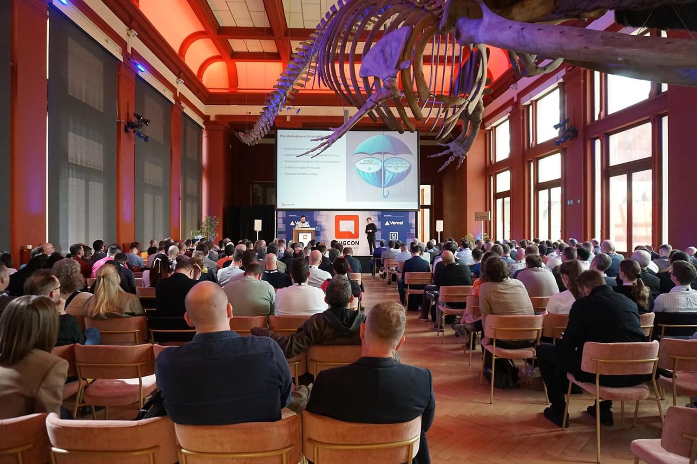
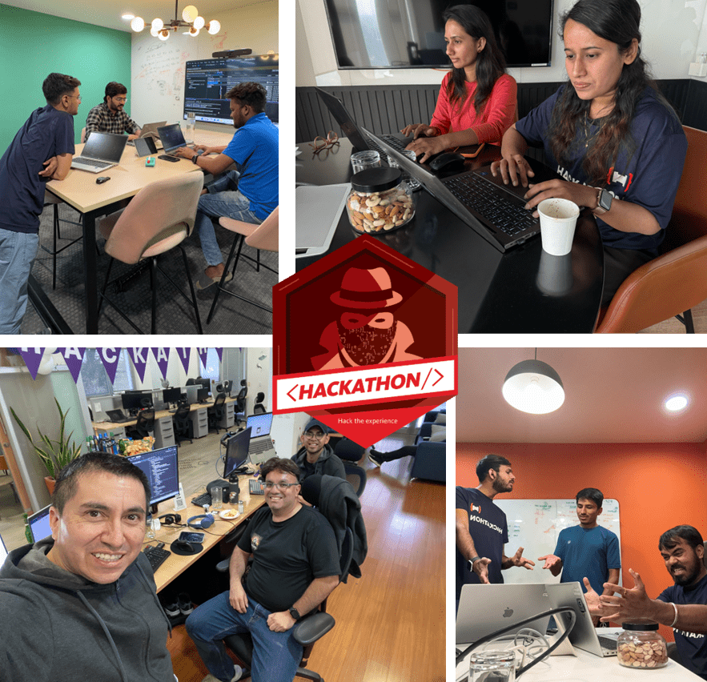

## Welcome to the Sitecore Community

During the summer 2006 I was asked by a small Hungarian digital agency to find the best Microsoft based CMS they could offer to their customers to build websites. It was a 3-month project, and I was comparing all the available solutions out there. When I narrowed the list down to the three best options, I had three important criteria to choose the right one:

1. It should offer all the functionality a **customer** would need, and it should have a robust roadmap for the future.
2. As I used to be a **developer**, I knew how important it is to have a system which is developer friendly, which is based on standards and offers a great API.
3. The **agency** needed a partner not just a license to be sold, so finding a vendor which can provide that was key.

**Sitecore was, and still is even today, the best choice for all the above, but at that time I did not know or calculate with Sitecore’s superpower: the Community.**

The Sitecore Community today is a global network of more than 30,000 passionate people. Developers, marketers, strategists, and enthusiasts come together to share, learn, and build something bigger than themselves. This community is open to everyone, and every contribution makes a difference.

## What Makes the Sitecore Community Special?

The Sitecore Community is a movement. They organize user groups, hackathons, and social events. They create thousands of blogs, podcasts, videos, and open-source projects every year.

**Whether you are technical or strategic, new or experienced, you will find your place here.**

What truly sets the Sitecore Community apart is the spirit of collaboration and generosity. People from diverse backgrounds, cultures, and even competing companies come together, united by a shared passion. They help each other succeed, celebrate each other’s milestones, and create lifelong friendships.

## The MVP Program: Celebrating Excellence

At the heart of the community are the Sitecore MVPs. These are the top 1% of contributors who go above and beyond to share knowledge, inspire others, and drive innovation. The MVP Program recognizes these outstanding people and gives them unique opportunities for growth, learning, and connection. The real reward, though, is the impact they make and the friendships they build along the way.

Sitecore is incredibly lucky to have such a remarkable group of MVPs. These are selfless, hardworking people who dedicate their own time and resources to make the Sitecore Community bigger, better, and more welcoming for everyone. Their passion and generosity are the foundation of the community’s success. Their stories are a constant source of inspiration. If you want to hear their journeys, challenges, and triumphs, listen to the [MVP Podcast](https://mvp.sitecore.com/Podcast). Each episode is just five to ten minutes and is full of insights and motivation from community heroes.

## Why Get Involved?

- **Grow your skills**: Learn from experts, access exclusive resources, and stay ahead in your field.
- **Build your network**: Connect with peers, mentors, and industry leaders worldwide.
- **Make an impact**: Share your knowledge, help others, and contribute to the future of Sitecore.
- **Be recognized**: Stand out through your contributions and maybe even become an MVP.

## How to Get Involved?

There are many ways to join and contribute to the Sitecore Community:

- Join the [Community Portal](https://community.sitecore.com/) for discussions, Q&A, and resources.
- Connect on [LinkedIn](https://www.linkedin.com/groups/71381/) with 13,000+ Sitecore enthusiasts.
- Subscribe to [YouTube](https://www.youtube.com/c/discoversitecore) for videos on all topics.
- Chat in real time on [Slack](https://sitecore.chat/), [Discord](https://discord.gg/XQ2k3x9s), or [Telegram](https://t.me/s/SitecoreTelegram)
- Participate in [User Groups](https://www.reddit.com/r/sitecore/wiki/user-groups/), there are many worldwide, both virtual and in-person
- Attend [SUGCON](https://sugcon.events/), the community’s flagship conference.
- Listen to podcasts like [Core Sampler](https://coresampler.fm/), [Fireside](https://www.buzzsprout.com/2049944/), and [Water Cooler](https://www.americaneagle.com/insights/studios/the-sitecore-water-cooler)
- Join the [Mentor Program](https://mvp.sitecore.com/Mentor-Program) to learn from experienced community members.
- Take part in the annual [Hackathon](https://sitecorehackathon.org/)

## Did You Know? Sitecore Community Q&A

- **Q: How many people are part of the Sitecore Community?**
  - A: There are more than 30,000 practitioners worldwide, including developers, marketers, and strategists, working for Sitecore’s partners, customers but also many freelancers.
- **Q: How much content does the Sitecore community create?**
  - A: Every year, members create thousands of blogs, podcasts, videos, and open-source projects. The Discover Sitecore YouTube channel has over 9,000 subscribers, 635 videos, and 1.3 million views. In 2024 alone, there were more than 120,000 views and 8,600 hours watched.
- **Q: Where do community members connect and share knowledge online?**
  - A: The Community Forum has 14,000 members who have posted 36,000 questions and answers. There are also active discussions on Slack, StackExchange, Reddit, Telegram, Discord, and LinkedIn.
- **Q: How active is the Sitecore community on Slack?**
  - A: There are more than 10,600 members on Slack, sending about 2.5 million messages per year in over sixty channels.
- **Q: What about Sitecore StackExchange?**
  - A: The Sitecore StackExchange has over 14,000 members with 14,000 questions and answers.
- **Q: How do Sitecore community members stay connected week to week?**
  - A: The [#SitecoreLunch](https://www.linkedin.com/feed/hashtag/sitecorelunch/) is a weekly virtual meetup that has taken place every Friday for over six years, even on holidays.
- **Q: What is SUGCON?**
  - A: SUGCON stands for Sitecore User Group Conference. It is a community-run event for all Sitecore practitioners. There have been 22 SUGCON events in 11 years, with the largest having 640 attendees. The conference happens in Europe every year and every other year in India and Australia, sometimes it is also organized in North America. More information: <https://sugcon.events/>.

Being part of the Sitecore Community in the last 19 years completely changed my life. I worked with famous brands all around the globe solving their digital marketing problems on the partner side and I was lucky enough to manage the Sitecore Community and the MVP Program in the last 9 years at Sitecore. Organized many events, met hundreds of bright individuals, saw dozens who managed to rise in the community, got many-many friends, so the only thing I can say is to come and join us, get inspired, and help shape the future of Sitecore and the community together.

<!-- markdownlint-disable MD033 -->
<aside class="about-the-author">
  Tamas is a <a href="https://www.sitecore.com" target="_blank">Sitecore</a> veteran, who developed large multi-country, multilingual solutions, managed development teams, ran business development, trained developers worldwide and became <a href="https://mvp.sitecore.com/en/Directory/Profile?id=83320553167e4473a13508dab5a5ea18" target="_blank">Sitecore Most Valuable Professional</a>. Now Tamas supports the community through webinars, meetings, user groups, conferences and he leads the <a href="https://mvp.sitecore.com" target="_blank">Sitecore MVP (Most Valuable Professional) Program</a>.
</aside>
<!-- markdownlint-enable MD033 -->
