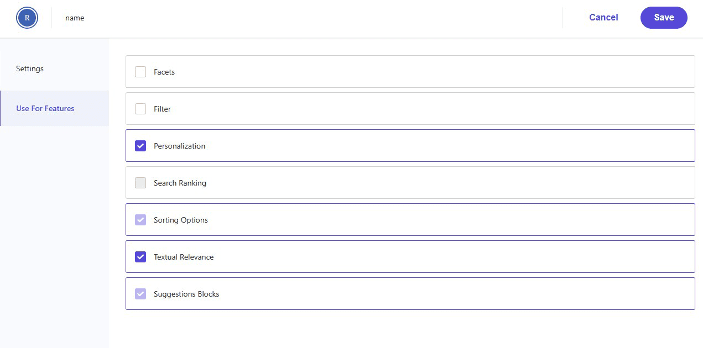
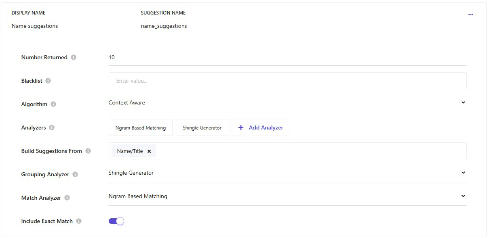
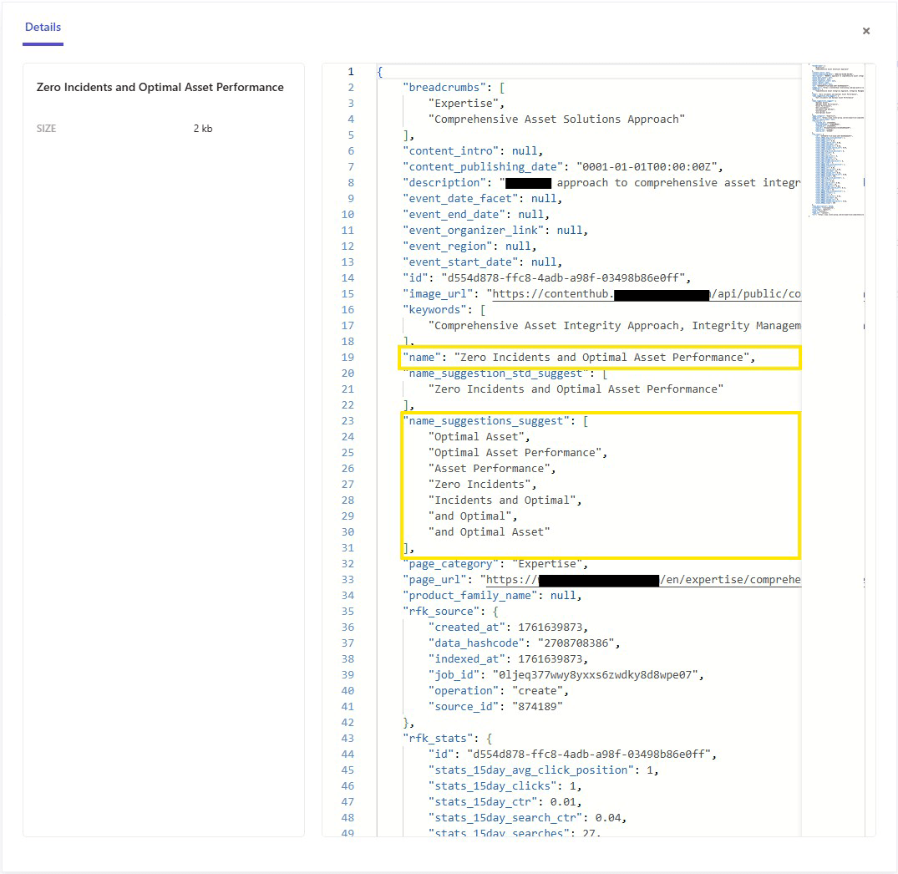
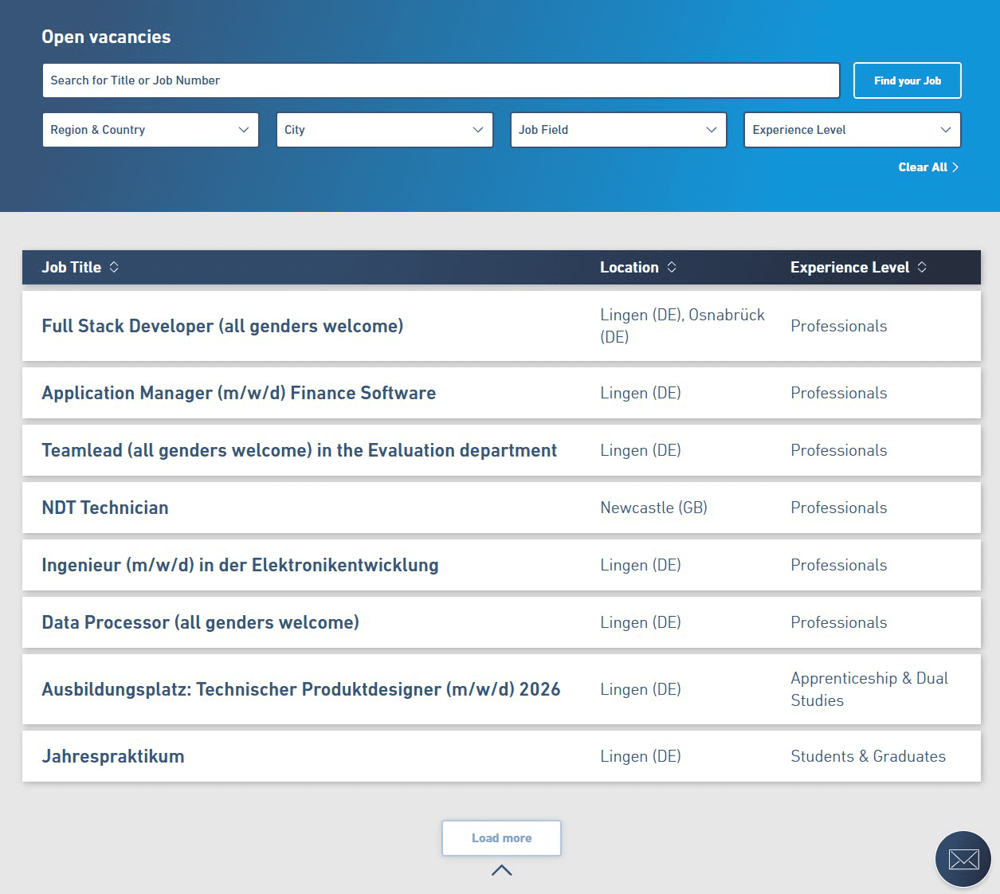
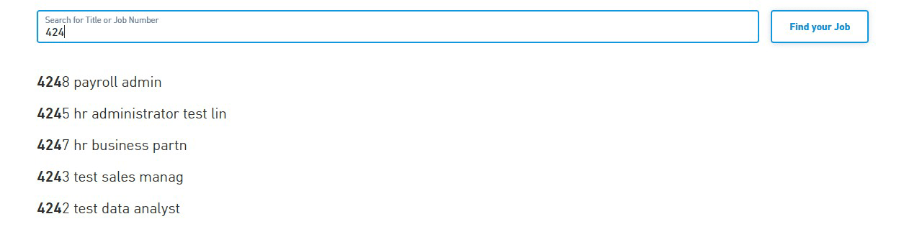
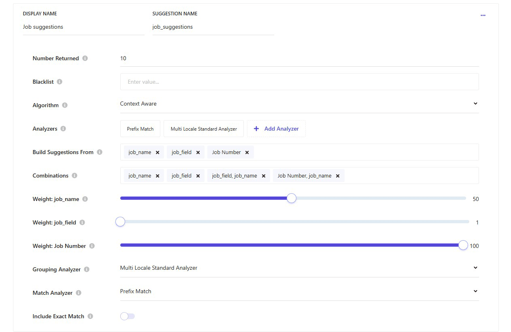
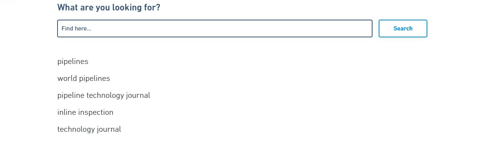

Search suggestions often feel like a small detail, but they shape how users interact with your content. Many implementations stop at the basics, but understanding the mechanics behind suggestion generation opens the door to smarter configurations. In this post, we'll look at how to configure autocomplete properly and enable exact-match suggestions for IDs like job numbers, so users find what they need faster.

## Setting Up Suggestion Blocks

Sitecore does have a fairly decent documentation about the various configurations of suggestion blocks in Sitecore Search. We are not going to repeat the details, as you can always [look them up here](https://doc.sitecore.com/search/en/users/search-user-guide/understand-suggestions-blocks.html).

Nevertheless, let's walk through the steps required to set up an auto-complete configuration for your search function based on the page titles.

### Prepare the Attribute

Your content in Sitecore Search is modeled using [entities and attributes](https://doc.sitecore.com/search/en/users/search-user-guide/configure-entities.html). To include an attribute in suggestions, you have to enable this on the attribute itself first.

Navigate to _Administration > Domain Settings > Attributes_ and click on the attribute representing the page title (`name`). On the left hand side, you will find an option _Use For Features_, where you can enable _Suggestion Blocks_.

### Configure the Feature

To find the Suggestion Block configuration, navigate to _Administration > Domain Settings > Feature Configuration_ and edit the _Suggestion Blocks_. For a default auto-complete, you can [follow the official documentation](https://doc.sitecore.com/search/en/users/search-user-guide/create-auto-complete-functionality-using-suggestions-blocks.html) again to achieve good results.

In this scenario, we build suggestions only from one attribute and we use the [Ngram Based Matching](https://doc.sitecore.com/search/en/users/search-user-guide/types-of-analyzers.html) as a Match Analyzer to tell Sitecore Search which suggestions it should find/match. This analyzer is a good fit here as it breaks down the search terms into smaller tokens with a good chance to match partial words.

The grouping analyzer defines what Sitecore Search returns in the API response. Using a _Shingle Generator_ as the grouping analyzer makes sense, because you want to return full words or word groups. This is what a Shingle Generator does - it's similar as an Ngram Analyzer, but for full words and not n-sized tokens.

> 💡 Ngram Analyzer breaks 'Incident Report' into tokens like 'Inc', 'iden', 'dent'. Shingle Generator, by contrast, returns full word groups like 'Incident Report'.

### Verify the Suggestion Blocks

Suggestion blocks are persisted in your index. Therefore, you also need to re-index the content after changes to the configuration. Sitecore Search will ask you to recrawl when you save and publish your changes.

You can leverage this situation to have a closer look at what suggestion blocks have been generated for each search document. Navigation to _Content Collection > Content_ and click on the small `i` (Sitecore Details) on the right side of the entry you want to inspect.

### Suggestion matching

Which suggestions are return based on what a user is typing might be a bit confusing. At least it was to me.

If we look at the example from above, if a user types "Incident", only "Incident and Optimal" is returned, but not "Zero Incidents". This leads to suggestions that you might expect, but are missing. Especially when your attribute has less than three words.

As another example, we look at a page with the name "Technology Fields". The only suggestion generated will be "Technology Fields" and when a user types "Fields", nothing is returned from that document.

> 💡 The suggestion blocks seem to be groups of 2 and 3 words. If the name attribute contains only 2 words, e.g. "Technology Fields", there will be no match when someone enters "Fields". It seems that the suggestions are only **matched starting from the first words**.

## Example - Exact Match Suggestions

As many websites might have it, we implemented a job search component that lists open positions and lets you search and filter them.

Every open position has a unique job number, and we wanted them to appear in the suggestions if someone searches for a specific number. At the same time, it should still suggest jobs based on any other search term.

We configured the suggestion blocks from multiple attributes and leveraged the _Prefix Match_ analyzer. Additionally, we included a _Job Number, Job Name_ combination for the results and weighted the attributes.

If you want to learn more about how we integrated an external job platform into Sitecore Search, you can [read this post next](https://www.studert.com/integrate-sitecore-search-with-workday-jobs/).

---

**Related Article:**

[Integrate Sitecore Search with Workday jobs](https://www.studert.com/integrate-sitecore-search-with-workday-jobs/)

Integrating two specific platforms can sometimes feel like hula hooping at the Olympics. But it can also give you insights into solutions that can be applied to other integrations as well. Authentication hurdles and multilingual requirements are a common scenario and for both I have some insights and learnings to share.

---

## Good Practices for Suggestions

Here are a few things that we found useful in our Sitecore Search implementation when it comes to the Suggestion Block feature.

### Offer suggestions right away

Sitecore Search does not need an actual search term to offer you suggestions. You can request and show suggestions based on an empty search term and offer the users guidance before they even start a search.

### Use different types of suggestions

We used **Context aware** suggestion blocks in our example. There are also **Edit distance** suggestion blocks that provide an option for _Did you mean..._ type correction or **Recent history** suggestions to display keywords previously searched for by the user. You can request multiple suggestions block configurations in one request from the API.

### Ask for suggestions

You can configure suggestion blocks to be returned from the API by default on a widget, or for every widget by configuring it on the _Global Widget_. However, this will return suggestions also when you don't need them. We prefer to explicitly ask for suggestions in the API request, to only transmit the information that is needed and save some bandwidth. This could also be a configuration on a Sitecore Search powered component.

---

**Related Article:**

[Building Sitecore Search powered Components](https://www.studert.com/building-sitecore-search-powered-components/)

When we think of a search solution, our brains might immediately jump to the use case of displaying search results for a user query. There are however many more use cases. This blog post shows how you can configure Sitecore Search to provide a component with data to display upcoming events.

---

## Summary

Sitecore Search suggestions can do much more than basic autocomplete. By configuring attributes correctly, choosing the right analyzers, and adding exact-match rules for scenarios like job numbers, you can make suggestions smarter and more relevant. Combine these with good practices, such as leveraging different suggestion types and controlling API requests, to deliver a faster, more intuitive search experience.

<!-- markdownlint-disable MD033 -->
<aside class="about-the-author">
  Tobias Studer is a Sitecore Solution Architect with over 20 years of experience in the .NET ecosystem and a deep passion for Sitecore since 2012. A <a href="https://mvp.sitecore.com/en/Directory/Profile?id=c6cad1fd0d29466f5ba408dbc9881a72" target="_blank">seven-time Sitecore MVP</a>, most recently in 2025, Tobias is a recognized member of the Sitecore community. He co-founded the <a href="https://sugch.github.io/" target="_blank">Sitecore User Group Switzerland (SUGCH)</a>, helps organize the <a href="https://europe.sugcon.events/" target="_blank">Sitecore User Group Conference Europe (SUGCON)</a>, and regularly shares insights as a speaker and contributor. His expertise spans SitecoreAI and Sitecore Search.
</aside>
<!-- markdownlint-enable MD033 -->
