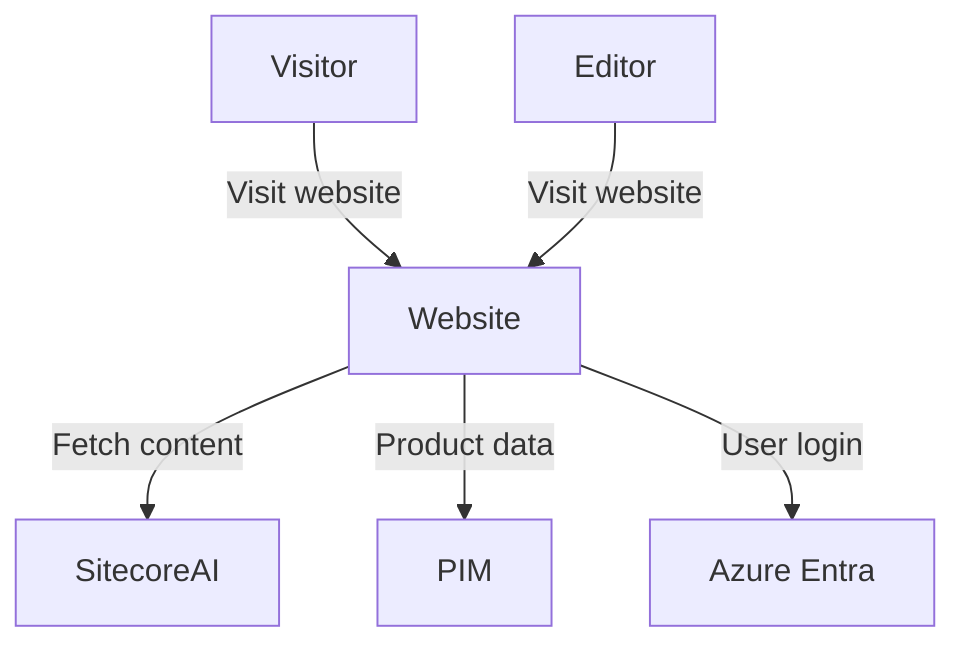
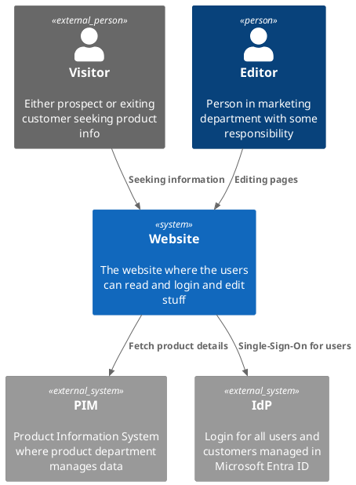
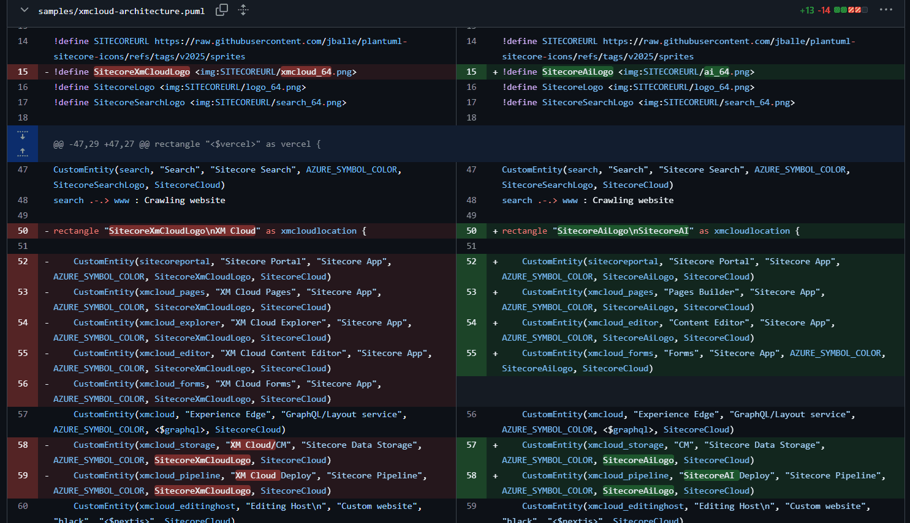
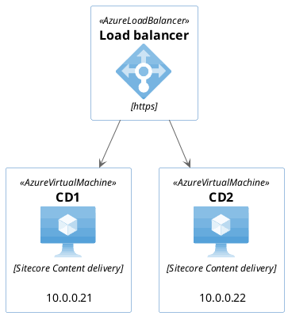

> As the digital landscape become increasingly complex especially with modern composable solutions and cloud offerings, the ability to clearly communicate how a solution fits together becomes a strategic advantage. Architectural diagrams are more than just technical artifacts, they’re critical tools for aligning teams, accelerating onboarding, and supporting faster, more confident decision-making.
> I'll share practical strategies I’ve found useful for creating and maintaining meaningful, consistent architecture diagrams and the tweaks to easily support the Sitecore product portfolio. With full traceability we are empowering the entire team so your documentation becomes a living part of your workflow and not a forgotten afterthought

Diagrams are a force-multiplier for software teams: they turn complexity into a shared, visual language that speeds decisions, shortens onboarding, and reduces misunderstandings between technical and non‑technical stakeholders.

## Find the right level of details

To communicate efficiently with the relevant stakeholders we need to find the right level of details that are relevant for that stakeholder at the point in time. Having too many details will make it more confusing and miss out the important part while too few details make the diagram irrelevant.

One approach I have found helpfull in this balance is Simon Brown's C4 model[^1] from 2017 or something like that. It is inspired by the 4+1 model by Philippe Kruchten[^2] and UML.

It describes a hiearchical set of abstractions and diagrams. It is explained very nicely compared to a geographic maps on the website that I will highly recommend. It is named after 4 levels starting with the letter C:

- **Context** diagram is very highlevel. What is the scope of the software system, who is using it, what are they doing and which system integrations does it need.
- **Containers** (component) zooms in on a specific software system and focuses on the major technological building blocks, their responsibilities and communication.
- **Components** (sub-components) zooms in on the container and showing the parts inside it. It might be exposed APIs, vertical slices or similar
- **Code** zooms in on a specific component. This is the level that UML usually focus on, actually classes, implementations, compositions etc.

Naming is always hard, what is a container (it is not related to docker at all) and we know from all development with Sitecore that we can get pretty confused about what a component is. They have tried with renaming to component and sub-component which is also a bit confusing.

I have said that we should always have a Context and Containers diagram on any project. It is useful for both non-technical and technical participants and it is realistic to have.

When there are certain areas where detailed diagrams can help the conversation and understanding within the team, we can create actual UML diagrams for that specific area.

C4 itself is completely tool and notation independent.

## A diagram is only as good as its last update

I think one of the worst things I know is documentation that you can't trust (ok confusing Confluence sites with plenty of empty pages are close, but there are usually also old and irrelevant meeting notes and other pages - all stuff you don't know if you can trust).

Therefore the team should own the documentation and the diagrams, it is an integrated part of the software engineering job to take care of multiple areas from User Experience, Editor Experience, deployment, cms items, database updates - maybe documentation for users and editors - keep the code clean and understandable for you and the team - and I say: at least make sure that the existing documentation in the project is still valid.

It is not the same as it should be a Kindergarden or playground where random changes are made everywhere, but neither is it with the code. And we already do have a practice in place to handle this: we are using a repository with versions

> At least make sure to have the overall diagrams have processes in place to ensure the diagrams are updated and versioned.

I argue that the diagrams belongs in the source repository - together with the code as an integrated part of the development cycle. It is visible for the developers and makes it clear that when you change code that would make changes to the diagram then you should also change the diagram. Hereby when reviewing Pull Requests it includes both code and diagrams.

## Make it easy to make and review updates

We all know binary files in source control is really hard and Git is not really optimal for binaries. So for this reason I don't really use Visio anymore.

Diagrams in draw.io can be saved as a (formatted) xml file and hereby fits fine in a source repository. I find it is really hard to tell the difference when the file is edited, it is hard to get the essence from all the changes in the xml so I actually rely on a visual diff.

This was probably the reason that I started seeking for another approach.

Don't get me wrong, the most important part is to have the fundamental and updated diagrams in place and preferably in a versioned way so nobody is worried about making the necessary updates.

If you are happy with Visio files in a Sharepoint folder, a Confluence page (that also can show history), or anything else, please continue. But let me share my journey with you.

## Draw.io

A drawing tool that also focuses on diagrams is draw.io or diagrams.net it is called now. With the VS Code extension it is very simple to work with the diagrams with the tool you are (probably) already using for development. The diagrams can be saved as an indented svg file and hereby you can get a lot of the benefits: have the diagrams together with the code repository and empower the team.

Diffing changes to a draw.io diagram is not straight forward as there is a lot of ceremony in the svg file so it can be hard to follow the changes. On the other hand the svg file is immediately usable, you can embed it in your existing `README.md` file or similar.

If you are doing nothing today and your team is a bit fearful regarding the diagrams, this might be a good starting point. Despite my following (a bit lengthy) arguments for using other tools, you are in a way better place when you have a few diagrams that the team takes ownership for than without.

## Diagrams as text is actually superior

It can seems counter-intuitive and fair to say starting to make diagrams in pure text can seem a bit freightening and take a focus on the important part

- simple to make a small change
- simple to avoid making unwanted changes
- simple to see what has changed

## Mermaid

You might know mermaid[^3] already, it is an obvious entry level solution for text based diagrams. It has a simple and intuitive syntax.

It is built in javascript so it is very easy to integrate so there is a chance that it is already available in some of the tools you are using today. If you are using Azure DevOps wiki you can insert mermaid diagrams[^4] and for Confluence there are plenty of integrations.

In mermaid you can write something like



And get something like:

[](https://mermaid.live/edit#pako:eNqFjkFrwkAQhf_KMucoRpMm2UNBqgUPhYCtQhMP2-yYBJJdmexiq_G_d1WsJ-lcZh7zvTdzhEJLBA7bRu-LSpBh77NcMVerbFV3tdG0YYPBc38RbI9frmHP1tn6Om6u9Dybyz-Y_Uff9RV_RVNUrNDKoDI9W2ZLtys04XTxwJGSlrYwTAojepZm6eLtAfnRIbFGl7Xq2TSbHiwhmytDYgMelFRL4IYsetAiteIs4XhOysFU2GIO3I0St8I2JodcnZxtJ9Sn1u3NSdqWFfCtaDqn7M49hbNalCTuCCqJ9KKtMsDDSwLwI3wD90N_OPGDaJREcRCPk-DJgx_HjIfjIEmiySie-LEf-eHJg8Pl6GgYR-HpF9fojyM)

For what I was seeking regarding the context and container diagram, I found that Mermaid was really limiting, there was from the beginning a focus on flow and sequence diagrams end even though several other types has been added, it didn't really match my needs and expectations

If you ever find you could improve your wiki pages with an ER diagram, flow diagram, a real UML sequence diagram, or even a Gantt diagram - take a look at Mermaid and there is a high chance that you can easily generate the diagram already in the tool you are working with.

## PlantUML

My first real successful work with diagrams based on text was when using PlantUML[^5]. It is implemented in Java and distributed as a jar file you can execute from the commandline, but there are also plenty of IDE extensions such as for VS Code[^6] and online editors[^7] that generate the diagram while editing the source file.

PlantUML is actually from back in 2009 but has been continously updated. There have also been focus on UML diagrams but additional types of diagrams have also been added and also a lot of extensibility in the diagrams itself and "standard libraries"[^8]. Hence I found a project to add C4 modelling to PlantUML. It was a project on its own so you included the files directly from GitHub but it has since been integrated into the product as one of those standard libraries.

With this C4 library it is simple to write text based diagrams that are almost readable directly from text



This will give something like

[](https://www.planttext.com/?text=NPB1QiCm44Jl_efjJYaqz99ZAO7K1KD3GrtQOr2ijRD4beoqRfA_xyfMwj3ROetVpeoq2gmyzws1ogWGikoER6LwZV2qNZwkbxkriundViwoBVhWx2u_y_o70h7p3p3x6gUPZ3dn0JrqteKEAmRd0S_4P1ke-i2kbSE0U8mVHAHxqP2jtUm-eUUe4pNNL-Xu8ZfebJ_YGDFOYUSMBSD9Ta8GD7WCdRE1zcI8ByBCoajWRESdt8j55DRtE4Nivm4X7S19N2E8T-Y3R8DAMQ4f3SfgCAwHtN6AvY1mNzSH_e5cQc5QKQPyCPTl5PEpeexYQxP96qCENQW6msHuABYZDeOlDaC7gQnYWiAeJTwlRTuKqoeRiQ0Lg-JWR_C8VqMk3ZU_iYBptmPf4HPw6rsy3Ks80r36fAfYBzUx3McdZfUreKgUWQiPSijUGV7otyI0BYM_mKL9ZLsyZ_0176siq6fvbxy0)

Clear and readable. When something needs to be added, it could be that we need to integrate with an additional external system or there is a new kind of user of the website, then it is simple to just add an additional line to the file. Just by having this drawing, you can now have the qualified discussion if you see SitecoreAI as an integrated part of the website(s) or if it is an integration to a SaaS product and what the consequences are for the organization.

There is also some configurations that can be added, also in text, eg. `SHOW_PERSON_PORTRAIT()` and `SHOW_FLOATING_LEGEND()` and you will get something like:

[](https://www.planttext.com/?text=NP91J-Cm48Nl-HL3JqK2xOKZGg0Is4YbgPeAZf69f-q8nuxioRRzzpjEN8AuZJ8ltxnvdiV0odFV6cYC2Y7BhiWsfjS8zukxFukxUk4iuuaVikfl-L6lyqrLhkfrkTbkdehj_3hBiZNwu6oTdtZ-ZmAnypSmUn-hcPGvyG4zTDw53Xi6vm5Fn6JtqFI1NIlDWFWLFuX8zw8XktEpwuIUeqxKN5-WOqTqq2h_XGDDOoUxj6WPZZ8JWg31O-YS3VH9XlWipAmw1yPsViHFiOZ2-XYhYDqU4583Zk8QGRn37sGQDCeAJMbGLeDnUvaTgsWE0lUxNOHlq4mfJ2Egj5_SoxUAoLbHH_5bjqaRbnooK7iCa-4Xu8xQk7pnDcIGmYecA8pQvFsIvezWMcKZ5hHYbHnyJnxXByZDuSUlhCZyja5QX8LUHnVB8Gbn0CgO55NCvVAs8StKyR7Ug94pS3k6tB9NK3p_DZ6WAzdVu6r5UtjRZl0176qSI8vJd7XqVEvmlCkNPVcqBLQlzJ9_pLVFmrq-ejLosFy1)

For a container diagram it could be something like this (follow the link on the image to see the actual source in the online editor):

[](https://www.planttext.com/?text=VPHDSziW48Rl-XNK9sTQfvSSEvsaiP9gnh4zbgSvQWYi9He9L42LFPt-zouWwoCVlO6q-x2y-oxNnb9jcweahAJ6HD478LdPS21VRgy-trvbjqfQAYJehr7wVVEORUDTkbbdsyrklxj9zlEBA8gse8sIMNoqyz_22Alq9pBx4LOpNCR25g19hPMfWLcYD86Zi4BcX3N6gWf_6e1dzm63U8CnGXxKxA93pu5tr9YVeU4Fnf6AwcVmD0urtgO2QKcBPnA3QAB1r4eQyIHAOK_8ZDAJiL1btrGZETMdkV5xP3x24nOD97oONP0_4I6z0lEsRJ6eEYtQ47V9LELAMSFHNluq94tlVMNDKoaOwO929TrrnhHQQKjBZ0-Bou4xPUxSzWuiAmYLd9X2jODid5hgkHEqWp2bWGfCJRlDJU90AQMfxycn1Yr0Ca3z9Ct1gVQYGWDKisA48Ad_CkOaaiCHE66OvNG_kEOU3e89jmk4Su4xABDLJmrg-dpVUAp1E69XRMryYejV1jKdDmfYu8a7aJSQ3-zpSqthubVvyINZhFL_CDGA9TzY_8qYX0pE3dMddLzTOtNL9v-J9XbzfrSgHx-wBWw-nuaGA5Tmo8ZW4MVVXpET-T-KQXmwkUAx6P5LEVYfT1Rl1i8DS2tS86oJ1-_aRXYJuP9TB6an5_ff7GrUS9CPdEcAEoiGw47u8HVjLhve_RGemPrJ-7RMQ-XiHikID0QVWOcYfgk0kwVXGJ1yTDJ1abXQJKcoVCCKdfwYJ2KiKf7BnIRmUw8xLWdENjbghFLx55_XAmAQgX3uok8LDIXxgY4yhtUhpSq-MTzdg_W-NY_TyteDakC3_Gy0)

I should mention that a few years ago Mermaid actually introduced experiemental support for C4 diagrams[^9]. It is based on the PlantUML syntax and it is currently still in experimental mode and eg. not available in Azure DevOps.

## But I want it nicer, give me colors and icons and... Sitecore

Ok there are plenty of options to style the elements in PlantUML, the UML ground is embraced so all elements can have sterotype(s) and apply styling for all elements of a certain (stero)type.

PlantUML diagrams are actually code, or at least there is a preprocessor. This enables functions and conditions in code and the extensions such as C4 are also "just" functions that creates rectangles with a certain stereotype and text with a reference to a sprite or an image.

There are plenty of those standard libraries eg. to support the major cloud providers with functions that embed the corresponding icon representing a specific service or feature, there are also for Kubernetes, font awesome icons, etc.

After discovering those I concluded that we could also get those for Sitecore, so I have encoded the product logos to sprites and published[^10] so you can easily embed those in your own diagrams.

[![SitecoreAI diagram](https://uml.planttext.com/plantuml/png/jLTRRzis57uFaF_06NjeiCXgWxKFXYeqSTmcW5rdSRDBcqAW9KPcIrCQHUNIeVzzXnT5f2qdtj0OGKmUdllb8_scabZ8UidGxJ9bHPtjxkpk_AI9LJr7bAUipaYbgHcvefoWms-r86TAP25bMGt2KE2RVaxbefxN5H5fmINXifyMox1ac2ljGIKpHkUXbWtE5FLYCWwNk994X1cj9EYtnbe3XdrOB9S5xvT0K6veseXBAk-61Ii4vVcpOLt9Occ8UzqiCof9Me0s5UG6dj_1US8QZYPUL_apac16SRMFICBmd32r0CKBhXQfKgGMLId0d5v1VAJOGuAa4lES4THx_ThANl98ImoiPDm8Hg7PN_8mZ2hwZGm-Z8OdxvEtq_SVajdfnr7yoLhz78NgF0x37egYnbmS8rmXw-h_2SIuiRUrnE77Y_DHCljhSZGT9yFfU7hkPc6bEgr3irE8Qte-kZWVRz5BN-QOCUAqbAreG86h2WMvgaA9yogyFdX-y38qrftmcmuufECYBr14b_d0yI34D7drQx_aURmkqot1WBfPPaQmI1VTafK-QsKTwRDpu9jjbvBLySefcsC1VpXeZqmUmkiN_HTEKffXQ-s5rxhzxQ1rCUG2buk_7-BWv5P-gHvWq1XpnR0W3zdHmUgwRksDpY7X6Q2M3s5_JfBXU7fnhAZE54O_ct3ZdfeLiqR_xEuW-CWY9t91HBDN7syKRcvkzb7l3p9NFTY3fK4EDCfojPqpd7xTLpRQS6EW-_ZIgHcgMjPgQ7f3ixhaZdvxwfamAUzM_zryUHPCgCcyfYm31SUaPCMTOwEa9M7GYQuHZK6ldiVHnIy7BuyEkervoNLA233sZieJA0KkIoVRYU41OXGvsc8z3ahXAXiA-dKPnCYD00sG53JFYV1ap9dbXse1sqnYILEaAePomec0RS4tIzbSW-IH9cEUeKmdIyLXv9JceELLZdzN_xo4crc7D1f0KAbk80BTaxeGT1r8MbgJUACSzOD-4-SGu0BgbwCRqvuhVU-Zu2M_tv_gqjXN02jIdHur0Hqzr41lMGY9cHlGcQPuCHv2rHyEqFYo7joQNUjTKkASm4NKErFVfZv4FBLHab6fhdUOJ8t0CEsAyDHchmgnLB6-LTzFR0oqZsvB8YZXAMdGhFTE0Urlut2CxufQ8hY3hcbADfY6qJUu7F-7684ae9GgjnCln6CiCKokFltXJMI1ph5tU8fQF6nxkaN47zvGCAYBef8gyMQ7Jc1hGDy8DNEiA1gGUokmtsLlUonkd770s5FOmh4_z02J07pUG3xEPaReSJxTyurTpuRYMzLeSzZ9xR3Q9lFPZ4UFyscFjbDdtK61laQSdrKkevLMJ4uu0DzbFMUqMY3xp3DIpLqK11ulBkbQacolhYXkuXpOAsnxeIQQLjANTMvdN_XUgND3s-lHUQTvWm5QeBSDhBNZDy7YAv7mdjs8EUuhVVLbijezkYZw0bzhmFP8XnDiQZDpwfLsLTUd1SqomZz3u0jv_sGnhzGt43qyMVy5)](https://www.planttext.com/?text=jLTRRzis57uFaF_06NjeiCXgWxKFXYeqSTmcW5rdSRDBcqAW9KPcIrCQHUNIeVzzXnT5f2qdtj0OGKmUdllb8_scabZ8UidGxJ9bHPtjxkpk_AI9LJr7bAUipaYbgHcvefoWms-r86TAP25bMGt2KE2RVaxbefxN5H5fmINXifyMox1ac2ljGIKpHkUXbWtE5FLYCWwNk994X1cj9EYtnbe3XdrOB9S5xvT0K6veseXBAk-61Ii4vVcpOLt9Occ8UzqiCof9Me0s5UG6dj_1US8QZYPUL_apac16SRMFICBmd32r0CKBhXQfKgGMLId0d5v1VAJOGuAa4lES4THx_ThANl98ImoiPDm8Hg7PN_8mZ2hwZGm-Z8OdxvEtq_SVajdfnr7yoLhz78NgF0x37egYnbmS8rmXw-h_2SIuiRUrnE77Y_DHCljhSZGT9yFfU7hkPc6bEgr3irE8Qte-kZWVRz5BN-QOCUAqbAreG86h2WMvgaA9yogyFdX-y38qrftmcmuufECYBr14b_d0yI34D7drQx_aURmkqot1WBfPPaQmI1VTafK-QsKTwRDpu9jjbvBLySefcsC1VpXeZqmUmkiN_HTEKffXQ-s5rxhzxQ1rCUG2buk_7-BWv5P-gHvWq1XpnR0W3zdHmUgwRksDpY7X6Q2M3s5_JfBXU7fnhAZE54O_ct3ZdfeLiqR_xEuW-CWY9t91HBDN7syKRcvkzb7l3p9NFTY3fK4EDCfojPqpd7xTLpRQS6EW-_ZIgHcgMjPgQ7f3ixhaZdvxwfamAUzM_zryUHPCgCcyfYm31SUaPCMTOwEa9M7GYQuHZK6ldiVHnIy7BuyEkervoNLA233sZieJA0KkIoVRYU41OXGvsc8z3ahXAXiA-dKPnCYD00sG53JFYV1ap9dbXse1sqnYILEaAePomec0RS4tIzbSW-IH9cEUeKmdIyLXv9JceELLZdzN_xo4crc7D1f0KAbk80BTaxeGT1r8MbgJUACSzOD-4-SGu0BgbwCRqvuhVU-Zu2M_tv_gqjXN02jIdHur0Hqzr41lMGY9cHlGcQPuCHv2rHyEqFYo7joQNUjTKkASm4NKErFVfZv4FBLHab6fhdUOJ8t0CEsAyDHchmgnLB6-LTzFR0oqZsvB8YZXAMdGhFTE0Urlut2CxufQ8hY3hcbADfY6qJUu7F-7684ae9GgjnCln6CiCKokFltXJMI1ph5tU8fQF6nxkaN47zvGCAYBef8gyMQ7Jc1hGDy8DNEiA1gGUokmtsLlUonkd770s5FOmh4_z02J07pUG3xEPaReSJxTyurTpuRYMzLeSzZ9xR3Q9lFPZ4UFyscFjbDdtK61laQSdrKkevLMJ4uu0DzbFMUqMY3xp3DIpLqK11ulBkbQacolhYXkuXpOAsnxeIQQLjANTMvdN_XUgND3s-lHUQTvWm5QeBSDhBNZDy7YAv7mdjs8EUuhVVLbijezkYZw0bzhmFP8XnDiQZDpwfLsLTUd1SqomZz3u0jv_sGnhzGt43qyMVy5)

There are many more ways to define styling of diagrams in PlantUML. Each element can have one or more stereotypes you easily apply styling rules to all elements of a certain stereotype, using either `skinparams` or the newer method is actually css-like stylesheets.

You probably know that SitecoreAI was announced at Symposium in November 2025. Updated the diagram was pretty simple and I think this is one of the major benefits of using a text based diagram tool. Here is a screenshot of the changes in GitHub, it is clear what is changed and simple to review:

[](https://github.com/jballe/plantuml-sitecore-icons/commit/2352872eb5784fbaeb1acead256659aa2fe010f3)

## It is not just a drawing, it is a model

Due to the preprocessor in PlantUML we have a little coding language. We can split a diagram across multiple files and we can define conditions. It also allows us to more explicitly express intend of the various parts and use the same source for different purposes or perspectives.

Here is a small example of conditionally including ip addresses. For most cases this is too much details and are preventing the overview, but sometimes you need a drawing of your servers, ips etc. and you can have that information collected in one place and rendered when relevant:



[](https://www.planttext.com/?text=bP9HIyCm58NV1_qFTqMXWqvjdxLCwulWV17sdYPtwyKqAKdgq5_lJIr5s1ucWIJatE_adf2D3yA5eTF98baioKWzA8HxyJqul7sCSssxpfhgL6MX7y9KjIDs4NehP4i6prI_OJXQzq7cy0kyMg6UX1P6egl6om_QDaB3bM_jyQM71xWERi1iDOgzin8LSx3RPaAJy3aOqM4E2hrqr0Uo9WVgkHnWINl8PgFPQTJEj7k18MgF_wKdqYZQSm9Uvn0nKhBW958LETJFFANl551Q3bXR4z04TjBqYUuhPR6ukucZBDBLn9MHAo_boiYTl7kc6ww99z1CHn5gG-Xz17G3wtK5tEIVVHbRtt0Q_ZG_)

## Reusability

The preprocessor enables reuse and import of files, even partial inclusion.

I can have a simple solution diagram like this (this example is in the GitHub repository for the Sitecore Plantuml sprites, but inclusion of files requires that you render the files locally eg. in VS Code):

[](https://github.com/jballe/plantuml-sitecore-icons/blob/master/samples/sitecoreai-example-solution.puml)

However, by including the SitecoreAI architecture diagram from before inside here, we can in a simple way have a full diagram (that might get too complex, but in the right setting, it might be beneficial)

[](https://github.com/jballe/plantuml-sitecore-icons/blob/master/samples/sitecoreai-example-solution.puml)

In the diagram source, the switching between those two are just a matter of `!define SITECOREAI_DETAILS 1`. I rarely use such a detailed diagram but when introducing eg. SitecoreAI in an organization there might be stakeholders that needs to understand the full picture - and having a toolbox of diagrams that can be applied to the specific solution can really help those discussions.

This can in similar way be used to insert similar content several times. Eg. a diagram to represent a Sitecore solution in kubernetes in a namespace. Hereby it is simple to make a diagram of multiple branches and even feature branches and when they are different (such as using a SQL container pod vs. a managed SQL service) then have this expressed clearly with when and how.

## Structurizr

A newer player in the space is Structurizr[^11]. They take the "diagram as the model" approach even further by using a Domain Specific Language (DSL) to describe the architecture and make diagrams to show relevant perspectives of this model.

They have for a while have a paid product that I haven't had a chance to check by there is also "Structurizr Lite" which is a docker container you can run yourself, the workspace file as volume and use most of the features. There is also a VS Code extension to help with syntax etc.

```structurizr
model {
    v = person "Visitor"
    e = person "Editor"

    ss = softwareSystem "Software System" {
        web = container "Website" {
            tag "Microsoft Azure - App Services"
        }
        portal = container "Portal" {
            tag "Microsoft Azure - App Services"
        }
        scai = container "SitecoreAI" {
            tag "SitecoreAI"
        }

        web -> scai "Fetches layouts"
        portal -> scai "Fetches content"
    }

    v -> web "Uses"
    v -> portal "Uses"

    e -> web "Edit content"
    e -> scai "Edit content"
}
```

You can then create system and container diagrams with

```structurizr
views {
    systemContext ss "ContextDiagram" {
        include *
        autolayout lr
    }

    container ss "ContainerDiagram" {
        include *
        autolayout lr
    }

    theme "https://static.structurizr.com/themes/microsoft-azure-2024.07.15/icons.json"

    theme "https://raw.githubusercontent.com/jballe/plantuml-sitecore-icons/refs/tags/v2025.1/sprites/structurizr-theme.json"
}
```


Structurizr also have an answer to one of the things that can be hard when jumping to pure generated diagrams: layout. With PlantUML the layout is completely generated and there are some "tweaks" to influence the layout engine. With Structurizr you can choose to align the elements completely manually like with hand-drawn tools. The alignmening is persisted in a json file (which is hard to read and diff, but when you know it is just layout information)

## Diagrams are artifacts

When diagrams or models are described in text files in your repository it might be necessary to also treat them as "code" with build and deploy steps. The concepts are very similar, the image is a representation of the model

Eg. render an image of the diagram and publish as artifact and maybe make it available to a larger part of the organization. If it is publishing a dedicated documentation website or if it is a matter of uploading the images to Confluence, Sharepoint, a wiki or similar.

## Ok but what about generation of diagrams, it is just text

Yes because we have text as interface it is "simple" to generate the input for the diagram. And it seems like the holy grail to just generate it all based on what we have.

There are several attempts on this. There are several generators that based on source code can generate class diagrams. As mentioned above, I don't really find that need for those diagrams, at definitly not for all of the codebase (when documenting certain modules it happens that we create a small diagram for specific concepts).

There are also some attempts on generating diagrams based on Terraform files. It is closer to what we want for a container diagram but I have still not had a really successfull case, often it becomes too granular (with network subnets, security groups, availability groups etc.) and the relations we want to show is actually of a different kind. Maybe you have those expressed as identities and permission rules, but otherwise it is actually something happening at runtime that should cause a relation.

My conclusion so far is, that the overview for Context and Container diagrams are best handled manually.

If you and your team are already totally on top of that and want to improve documentation at deeper levels for certain areas, it might be that you can find generation valuable in some areas. For some more specialized diagrams (such as class, sequence, communication, deployment diagrams) I do see that generation can be helpful. And several source can be used for the generation source code for code and infrastructure, but also telemetry data can be used. But be aware, don't just generate a bunch of diagrams to put a checkmark and nobody is going to actually use the diagrams.

## Key takeways

1. Overall diagrams is a significant assets that helps both stakeholders and developers share view on the solution(s) and easily share important parts.
2. C4 model provides a set of abstractions that helps establish a common baseline and focus.
3. It is significant better to have few updated diagrams than any number of potentially outdated ones. Make sure to have updated documentation as an integrated part of your development flow.
4. By using text based diagrams it can be simpler to diff and follow changes to diagrams in source control, and hereby empower teams to make necessary changes. Consider if that is the right for your product and if some of the examples and techniques can help you get started.

<!-- markdownlint-disable MD033 -->
<aside class="about-the-author">
  Jesper Balle has been working with Sitecore for the last 15 years, engaged in large scale projects for both locale and global clients. He has mentored many both colleagues and client's developers through the time guiding them to utilize features of Sitecore to simplify solutions. Jesper is Partner and CT at <a href="https://asmblii.com" target="_blank">asmblii</a> and <a href="https://mvp.sitecore.com/en/Directory/Profile?id=6a895e21e85848a9e69a08dd86f2f73e" target="_blank">Sitecore MVP 2024-2025</a>.
</aside>
<!-- markdownlint-enable MD033 -->

[^1]: [C4 model introduction](https://c4model.com/introduction)
[^2]: [4+1 model](https://en.wikipedia.org/wiki/4%2B1_architectural_view_model)
[^3]: [Mermaid Intro](https://mermaid.js.org/intro/)
[^4]: [Mermaid in Azure DevOps wiki](https://learn.microsoft.com/en-us/azure/devops/project/wiki/markdown-guidance?view=azure-devops#add-mermaid-diagrams-to-a-wiki-page)
[^5]: [PlantUML Website](https://plantuml.com/)
[^6]: [PlantUML VS Code Extension](https://marketplace.visualstudio.com/items?itemName=jebbs.plantuml)
[^7]: [Planttext, online editor](https://www.planttext.com/)
[^8]: [Standard library - extensions for PlantUML](https://github.com/plantuml-stdlib/)
[^9]: [C4 diagrams in Mermaid](https://mermaid.js.org/syntax/c4.html)
[^10]: [Sitecore icons in PlantUML diagrams](https://github.com/jballe/plantuml-sitecore-icons)
[^11]: [Structurizr Tutorial](https://docs.structurizr.com/dsl/tutorial)
