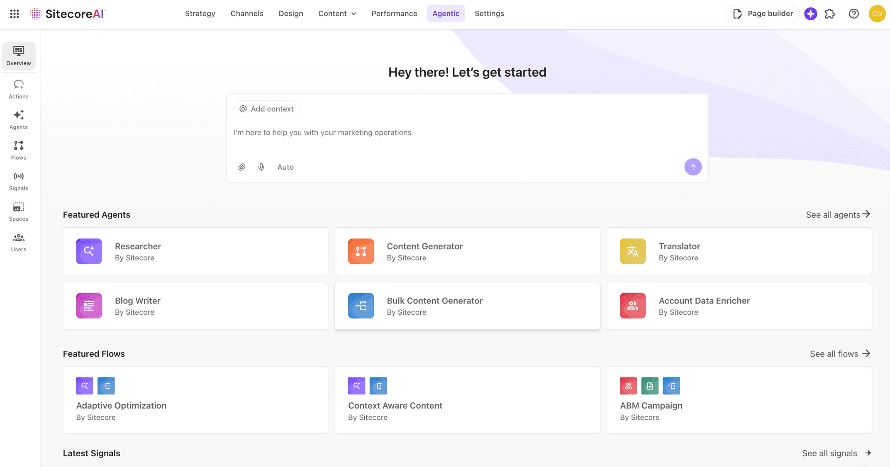
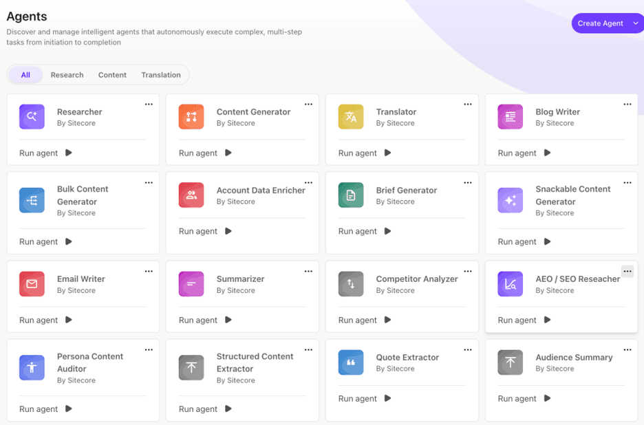
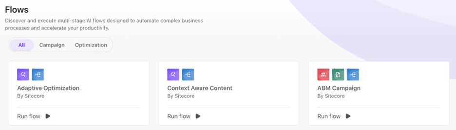
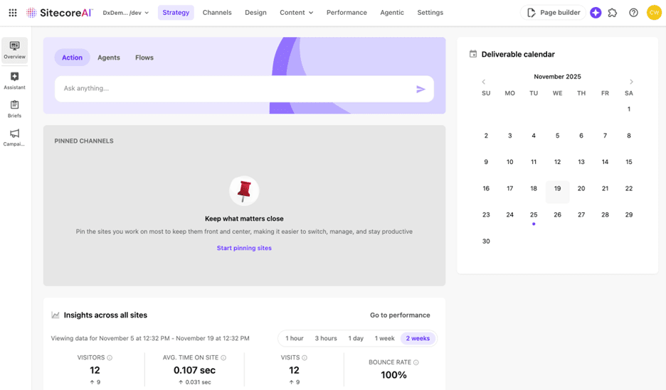
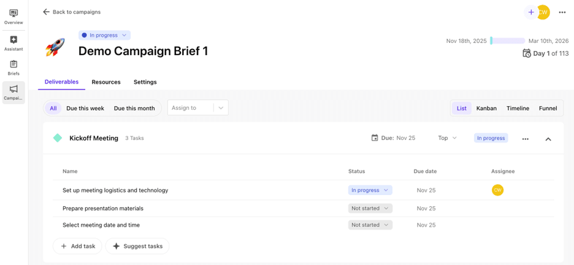

Sitecore Stream has changed. Not incrementally, but fundamentally. With the introduction of SitecoreAI, Stream no longer exists as a standalone product in the SaaS ecosystem. Its capabilities have been absorbed, expanded, and rebuilt inside an AI-native platform that now underpins the entire Sitecore experience.

If you’ve been using Stream, you need to rethink your mental model. Sitecore is no longer "adding AI" via Stream. SitecoreAI is a new architectural approach where AI is embedded across the platform, not layered on top.

## What Has Changed

- Stream continues only for XP and XM customers.
- In the XM Cloud world, Stream has been folded directly into SitecoreAI - an AI-native platform with agentic assistants, marketplace apps, and integrated project-orchestration capabilities, all built-in.
- Everything that once made up Stream Premium is now included by default in SitecoreAI packages.
- Stream Premium customers are transitioned automatically; Stream Free customers are uplifted to the same level.
- Stream-style AI features still surface in Content Hub, Search, CDP and XM Cloud, but XM Cloud itself is now part of SitecoreAI and those capabilities are native.

*In short*: "Sitecore Stream" survives only where XP and XM survive. Everywhere else, SitecoreAI replaces it entirely.

## Why this matters

Stream was a bolt-on AI productivity layer. SitecoreAI eliminates that separation. AI is now the operating model of the whole platform.

If you previously used Stream for content creation, optimisation, translation, workflow help, or light project management, those capabilities now live within Agentic Studio and the Strategy workspace.

## Agentic Studio: The New Operational Layer

### Actions

ChatGPT-style interactions, but contextualised with brand-kit content, file uploads, and grounding in your DXP instance.

### Agents

20 out-of-the-box agents covering content creation, translation, AEO/SEO, brief generation, compliance reviews, and more. They handle digital tasks end-to-end. The documentation is thin, but most of the expected use cases are represented.

Custom agent creation does exist - but in my testing, the experience was buggy and I couldn’t complete the process. The major use case missing from the agent library is large-scale content migration. Sitecore’s direction is clear here: Pathway, a separate tool, is the official answer.

Other obvious gaps include automated auditing of existing sites for accessibility, performance, content quality, readability, spelling and grammar.

### Flows

Flows combine multiple agents to perform multi-step tasks. At present there are only 3 flows and no way to build your own. This is likely to become one of the most important features as the platform matures.

The bigger opportunities for flows include:

- content migration directly into new components
- page-to-page transformation ("scrape → rebuild inside SitecoreAI")
- full optimisation cycles (analyse → recommend → generate variations → prepare tests)
- personalisation insights tied directly to analytics and journey drop-offs

The current flows are very marketing-centric and don’t do much for day-to-day website operations or administrators - but they show the direction of travel.

### Signals

Signals provide daily research insights based on prompts, topics, and industries you define. You get 3 insights per day. The "Action Signal" feature is supposed to recommend campaigns or responses - but it didn’t function in my testing.

Signals is still promising, because it brings structured discovery and competitive intelligence into the DXP workflow rather than relying on random LLM prompting.

I would like to see:

- multiple signals per project
- support for signal collections
- direct conversion from insight → campaign → tasks

### Brand Kits (now under Design)

Brand Kits now sit inside the Design section. Upload brand guidelines, tone documents, messaging rules, and SitecoreAI becomes brand-aware across every tool.

Initial tests worked, but I haven’t stress-tested whether more assets improve accuracy or whether a selective, curated kit produces better results. This will matter for large enterprises with inconsistent or overly complex brand documentation.

## Strategy: The Successor to Stream’s Project Workspace

The Strategy workspace is a structured orchestration layer connecting strategy → briefs → campaigns → tasks → execution. It is a clear evolution from Stream’s old project space.

### Brand Assistant

A brand-aware copilot that uses your brand kit to generate or refine content within your rules.

### Briefs

A structured way to capture objectives, audiences, channels, budgets, timing, and constraints. The brief becomes the anchor for campaign planning.

### Campaigns

Convert a brief directly into a campaign and all the key information transfers automatically. Campaigns include:

- deliverables
- tasks and owners
- due dates and priorities

with kanban and timeline views and AI assistance for generating or managing tasks.

This section of SitecoreAI is far more usable and aligned with existing real-world marketing workflows than anything in Stream. Tasks also appear throughout the SitecoreAI interface - for example on your project dashboards - which unifies planning and execution in a handy way.

I can see smaller digital teams running their entire DXP operations using SitecoreAI Strategy. It’s free, it’s structured, and the AI capability gives it more leverage than lightweight tools like Trello - while avoiding the overhead of Jira.

## What Stays the Same

The embedded AI features previously surfaced through Stream still behave the same across SitecoreAI, Content Hub, Search and CDP:

- content optimisation
- translation
- variation generation > AB Testing and Personalisation
- auto-tagging of images
- workflow acceleration

They’re now delivered through a unified AI framework instead of a separate Stream identity.

## Governance Changes

Stream stayed safely within your existing permissions and workflow rules. SitecoreAI does too - but agentic behaviour, especially as flows mature, introduces more variability. This increases the need for governance.

Expect:

- more variation in AI outputs
- stronger reliance on brand kits
- more human review
- clearer guardrails

This isn’t "AI chaos", but it is not set-and-forget. It’s the centaur model: human oversight plus AI acceleration.

This is where teams need clear ownership - people who stay on top of platform evolution and update internal procedures so everyone knows where and how these capabilities should be used.

## What Teams Should Do Now

1. Use structured components (briefs, campaigns) as your starting point - they map easily to how most digital teams already operate outside Sitecore, so the learning curve is minimal.
2. Treat agents and flows as accelerators, not autonomous decision-makers. Identify tasks where you need better speed or quality and tap into agent capability deliberately.
3. Expect custom agents, custom flows and signal-based orchestration to mature quickly. Over time, more of your workflow will be accelerated with less human effort - provided you supply clear inputs and outcomes.

## The Simple Takeaway

- Stream was your first taste of embedded AI.
- SitecoreAI is the full operating system.

<!-- markdownlint-disable MD033 -->
<aside class="about-the-author">
  Cade is a highly accomplished and experienced digital strategist and client services director with over 25 years’ experience in leadership and management of digital teams, client services, support & operations.
</aside>
<!-- markdownlint-enable MD033 -->
