Since Sitecore announced SitecoreAI Marketplace, I've been wondering what kind of useful extensions we can create. Extensions that actually increase our users day-to-day productivity or just make it easier for them to use it.

For a client I'm working for, I asked which software or tools the marketing department uses regularly. These were mentioned:

- Google Pagespeed
- Mouseflow - mainly for page heatmap functionality of certain pages on a website
- Atlassian Confluence for documentation
- their DAM environment to move images to their website

## Summary of this blog

We'll have a look at the Sitecore Marketplace and then delve into 3 solutions setup as a POC to show the kind of integrations that are possible. We'll also show some functionality of the product design system that Sitecore has in beta right now: blok.

## What are Sitecore Marketplace extensions?

Before diving into the created solutions, let me introduce you to what the Sitecore Marketplace actually is. You'll find all information on the well structured [Sitecore Developer documentation website](https://doc.sitecore.com/mp/en/developers/marketplace/introduction-to-sitecore-marketplace.html). So this section is more of a summary and if you know what it does, please [skip to the next heading](#my-challenge).

### General info

> Sitecore Marketplace is the home for extending and customizing Sitecore digital experience platform (DXP) products.

It is meant to add new capabilities to Sitecore. Something I as a developer have been missing for a few years since Sitecore XM Cloud was introduced.

The ability to be able to use custom fields again will really improve the overall flexibility of SitecoreAI.

### Extension points

There are 5 integration points:

- As a Standalone on the Cloud Portal dashboard
- 4 in SitecoreAI itself:
  - as full-screen;
  - in the Page builder context panel;
  - in the Page builder custom field;
  - or as a Dashboard widget.

### Getting started

A great resource for getting started with development is this introductory video by Rob Earlam: <https://www.youtube.com/watch?v=1LGvDLpp1wI>.

This video encapsulates the bare minimum you need to know about developing for the Sitecore Marketplace and will also explain the integration points.

For all examples below, I started from the [Marketplace Starter kit repository on GitHub](https://github.com/Sitecore/marketplace-starter) for my own app developments. It is easy to understand and will definitely kick-start your development as well.

* * *

## My challenge

I wanted to come up with a solution for at least 3 tools. Trying to integrate them into SitecoreAI. Even though not every integration will be fully optimized, the focus of this side project was bilateral: getting insights into working with the Marketplace starter kit and SDK and showcasing business & marketing that you can extend SitecoreAI easily. And on top of that, learning some react!

> **Warning:** I'm no react developer. I spent a lot of time trying and testing code, rewriting and searching on how to do things. I wanted to make it work first. Before getting worried about performance and optimization. Please bear this in mind when checking out code in this blog post.
> If you notice something that is blatantly wrong, or code that can be improved ... or just want to say hi; please reach out to me through [LinkedIn](https://www.linkedin.com/in/koenheye/).

I'm trying to provide useful information and I'm doing this by splitting things up in steps. This also helps me to document and structure this process. Especially since I really had to go back and forth with trial and error to get things to work.

## Only interested in the results?

Go to these sections:

- [Google Pagespeed integration summary](#google-pagespeed-integration-summary)
- [Mouseflow integration summary](#mouseflow-integration-summary)
- [Atlassian Confluence integration summary](#atlassian-confluence-integration-summary)
- [Overall conclusion](#overall-conclusion)

* * *

## Google PageSpeed Insights (PSI)

Regularly checking the performance of your website is something that should be done automatically.

I had several ideas for an integration. Since this was my first dabble around in what is possible, I looked at the easiest implementation.

Some of the ideas:

- request PageSpeed Insights **on demand**.
- have an **overview** of a few **key pages** with historical results
- ability to compare PageSpeed with different versions of a page (before / after result with published changes)

If you don't know Google PageSpeed, this is what it is:

> It is a free tool that analyzes the performance of a webpage on both mobile and desktop devices.  It provides a score, metrics, and actionable recommendations for improving a site's speed and user experience, using both real-world (field) data and lab data.
> \- [https://developers.google.com/speed/docs/insights/v5/about](https://developers.google.com/speed/docs/insights/v5/about)

I also recommended to have a look at the integration with Google Analytics provided by Sitecore. This also shows you a great example of how an integration can work!

- [https://github.com/Sitecore/marketplace-google-analytics](https://github.com/Sitecore/marketplace-google-analytics)
- [https://www.youtube.com/watch?v=DA07lRVfEqg](https://www.youtube.com/watch?v=DA07lRVfEqg&ref=koenheye.be)

For the Google PageSpeed integration, I used several blog posts describing how to use this and examples of the code were partially copied. Sources can be found at the bottom of this blog.

### Step 0: Extension point starter

We'll start from the integration point that lists data inside of the site dashboard: **dashboard-widget-extension**. Which currently lists Application context data.

### Step 1: Create API key from Google Cloud Console

Just follow the documentation on the Get-Started page of Google!

[Get Started with the PageSpeed Insights API | Google for Developers](https://developers.google.com/speed/docs/insights/v5/get-started)

1. Go to your [Google Cloud Console](https://console.cloud.google.com/?ref=library.linkbot.com).
2. Create a new project or select an existing one.
3. Navigate to the **APIs & Services** section.
4. Enable the **PageSpeed Insights API**.
5. Generate an API Key from the **Credentials** tab.

### Step 2: environment variable

Define the API key in the .env file:

```plaintext
PAGESPEED_API_KEY=your-API-key
```

### Step 3: define a type

We'll define an interface that can hold all the data we want to show on the page.

**File created: src/types/Metrics.ts**

```typescript
export interface Metrics {
  performance: number;
  accessibility: number;
  bestPractices: number;
  seo: number;
  fcp: string;
  lcp: string;
  tbt: string;
  cls: string;
}
```

### Step 4: define a component

A Function Component (FC) is what we'll use on the page to display our metrics data. Combined with the react chartjs 2 library for displaying the data in a nicer way.

**File created: src/components/metricschart.tsx**

We want to show the performance, accessibility, best practices and SEO as a bar chart. And the fcp, lcp, tbt, cls as a doughnut together with the results in a plain old unordered list.

```tsx
import { FC } from 'react';
import { Bar, Doughnut } from 'react-chartjs-2';
import { Metrics } from '../types/metrics';
import {
  Chart as ChartJS,
  CategoryScale,
  LinearScale,
  BarElement,
  ArcElement,
  Tooltip,
  Legend,
} from 'chart.js';

ChartJS.register(CategoryScale, LinearScale, BarElement, ArcElement, Tooltip, Legend);

interface Props {
  metrics: Metrics;
}

const MetricsChart: FC<Props> = ({ metrics }) => {
  return (
    <div style={{ display: 'flex', gap: '2rem', alignItems: 'flex-start' }}>
      <div style={{ flex: 1 }}>
        <Bar
          data={{
            labels: ['Performance', 'Accessibility', 'Best Practices', 'SEO'],
            datasets: [
              {
                label: 'Scores',
                data: [
                  metrics.performance,
                  metrics.accessibility,
                  metrics.bestPractices,
                  metrics.seo,
                ],
                backgroundColor: ['#4caf50', '#2196f3', '#ff9800', '#9c27b0'],
              },
            ],
          }}
          options={{ responsive: true, plugins: { legend: { display: false } } }}
        />
      </div>
        {/* <div style={{ marginTop: '2rem', display: 'flex', gap: '2rem' }}> */}
      <div style={{ flex: 1, height: '300px', width: '300px' }}>
        <Doughnut
          data={{
            labels: ['FCP', 'LCP', 'TBT', 'CLS'],
            datasets: [
              {
                data: [
                  parseFloat(metrics.fcp),
                  parseFloat(metrics.lcp),
                  parseFloat(metrics.tbt),
                  parseFloat(metrics.cls),
                ],
                backgroundColor: ['#03a9f4', '#e91e63', '#ffc107', '#8bc34a'],
              },
            ],
          }}
        />
        </div>
        <div style={{ flex: 1, height: '300px', width: '300px' }}>
        <ul>
          <li><strong>First Contentful Paint:</strong> {metrics.fcp}</li>
          <li><strong>Largest Contentful Paint:</strong> {metrics.lcp}</li>
          <li><strong>Total Blocking Time:</strong> {metrics.tbt}</li>
          <li><strong>Cumulative Layout Shift:</strong> {metrics.cls}</li>
        </ul>
      </div>
    </div>
  );
};

export default MetricsChart;
```

### Step 5: Define our server side API endpoint

We know what to display, but we do not have a way to fetch the data yet. Let's create the api endpoint on our react server that will call the Google PageSpeed api.

**File created: src/app/api/pagespeed/route.ts**

This route has a GET function that receives the url to seach for through the url passed in as querystring.

Some things you need to know about this code:

- We'll fetch the UrlSearchParams from the request (reg.url). And then get the url value. I'm repeating this here since it can be confusable. The route url that gets called will be for example this:
  https://localhost:3000/api/pagespeed?url=www.yoursite.com
  searchParams.get('url') will result in: www.yoursite.com in the const url.
- you can use console.log(API\_KEY) to verify that the key is getting fetched
- you need to specify what data you want to receive from PSI. That is why these querystring parameters are being passed: category=performance&category=accessibility&category=best-practices&category=seo\`

```typescript
// src/app/api/pagespeed/route.ts
import { NextRequest } from 'next/server';
import axios from 'axios';
import { Metrics } from '@/src/types/metrics';

export async function GET(req: NextRequest) {
  const { searchParams } = new URL(req.url);
  const url = searchParams.get('url');
  const API_KEY = process.env.PAGESPEED_API_KEY;

  if (!url) {
    return new Response(JSON.stringify({ error: 'Missing URL' }), { status: 400 });
  }

  try {
    const response = await axios.get(
      `https://www.googleapis.com/pagespeedonline/v5/runPagespeed?url=${encodeURIComponent(url)}&key=${API_KEY}&category=performance&category=accessibility&category=best-practices&category=seo`
    );

    const lighthouse = response.data.lighthouseResult.categories;
    const audits = response.data.lighthouseResult.audits;

    const metrics: Metrics = {
      performance: lighthouse.performance.score * 100,
      accessibility: lighthouse.accessibility.score * 100,
      bestPractices: lighthouse['best-practices'].score * 100,
      seo: lighthouse.seo.score * 100,
      fcp: audits['first-contentful-paint'].displayValue,
      lcp: audits['largest-contentful-paint'].displayValue,
      tbt: audits['total-blocking-time'].displayValue,
      cls: audits['cumulative-layout-shift'].displayValue,
    };

    return new Response(JSON.stringify(metrics), { status: 200 });
  } catch (error) {
    return new Response(JSON.stringify({ error: 'Failed to fetch PageSpeed data' }), { status: 500 });
  }
}
```

### Step 6: Bringing it all together

We need a page.tsx file to actually have our widget in SitecoreAI.

**Created file: src/app/dashboard-widget-pagespeed/page.tsx**

> To keep things as simple as possible for this first attempt of mine to use Sitecore Marketplace, I used an input field where you need to fill in the url of the website you want to have PageSpeed info on.
> This is definitely something that has room for improvement. Eg. fetch several pages each time dashboard is opened, report on progress in PageSpeed results (and store this data in Sitecore), mark a page as 'needs follow up' to see changes in published versions impact the pagespeed.

The code here is rather straightforward.
We have a handleFetchMetricsByUrl function that will call our api endpoint the the url parameter passed in from an input field.

And what we display is:

- a title
- input field
- button with an onClick registered to fetch data
- a MetricsChart component

```tsx
"use client";

import { useEffect, useState } from "react";
import { useMarketplaceClient } from "@/src/utils/hooks/useMarketplaceClient";
import { ApplicationContext } from "@sitecore-marketplace-sdk/client";

import MetricsChart from '../../components/metricschart';
import { Metrics } from '../../types/metrics';

export default function GooglePageSpeed() {
  const { client, isInitialized, error } = useMarketplaceClient();
  const [appContext, setAppContext] = useState<ApplicationContext>();

  const [url, setUrl] = useState<string>('');
  const [metrics, setMetrics] = useState<Metrics | null>(null);
  const [loading, setLoading] = useState(false);

  const handleFetchMetricsByUrl = async (url: string) => {
    setLoading(true);
    try {
      const response = await fetch(`api/pagespeed?url=${encodeURIComponent(url ?? "")}`);
      const data: Metrics = await response.json();
      console.log("In handleFetchMetricsByUrl", data)
      setMetrics(data);
    }
    catch(err){
      console.error('Error fetching metrics:', err);
    }
    finally{
      setLoading(false);
    }
  }

  useEffect(() => {
    if (!error && isInitialized && client) {
      console.log("Marketplace client initialized successfully.");
      // Make a query to retrieve the application context
      client.query("application.context")
        .then((res) => {
          console.log("Success retrieving application.context:", res.data);
          setAppContext(res.data);
        })
        .catch((error) => {
          console.error("Error retrieving application.context:", error);
        });
    } else if (error) {
      console.error("Error initializing Marketplace client:", error);
    }
  }, [client, error, isInitialized]);

  return (
    <div>
      <h1>📊 PageSpeed Insights Dashboard</h1>
      <input
        type="text"
        placeholder="Enter website URL"
        value={url}
        onChange={(e) => setUrl(e.target.value)}
        style={{ width: '300px', marginRight: '1rem' }}
      />
      <button onClick={() => handleFetchMetricsByUrl(url)}>Analyze</button>

      {metrics && <MetricsChart metrics={metrics} />}
    </div>
  );
}
```

### Google PageSpeed integration summary

I got an integration working with Google PageSpeed, allowing you to display some metrics. Which was the point, so I'm happy.

What can be improved:

- Results aren't saved (no history)
- I used an input field. This component could also be dependent on configuration in Sitecore to fetch the results from a fixed list of pages or can be manipulated with additional functionality in SitecoreAI.
- Perhaps use a different integration point to show results on a page detail as well.

#### Screenshots of working example

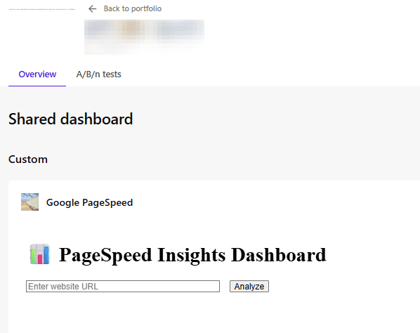

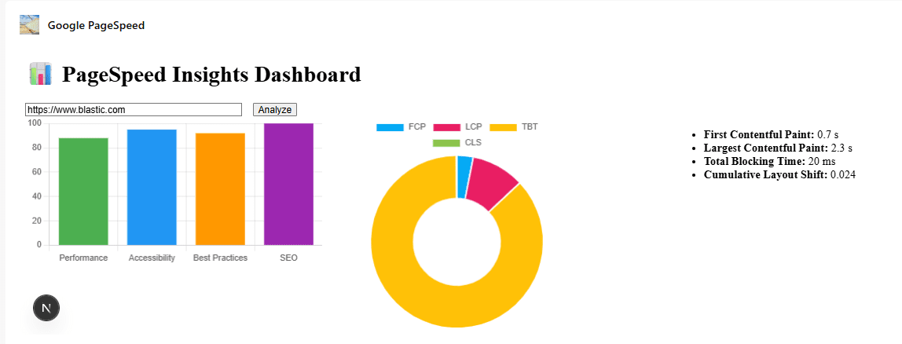

* * *

Mouseflow
---------

Mouseflow is a tool that our marketeers use for understanding heatmaps of pages to understand where users are clicking, scrolling or moving around on their website. [Have a look at their website to get more info.](https://mouseflow.com/)

Here is an example of a heatmap result. It measures visit time, engagement, clicks, render time, scroll time...

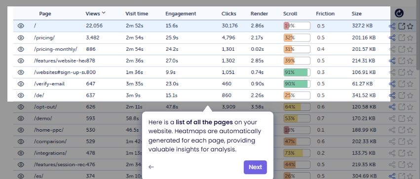

Now they have to log in into their platform to see the results. But it would be nice to have this integrated into SitecoreAI.

Providing a more direct loopback feed on how certain pages are performing.

### Step 0: Extension point starter

We'll be using the same extension point as the Google PageSpeed integration: **dashboard-widget-extension**

### Step 1: Create API key for Mouseflow

On the /settings/api page, you can generate an api key.

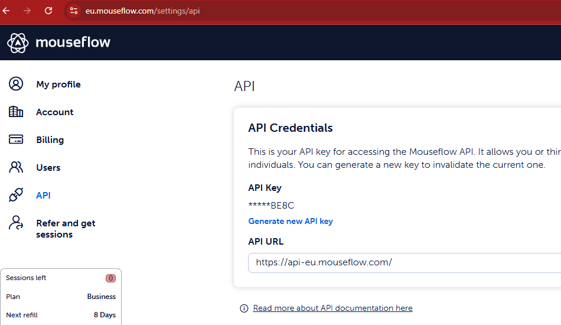

### Step 2: environment variable

I've configured 3 settings in the .env file for Mouseflow. We need the account email, the api key and a website identifier as found in the mouseflow environment.

```plaintext
MOUSEFLOW_EMAIL=your-email-account
MOUSEFLOW_API_KEY=your-api-key
MOUSEFLOW_WEBSITE_ID=your-mouseflow-website-id
```

For multisite setup in Sitecore, we should use a configuration item so that we can easily integrate across multiple websites.

### Step 3: define a type

We create an interface that will hold the data retrieved from Mouseflow for a specific page. This information was fetched from the documentation: [https://api-docs.mouseflow.com/#heatmaps](https://api-docs.mouseflow.com/#heatmaps)
Note that I didn't include all properties since I wanted to limit them.

**File created: src/types/HeatmapPage.ts**

```typescript
export interface HeatmapPage {
  displayUrl: string;
  views: number;
  visitTime: number; // in ms
  clicks: number;
  scroll: number; // percentage
  friction: number;
  size: number; // in bytes
}
```

### Step 4: define a component

The component will render our data in the application. I'm choosing for a basic table that will list the results.

**File created: src/components/HeatmapTable.ts**

We need 2 helper functions: formatTime and formatSize to display these properties correctly.

```tsx
'use client';

import { HeatmapPage } from '../types/heatmap';

interface Props {
  data: HeatmapPage[];
}

function formatTime(ms: number): string {
  const sec = Math.floor(ms / 1000);
  const min = Math.floor(sec / 60);
  const remSec = sec % 60;
  return min > 0 ? `${min}m ${remSec}s` : `${remSec}s`;
}

function formatSize(bytes: number): string {
  return bytes > 1024 * 1024
    ? `${(bytes / (1024 * 1024)).toFixed(2)} MB`
    : `${(bytes / 1024).toFixed(2)} KB`;
}

export default function HeatmapTable({ data }: Props) {
  return (
    <table style={{ width: '100%', borderCollapse: 'collapse', marginTop: '2rem' }}>
      <thead>
        <tr>
          <th>Page</th>
          <th>Views</th>
          <th>Visit Time</th>
          <th>Click</th>
          <th>Scroll</th>
          <th>Friction</th>
          <th>Size</th>
        </tr>
      </thead>
      <tbody>
        {data.map((page, idx) => (
          <tr key={idx}>
            <td>{page.displayUrl}</td>
            <td>{page.views}</td>
            <td>{formatTime(page.visitTime)}</td>
            <td>{page.clicks}</td>
            <td>{page.scroll}%</td>
            <td>{page.friction}</td>
            <td>{formatSize(page.size)}</td>
          </tr>
        ))}
      </tbody>
    </table>
  );
}
```

### Step 5: Define our server side API endpoint

For calling the Mouseflow api, we use a server side route: /api/mouseflow

**File created: src/app/api/mouseflow/route.ts**

This route will:

- build the authentication base 64 string
- call the Mouseflow api endpoint /pagelist
- convert the response into a HeatmapPage array: HeatmapPage\[\] = data.pages.map

```typescript
// src/app/api/heatmaps/route.ts
import { NextRequest } from 'next/server';
import { HeatmapPage } from '@/src/types/heatmap';

export async function GET(req: NextRequest) {
  const API_ENDPOINT = 'https://api-eu.mouseflow.com/websites';
  const auth = Buffer.from(`${process.env.MOUSEFLOW_EMAIL}:${process.env.MOUSEFLOW_API_KEY}`).toString('base64');

  try {
    const res = await fetch(`${API_ENDPOINT}/${process.env.MOUSEFLOW_WEBSITE_ID}/pagelist`, {
      headers: {
        Authorization: `Basic ${auth}`,
      },
    });

    if (!res.ok) throw new Error('Mouseflow API error');

    const data = await res.json();
    const pages: HeatmapPage[] = data.pages.map((page: any) => ({
      displayUrl: page.displayUrl,
      views: page.views,
      visitTime: page.visitTime,
      clicks: page.clicks,
      scroll: page.scroll,
      friction: page.friction,
      size: page.size,
    }));

    return new Response(JSON.stringify(pages), { status: 200 });
  } catch (err) {
    return new Response(JSON.stringify({ error: 'Failed to fetch heatmaps' }), { status: 500 });
  }
}
```

### Step 6: Bringing it all together

Again, for we'll always need a page.tsx file to have our widget in SitecoreAI.

**Created file: src/app/dashboard-widget-mouseflow/page.tsx**

We import our component HeatmapTable and our type HeatmapPage.
And we'll add a HeatmapPage array to our state.

We call our server side api endpoint to fetch the heatmap data:

```typescript
fetch('/api/mouseflow').then((res) => res.json().then((data) => setHeatmapData(data)));
```

And we pass that data to our component:

```tsx
<h1>🔥 Heatmaps</h1>
<HeatmapTable data={heatmapData} />
```

Full code sample:

```tsx
"use client";

import { useEffect, useState } from "react";
import { useMarketplaceClient } from "@/src/utils/hooks/useMarketplaceClient";
import { ApplicationContext } from "@sitecore-marketplace-sdk/client";

import HeatmapTable from '../../components/heatmaptable';
import { HeatmapPage } from "@/src/types/heatmap";

function DashboardWidget() {
  const { client, isInitialized, error } = useMarketplaceClient();
  const [appContext, setAppContext] = useState<ApplicationContext>();
  const [heatmapData, setHeatmapData] = useState<HeatmapPage[]>([]);

  useEffect(() => {
    if (!error && isInitialized && client) {
      console.log("Marketplace client initialized successfully.");
      // Make a query to retrieve the application context
      client.query("application.context")
        .then((res) => {
          console.log("Success retrieving application.context:", res.data);
          setAppContext(res.data);
        })
        .catch((error) => {
          console.error("Error retrieving application.context:", error);
        });

        fetch('/api/mouseflow').then((res) => res.json().then((data) => setHeatmapData(data)));

    } else if (error) {
      console.error("Error initializing Marketplace client:", error);
    }
  }, [client, error, isInitialized]);

  return (
    <div>
      {isInitialized ? (
        <>
        <h1>🔥 Heatmaps</h1>
        <HeatmapTable data={heatmapData} />
        </>
      ) : (
        <p>Loading widget...</p>
      )}
      {error && <p style={{ color: "red" }}>Error: {String(error)}</p>}
    </div>
  );
}

export default DashboardWidget;
```

### Mouseflow integration summary

This setup was much easier than the Google PageSpeed one since I already had that working. And basically the same steps were necessary for Mouseflow. It does help that their documentation is very clear as well.

What can be improved:

- move mouseflow website id to a Sitecore configuration template & item
- better and modern styling
- I need some input on what data is most useful and needed by our marketeers to know exactly which data they need.

#### Screenshots of working example

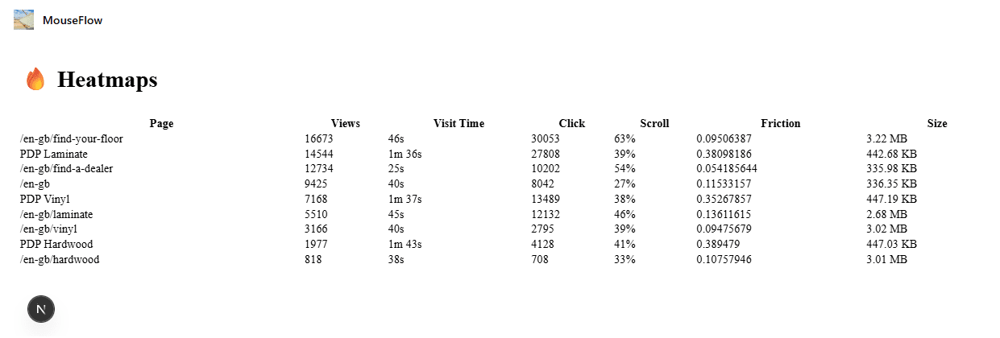

#### Bonus styling update

I asked Copilot for help on styling the results. So I don't want to take any credit on this at all.

Prompt:

```plaintext
I have this integration in react for displaying data from the Mouseflow api found here: https://api-docs.mouseflow.com/#heatmap-page-list
I want to know how to enhance the display of the rendered table. Since this is a bit boring right now and only contains text. Can this be enriched for example with:
- icon for lowest visit time
- icon for lowest click
- a 0 to 100% bar with the number for scroll information
- icon for lowest friction
- icon for highest size
```

Which resulted in an updated components/heatmaptable.tsx file. No other changes were needed. It does include inline css styling though.

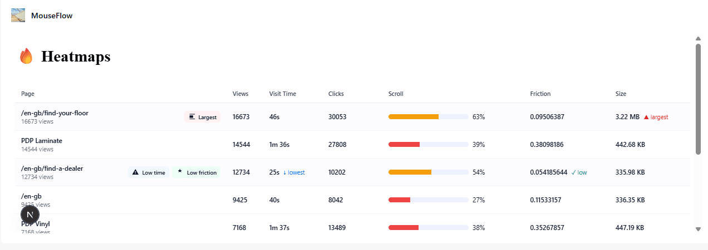

```tsx
// components/heatmaptable.tsx
'use client';

import React, { useMemo } from 'react';
import { HeatmapPage } from '../types/heatmap';

interface Props {
  data: HeatmapPage[];
}

function formatTime(ms: number): string {
  const sec = Math.floor(ms / 1000);
  const min = Math.floor(sec / 60);
  const remSec = sec % 60;
  return min > 0 ? `${min}m ${remSec}s` : `${remSec}s`;
}

function formatSize(bytes: number): string {
  return bytes > 1024 * 1024
    ? `${(bytes / (1024 * 1024)).toFixed(2)} MB`
    : `${(bytes / 1024).toFixed(2)} KB`;
}

/* Small inline SVG icons */
const IconTrophy = ({ title = 'Best' }: { title?: string }) => (
  <svg width="16" height="16" viewBox="0 0 24 24" aria-hidden focusable="false" role="img" title={title}>
    <path fill="currentColor" d="M12 2l1.5 4.5L18 7l-3 2 1 4-4-2-4 2 1-4-3-2 4.5-.5L12 2z" />
  </svg>
);

const IconWarning = ({ title = 'Lowest' }: { title?: string }) => (
  <svg width="14" height="14" viewBox="0 0 24 24" aria-hidden focusable="false" role="img" title={title}>
    <path fill="currentColor" d="M1 21h22L12 2 1 21zm13-3h-4v-2h4v2zm0-4h-4v-4h4v4z" />
  </svg>
);

const IconSize = ({ title = 'Largest' }: { title?: string }) => (
  <svg width="14" height="14" viewBox="0 0 24 24" aria-hidden focusable="false" role="img" title={title}>
    <path fill="currentColor" d="M3 3h18v2H3V3zm0 16h18v2H3v-2zM3 8h12v8H3V8z" />
  </svg>
);

/* Styles kept inline for simplicity and encapsulation */
const tableStyle: React.CSSProperties = {
  width: '100%',
  borderCollapse: 'collapse',
  marginTop: '1rem',
  fontFamily: 'Inter, ui-sans-serif, system-ui, -apple-system, "Segoe UI", Roboto, "Helvetica Neue", Arial',
  fontSize: 13,
  color: '#0f172a',
};

const thStyle: React.CSSProperties = {
  textAlign: 'left',
  padding: '10px 12px',
  borderBottom: '1px solid #e6e9ef',
  fontWeight: 600,
  fontSize: 12,
  color: '#334155',
};

const tdStyle: React.CSSProperties = {
  padding: '10px 12px',
  borderBottom: '1px solid #f1f5f9',
  verticalAlign: 'middle',
};

const smallMuted: React.CSSProperties = {
  fontSize: 12,
  color: '#667085',
};

const badgeStyle = (bg: string): React.CSSProperties => ({
  display: 'inline-flex',
  alignItems: 'center',
  gap: 6,
  background: bg,
  color: '#021124',
  padding: '4px 8px',
  borderRadius: 6,
  fontSize: 12,
  fontWeight: 600,
});

/* Scroll bar component */
function ScrollBar({ value }: { value: number }) {
  const clamped = Math.max(0, Math.min(100, Math.round(value)));
  const trackStyle: React.CSSProperties = {
    height: 10,
    background: '#eef2ff',
    borderRadius: 999,
    overflow: 'hidden',
    width: 160,
    display: 'inline-block',
    verticalAlign: 'middle',
    marginRight: 8,
  };
  const fillStyle: React.CSSProperties = {
    width: `${clamped}%`,
    height: '100%',
    background: clamped > 75 ? '#16a34a' : clamped > 40 ? '#f59e0b' : '#ef4444',
    transition: 'width 300ms ease',
  };
  return (
    <div style={{ display: 'flex', alignItems: 'center' }}>
      <div style={trackStyle} aria-hidden>
        <div style={fillStyle} />
      </div>
      <div style={{ fontVariantNumeric: 'tabular-nums', minWidth: 36 }}>{clamped}%</div>
    </div>
  );
}

export default function HeatmapTable({ data }: Props) {
  const stats = useMemo(() => {
    if (!data || data.length === 0) return null;
    // compute mins and maxes
    let minVisit = data[0], minClicks = data[0], minFriction = data[0], maxSize = data[0];
    for (const p of data) {
      if (p.visitTime < minVisit.visitTime) minVisit = p;
      if (p.clicks < minClicks.clicks) minClicks = p;
      if (p.friction < minFriction.friction) minFriction = p;
      if (p.size > maxSize.size) maxSize = p;
    }
    return {
      minVisitUrl: minVisit.displayUrl,
      minClicksUrl: minClicks.displayUrl,
      minFrictionUrl: minFriction.displayUrl,
      maxSizeUrl: maxSize.displayUrl,
    };
  }, [data]);

  return (
    <div style={{ overflowX: 'auto' }}>
      <table style={tableStyle} role="table" aria-label="Mouseflow heatmap summary">
        <thead>
          <tr>
            <th style={thStyle}>Page</th>
            <th style={thStyle}>Views</th>
            <th style={thStyle}>Visit Time</th>
            <th style={thStyle}>Clicks</th>
            <th style={thStyle}>Scroll</th>
            <th style={thStyle}>Friction</th>
            <th style={thStyle}>Size</th>
          </tr>
        </thead>

        <tbody>
          {data.map((page, idx) => {
            const isMinVisit = stats?.minVisitUrl === page.displayUrl;
            const isMinClicks = stats?.minClicksUrl === page.displayUrl;
            const isMinFriction = stats?.minFrictionUrl === page.displayUrl;
            const isMaxSize = stats?.maxSizeUrl === page.displayUrl;

            const rowHighlight: React.CSSProperties = {
              background: isMinVisit || isMinClicks || isMinFriction || isMaxSize ? '#fcfcfe' : 'transparent',
            };

            return (
              <tr key={idx} style={rowHighlight}>
                <td style={{ ...tdStyle, minWidth: 220 }}>
                  <div style={{ display: 'flex', gap: 8, alignItems: 'center' }}>
                    <div style={{ flex: 1 }}>
                      <div style={{ fontWeight: 600 }}>{page.displayUrl}</div>
                      <div style={smallMuted}>{page.views} views</div>
                    </div>

                    <div style={{ display: 'flex', gap: 6, alignItems: 'center' }}>
                      {isMinVisit && (
                        <div title="Lowest average visit time" style={badgeStyle('#f0f9ff')}>
                          <IconWarning /> <span style={{ fontSize: 11 }}>Low time</span>
                        </div>
                      )}
                      {isMinClicks && (
                        <div title="Lowest clicks" style={badgeStyle('#fff7ed')}>
                          <IconWarning /> <span style={{ fontSize: 11 }}>Low clicks</span>
                        </div>
                      )}
                      {isMinFriction && (
                        <div title="Lowest friction" style={badgeStyle('#ecfdf5')}>
                          <IconTrophy /> <span style={{ fontSize: 11 }}>Low friction</span>
                        </div>
                      )}
                      {isMaxSize && (
                        <div title="Largest size" style={badgeStyle('#fff1f2')}>
                          <IconSize /> <span style={{ fontSize: 11 }}>Largest</span>
                        </div>
                      )}
                    </div>
                  </div>
                </td>

                <td style={tdStyle}>
                  <div style={{ fontWeight: 600 }}>{page.views}</div>
                </td>

                <td style={tdStyle}>
                  <div style={{ display: 'flex', alignItems: 'center', gap: 8 }}>
                    <div style={{ fontWeight: 600 }}>{formatTime(page.visitTime)}</div>
                    {isMinVisit && <div style={{ color: '#0b69ff', fontSize: 12 }}>↓ lowest</div>}
                  </div>
                </td>

                <td style={tdStyle}>
                  <div style={{ display: 'flex', alignItems: 'center', gap: 8 }}>
                    <div style={{ fontWeight: 600 }}>{page.clicks}</div>
                    {isMinClicks && <div style={{ color: '#b45309', fontSize: 12 }}>↓ lowest</div>}
                  </div>
                </td>

                <td style={tdStyle}>
                  <ScrollBar value={page.scroll} />
                </td>

                <td style={tdStyle}>
                  <div style={{ display: 'flex', alignItems: 'center', gap: 8 }}>
                    <div style={{ fontWeight: 600 }}>{page.friction}</div>
                    {isMinFriction && <div style={{ color: '#059669', fontSize: 12 }}>✓ low</div>}
                  </div>
                </td>

                <td style={tdStyle}>
                  <div style={{ display: 'flex', alignItems: 'center', gap: 8 }}>
                    <div style={{ fontWeight: 600 }}>{formatSize(page.size)}</div>
                    {isMaxSize && <div style={{ color: '#dc2626', fontSize: 12 }}>▲ largest</div>}
                  </div>
                </td>
              </tr>
            );
          })}
        </tbody>
      </table>

      {data.length === 0 && (
        <div style={{ marginTop: 12, color: '#667085' }}>No heatmap pages available</div>
      )}
    </div>
  );
}
```

* * *

Atlassian Confluence
--------------------

Alright, how about this beautiful use-case. Our client keeps documentation in Confluence for all their internal applications. And are using it to explain the usage of Sitecore and their very **business specific** components and fields.

What if we can integrate Confluence inside of the Pages editor?
You can directly get feedback on the component, get information on use-cases or best practises inside of SitecoreAI.

For this integration we'll need 2 major things:

- get information on a component from Sitecore
- use that information to call Atlassian API's to fetch page links or even page content from a specific Confluence environment.

### Get component information

I really wanted to have an integration point inside of a selected component rendering. But currently there is no extension point available to add this functionality. Perhaps the ability to add an additional pill next to Content & Design called Documentation could be a solution.

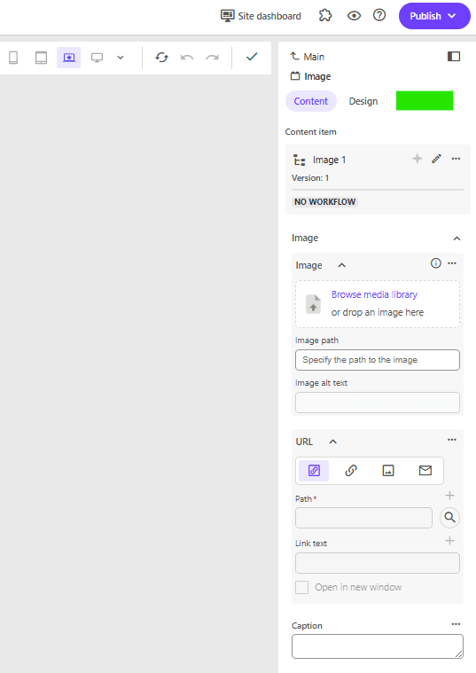

But then again, the space in general on the right-side panel is rather limited. Maybe its better to use the extension point for page builder content panel.

The other existing option - to use a custom field - would make the template setup overly complex and would use redundant fields only needed for the Pages. So that is a no-go.

### Step 0: Extension point starter

We'll start from the integration point that lists data inside of a page context panel: **pages-contextpanel-extension**. Which currently lists Application context and Pages context data.

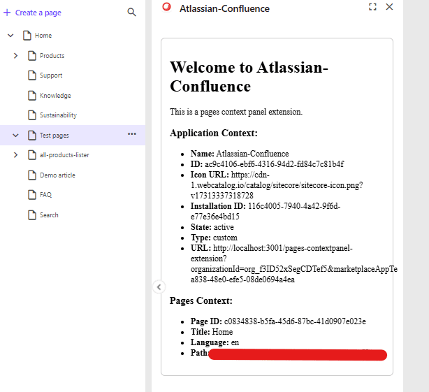

### Step 1: Get the layout details from the PageContext

Easy, you have the pages context, you can get the presentation details and know all the components that this page will render.

```tsx
<li><strong>PresentationDetails:</strong> {pagesContext.pageInfo?.presentationDetails}</li>
```

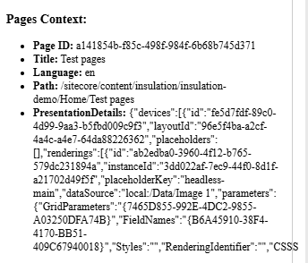

You can also find the presentation details in the console. Since the starter kit logs the full object.

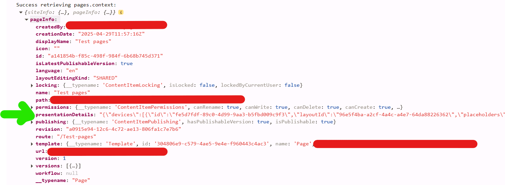

### Step 2: Filter out rendering ids

So we have our presentation details, lets get all the unique rendering ids from the page.

I created a util class which receives the pagePresentationDetails, parses it and creates a flat list of rendering ids.

```typescript
// utils/xmcloud/getUniqueRenderingIds.ts
export const getUniqueRenderingIds = (pagePresentationDetails: any): string[] => {
  const jsonPagePresentationDetails = JSON.parse(pagePresentationDetails);
  const renderings = jsonPagePresentationDetails?.devices?.flatMap((device: any) => device.renderings || []);
  //Use Set to get unique values
  return Array.from(new Set(renderings?.map((r: any) => r.id)));
};
```

Possible optimizations: only fetch renderings from specific placeholders or exclude some renderings with specific paths.

Changes made to the page.tsx file:

```tsx
// add import of util
import { getUniqueRenderingIds } from "@/src/utils/xmcloud/getUniqueRenderingIds";

...
// define constant in: function PagesContextPanel()
const [renderings, setRenderings] = useState<string[]>();

...
// in useEffect() after the setPagesContext, call the getUniqueRenderingIds function.
setPagesContext(res);

// get renderingids from the presentationdetails setRenderings(getUniqueRenderingIds(res.pageInfo?.presentationDetails));
```

And to see something visual, I added this section:

```tsx
<div className="renderings">
  <h3>Renderings:</h3>
  <ul>
  {
    renderings?.map((item) => <li key={item}>{item}</li>)
  }
  </ul>
</div>
```

Above code, will then transform the presentation details to something useful.

```json
{
  "devices": [{
    "id": "fe5d7fdf-89c0-4d99-9aa3-b5fbd009c9f3",
    "layoutId": "96e5f4ba-a2cf-4a4c-a4e7-64da88226362",
    "placeholders": [],
    "renderings": [{
      "id": "ab2edba0-3960-4f12-b765-579dc231894a",
      "instanceId": "3dd022af-7ec9-44f0-8d1f-a21702d49f5f",
      "placeholderKey": "headless-main",
      "dataSource": "local:/Data/Image 1",
      "parameters": {
        "GridParameters": "{7465D855-992E-4DC2-9855-A03250DFA74B}",
        "FieldNames": "{B6A45910-38F4-4170-BB51-409C67940018}",
        "Styles": "",
        "RenderingIdentifier": "",
        "CSSStyles": "",
        "DynamicPlaceholderId": "1"
      }
    }]
  }]
}
```

Result for the json above:

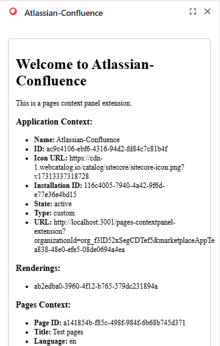

Or when you have more renderings on a page, the list can look like this:


### Step 3: Use ClientSDK to fetch component information

Now that we have our rendering id, lets call the Sitecore Authoring api to fetch more info about the component. I need the **name** of the Sitecore Component to be able to call Atlassian to get a page.

We do this by leveraging the GraphQL ClientSDK.

The advantage of a Marketplace app, is that you can use the Marketplace SDK without explicitly authenticating. Since you are running the app inside SitecoreAI itself. This makes it a lot easier to just utilize the SDK and the available functionalities that Sitecore brings.

> Make queries to the [Authoring and Management GraphQL API](https://doc.sitecore.com/xmc/en/developers/xm-cloud/sitecore-authoring-and-management-graphql-api.html) to manage Sitecore content directly from your Marketplace app.

#### Add utility class to fetch data

I created the file: utils/authoring-client-sdk/fetchItemData.ts

It's job is clear, we call the Authoring api to get data from Sitecore.

This file contains 2 major items:

- buildGraphQlGetItemQuery, feed it the itemId to set it in the query.
  You can tweak the fields you want to receive as well.
- fetchSitecoreRenderingName function, which received the itemId, clientSDK and appContext.

```typescript
import { ClientSDK } from "@sitecore-marketplace-sdk/client";

//test
const graphQLQuery = {
  query: `query { sites { name } }`,
};

function buildGraphQLGetItemQuery(itemId: string): { query: string } {
  return {
    query: `query {
      item(
        where: {
          database: "master",
          itemId: "${itemId}"
        }
      ) {
        itemId
        name
        path
        fields(ownFields: true, excludeStandardFields: true) {
          nodes {
            name
            value
          }
        }
      }
    }`,
  };
}

export async function fetchSitecoreRenderingName(
  itemId: string | null,
  client: ClientSDK | null,
  appContext: any
): Promise<any | null> {
  const sitecoreContextId = appContext?.resourceAccess?.[0]?.context?.preview;

  if (!sitecoreContextId) {
    console.error("Sitecore Context ID not found in application context. Make sure your app is configured to use the APIs.");
    return null;
  }

  if (!itemId || !client) {
    console.error("Missing itemId for GraphQL query.");
    return null;
  }

  if (!client) {
    console.error("Missing client for GraphQL query.");
    return null;
  }

  const graphQLQuery = buildGraphQLGetItemQuery(itemId);

  try {
    const response = await client?.mutate("xmc.authoring.graphql", {
      params: {
        query: { sitecoreContextId },
        body: graphQLQuery,
      },
    });

    console.log("GraphQL called", response);
    return response.data?.data?.item;
  } catch (error) {
    console.error("GraphQL query failed:", error);
    return null;
  }
}
```

#### Call utility class to fetch rendering name

I had defined a string array first for the renderings. And changed this to an interface first. File: interfaces/pageComponents.ts

```typescript
export interface PageComponent {
    id: string;
    name?: string;
}
```

Further changes made to the page.tsx file

- hasFetchedNames to prevent calling api constantly, use a boolean to indicate we've already fetched what we need
- we use a Promise.all on pageComponents to loop them all and to update the values after every single fetchSitecoreRenderingName completed.

```tsx
  const [pageComponents, setPageComponents] = useState<PageComponent[]>(); //renamed from renderings
  const [hasFetchedNames, setHasFetchedNames] = useState(false);

// Call fetchSitecoreRenderingName when both contexts are ready
  useEffect(() => {
    if (client && appContext && pagesContext && pageComponents?.length && !hasFetchedNames) {
      Promise.all(
        pageComponents.map(async (pageComponent) => {
          try {
            const item = await fetchSitecoreRenderingName(pageComponent.id, client, appContext);
            return { ...pageComponent, name: item.name };
          } catch (err) {
            console.error("Error fetching rendering name:", err);
            return pageComponent; // fallback to original if error
          }
        })
      ).then((updatedComponents) => {
        setHasFetchedNames(true); // prevent from getting in endless loop and keep calling the fetch method
        setPageComponents(updatedComponents); // update the pageComponents array with new values that include name
      });
    }
  }, [client, appContext, pagesContext, pageComponents]);
```

I also updated the html output, which now reflects the component name as well.

```tsx
<div className="page-components">
  <h3>PageComponents:</h3>
  <ul>
  {
    pageComponents?.map((item) => <li key={item.id}>{item.id} - {item.name ?? "unknown"}</li>)
  }
  </ul>
</div>
```

Result:

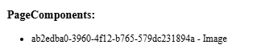

### Step 4: Implement a call to the Atlassian Confluence API

Now comes the fun part, we want to fetch content from Atlassian and show it in SitecoreAI.

#### Atlassian preparation - create API token

There are multiple ways to authenticate with Atlassian. I created an API token with full scope. Tried first with limited scope but had too many issues when calling the API through Postman myself.

So, create an API token: [https://id.atlassian.com/manage-profile/security/api-tokens](https://id.atlassian.com/manage-profile/security/api-tokens)
Name of my token: sitecore\_xmcloud\_full

Remember of converting your api token to base64 as described in the documentation.

Drawback: api tokens expire and will need to be renewed. A better option could be to use user authentication.

> Again, this is meant to be a proof of concept. I want to show data from Atlassian Confluence in Sitecore. And the focus was on this integration.
> I intentionally created some dependencies

#### Server route to call Atlassian Confluence API

We define a server route which can call the Atlassian API:

```typescript
// src/app/api/confluence/route.ts
import { NextRequest } from 'next/server';

export async function GET(req: NextRequest) {
  const pageTitle = req.nextUrl.searchParams.get('pageTitle'); // https://stackoverflow.com/questions/70272983/how-do-i-get-query-string-params-in-nextjs-middleware
  //console.log(pageTitle);
  const username = "your-email";
  const password = "your-base64-api-token";
  const api_endpoint = `https://your-domain.atlassian.net/wiki/api/v2/pages?body-format=storage&title=${encodeURIComponent(pageTitle ?? "")}`;
  //warning: we're currently looking for an EXACT match
  const auth = Buffer.from(`${username}:${password}`).toString('base64');

  try {
    const res = await fetch(`${api_endpoint}`, {
      headers: {
        Authorization: `Basic ${auth}`,
        Accept: "application/json",
      },
    });

    if (!res.ok) throw new Error('Atlassian API error');

    const data = await res.json();

    //console.log(data);

    return new Response(JSON.stringify(data), { status: 200 });
  } catch (err) {
    return new Response(JSON.stringify({ error: 'Failed to fetch page data' }), { status: 500 });
  }
}
```

- console.log is usefull 😄
- be aware that we're looking for an EXACT match to the title

We're leveraging the Confluence REST v2 API: [https://developer.atlassian.com/cloud/confluence/rest/v2/api-group-page/#api-pages-get](https://developer.atlassian.com/cloud/confluence/rest/v2/api-group-page/#api-pages-get)

#### Changes to the page.tsx

Right now, I just want to dump the response. Let's try to get data from Atlassian on our screen!

Constant to call our server api route:

```typescript
const handleFetchConfluencePageByTitle = async (title: string) => {
  const response = await fetch(`api/confluence?pageTitle=${encodeURIComponent(title ?? "")}`);
    setConfluencePageData(await response.json());
}
```

I've modified the PageComponents section, it now also renders buttons. And an onClick event is linked to call the handleFetchConfluencePageByTitle method.

```tsx
<div className="page-components">
            <h3>PageComponents:</h3>
            <ul>
              {
                pageComponents?.map((item) => <li key={item.id}>{item.id} - {item.name ?? "unknown"}</li>)
              }
            </ul>
            {
              pageComponents?.map((item) => <button key={item.id} onClick={() => handleFetchConfluencePageByTitle(item.name ?? "")}>{item.name}</button>)
            }
          </div>
          <div className="confluence-page-data">
            <h3>Confluence Page Data:</h3>
            <div>
              {
                // just dump everything
                JSON.stringify(confluencePageData)
              }
            </div>
          </div>
```

#### Intermediate result

> I know it isn't pretty! But read further, it improves a bit.

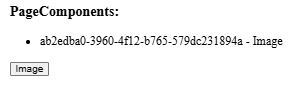

And after clicking the button:

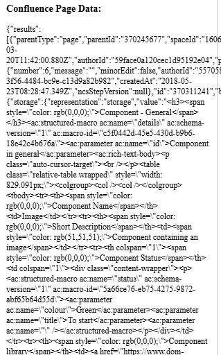

### Step 5: Your marketplace app - making it prettier

Lets use blok.sitecore.com, the new Product Design Library of Sitecore to visualize data.

> **Build better products faster**
> Blok is Sitecore's product design system: the UI framework and style guide we use to build great apps. It's publicly available, so that anyone can easily build software in the Sitecore product design language.

blok is based on shadcn, a design system with components that you can customize and extend. Important to know is that shadcn is NOT a component library. It is how you build your component library.

Lets add it to our project. Documentation says to just add this:

```bash
npx shadcn@latest add https://blok-shadcn.vercel.app/r/blok-components.json
```

But I got an error saying that Tailwindcss was not installed.

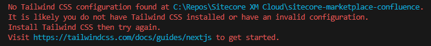

To install tailwind, follow the steps described on the [Tailwindcss website](https://tailwindcss.com/docs/installation/framework-guides/nextjs).
In short:

- npm install tailwindcss #tailwindcss/postcss postcss
- Add postcss.config.mjs
- Add /src/app/globals.css

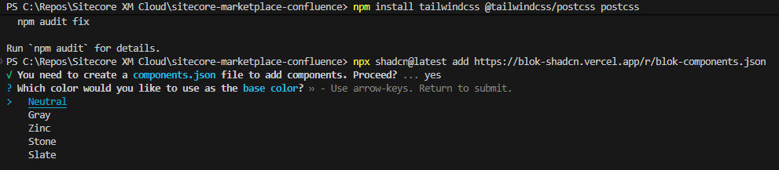

And of course, you have to import the styling as well. Otherwise your components will just not be styled. And all components that you want to use.

```typescript
import '/src/app/globals.css'
import { Button } from "@/components/ui/button"
```

Modify your code to use the shadcn components and your app will be using the look & feel of SitecoreAI. After some further tweaks, I got this result:

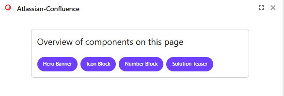

### Step 6: Atlassian - making it prettier

> I was expecting this bit to be easier. I read about react packages being available before starting on this implementation. Alas, I was in uncharted territory and had to improvise to make this implementation work somewhat.

#### First attempt

We'll start by importing the npm install @atlaskit/renderer. Unfortunately Atlassian supports React 18. While the marketplace app is running 19.
[https://community.developer.atlassian.com/t/react-19-support-for-atlaskit-components/92166/5](https://community.developer.atlassian.com/t/react-19-support-for-atlaskit-components/92166/5)

I tried with running --legacy-peer-deps, but I kept getting issues with the package. And couldn't use the renderer component from the @atlaskit module.

```bash
npm install @atlaskit/renderer --legacy-peer-deps
```

#### Second attempt

I searched the internet for libraries and documentation. But the search call I'm making towards Atlassian will only return the page data in 'storage' or 'atlas\_doc\_format'. I was not able to convert these formats to HTML.

#### Third attempt

We can make an additional call towards Confluence. A page specific one which does return html.

```bash
GET https://your-domain.atlassian.net/wiki/rest/api/content/{pageId}?expand=body.view
```

> I didn't work this out further. Main reason was time-constraints. I spent already a lot of time getting to this point.
> Which is why I tested this call in Postman, and included the result directly as a test in my app.

### Step 7: Another change - return only data we need

Returning only data you need from the route call.

- created an interface:

```typescript
interface ConfluencePageSummary {
  id: string;
  title: string;
  webui: string;
}
```

- changed the **route.ts** to return this data:

```typescript
function extractConfluencePageSummary(apiResponse: any): ConfluencePageSummary | null {
  const baseUrl = apiResponse._links?.base || "";

  const first = apiResponse.results?.[0];
  if (!first) return null;

  return {
    id: first.id,
    title: first.title,
    webui: `${baseUrl}${first._links?.webui}`,
  };
}
```

- updated the corresponding return statement:

```typescript
return new Response(JSON.stringify(extractConfluencePageSummary(data)), { status: 200 });
```

- Changes to the page.tsx -> updated handleFetchConfluencePageByTitle

```typescript
  const handleFetchConfluencePageByTitle = async (title: string) => {
    const response = await fetch(`api/confluence?pageTitle=${encodeURIComponent(title ?? "")}`);
    const data: ConfluencePageSummary = await response.json();
    setConfluencePageData(data);
  }
```

### Atlassian Confluence integration summary

What works:

- I'm listing the components on the page separately
- Details for each component can be fetched and displayed
- Link can be displayed to the documentation page

What doesn't work:

- You can call the confluence page directly to fetch html but I didn't work this out (yet?)
- I was not able to use the Atlassian Document Format library and was not able to render ADF directly (react 18 vs 19 issues).
- Not able to render images of Confluence.
- Custom data structures from Confluence will also not display
- Not able to open links into a new window since the Marketplace integration point is rendered in a frame. And the sandboxed frame doesn't have 'allow-popups' configured. CTRL + Click works however to open the page in a new tab.

What I'd like to improve:

- Add caching. Now we do a call to Sitecore Authoring API for every component. Even when switching page contexts.
- I'm doing an EXACT match between the title and the component name. This isn't always wanted and could be handled differently. Maybe having a fixed structure in the title could be an option. And limiting the search to a dedicated subsection of Confluence.
- Only retrieve fields we need in buildGraphQLGetItemQuery
- Define better scopes for the Atlassian API user.
- Implement the 2nd call to Confluence to fetch HTML data.

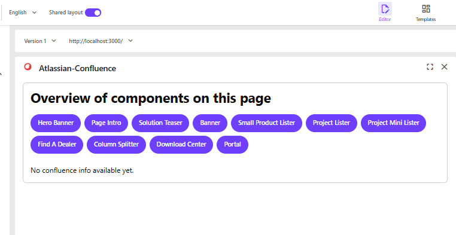

When opening the app on a page

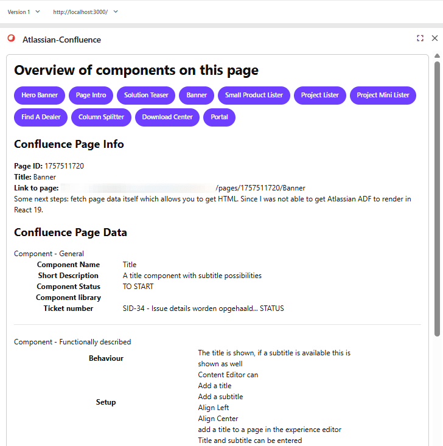

When clicking on a component, you can see info and data

* * *

## Overall conclusion

The documentation available from Sitecore regarding SitecoreAI applications is great. The Marketplace starter kit is really easy to use. I recommend it to everyone who wants to start with an integration.

I spent more time with investigation API's I want to integrate, getting to know react, styling results than I did with Sitecore.

I would like to see an integration point on a component level or even field level. Which would expand the options for creating enhancements even further.

The code in this blog - as stated earlier - is me trying to get better and learning. I'm sure optimalizations can be implemented. This is also the reason why I didn't want to make these repositories public. They just aren't ready for this. But feel free to reach out to get more details about the code and I'm planning on improving them and making them available as well.

* * *

## Special thanks

I want to express gratitude for the opportunity to participate in the Sitecore Community Advent Calendar. It is a really nice way to promote this wonderful community and bring joy to all Sitecore developers around the world ;-)

* * *

## Useful references

### Sitecore

- Marketplace Starter kit: [https://github.com/Sitecore/marketplace-starter](https://github.com/Sitecore/marketplace-starter)
- Discover Sitecore Youtube channel: [https://www.youtube.com/@DiscoverSitecore](https://www.youtube.com/@DiscoverSitecore)
- Marketplace Google Analytics extension: [https://github.com/Sitecore/marketplace-google-analytics](https://github.com/Sitecore/marketplace-google-analytics)
- Marketplace SDK with GraphQL queries: [https://doc.sitecore.com/mp/en/developers/sdk/latest/sitecore-marketplace-sdk/make-a-graphql-query.html](https://doc.sitecore.com/mp/en/developers/sdk/latest/sitecore-marketplace-sdk/make-a-graphql-query.html)
- Product Design Library: [https://blok.sitecore.com/beta](https://blok.sitecore.com/beta)

### Google PageSpeed

- Getting Started: [https://developers.google.com/speed/docs/insights/v5/get-started](https://developers.google.com/speed/docs/insights/v5/get-started)
- Good information on the structure: [https://dev.to/addyosmani/monitoring-performance-with-the-pagespeed-insights-api-33k7](https://dev.to/addyosmani/monitoring-performance-with-the-pagespeed-insights-api-33k7)
- Integration guide examples: [https://www.jasminedirectory.com/blog/pagespeed-insights-api-integration-guide/](https://www.jasminedirectory.com/blog/pagespeed-insights-api-integration-guide/)

### Mouseflow

- Website: [https://www.mouseflow.com](https://www.mouseflow.com/)
- Mouseflow API documentation: [https://api-docs.mouseflow.com](https://api-docs.mouseflow.com/)

### Atlassian

- About Atlassian REST API & authentication: [https://developer.atlassian.com/cloud/confluence/rest/v2/intro/#auth](https://developer.atlassian.com/cloud/confluence/rest/v2/intro/#auth)
- About API tokens: [https://support.atlassian.com/atlassian-account/docs/manage-api-tokens-for-your-atlassian-account/](https://support.atlassian.com/atlassian-account/docs/manage-api-tokens-for-your-atlassian-account/)

### React basics

- useEffect() explained: [https://dmitripavlutin.com/react-useeffect-explanation/](https://dmitripavlutin.com/react-useeffect-explanation/)
- Components / Functions / Hooks explained: [https://medium.com/@dan\_abramov/making-sense-of-react-hooks-fdbde8803889](https://medium.com/@dan_abramov/making-sense-of-react-hooks-fdbde8803889)
- React Function Components: [https://dev.to/elhamnajeebullah/react-typescript-what-is-reactfc-and-why-should-i-use-it-4029](https://dev.to/elhamnajeebullah/react-typescript-what-is-reactfc-and-why-should-i-use-it-4029)
- React ChartJS 2 library: [https://react-chartjs-2.js.org/](https://react-chartjs-2.js.org/)

<!-- markdownlint-disable MD033 -->
<aside class="about-the-author">
  Koen is a Belgian Sitecore Solution Architect and Developer at <a href="https://www.blastic.com/" target="_blank">Blastic</a>, with 13 years of experience across projects both small and large. His journey began with maintenance on a Sitecore 6.5 project. Over the years, Koen has worked extensively with all Sitecore versions including <s>Sitecore XM Cloud</s> SitecoreAI. Passionate about the community, Koen has been involved in the <a href="https://www.meetup.com/sitecore-user-group-belgium/" target="_blank">Belgian Sitecore User Group</a> since its founding in 2014. His commitment later expanded to the <a href="https://europe.sugcon.events/" target="_blank">SUGCON Europe</a> organization team, helping to bring together Sitecore professionals from across the globe. Koen started his blogging adventures in 2016 as a place to share development experiences and struggles, and continues to contribute insights from his work.
</aside>
<!-- markdownlint-enable MD033 -->
