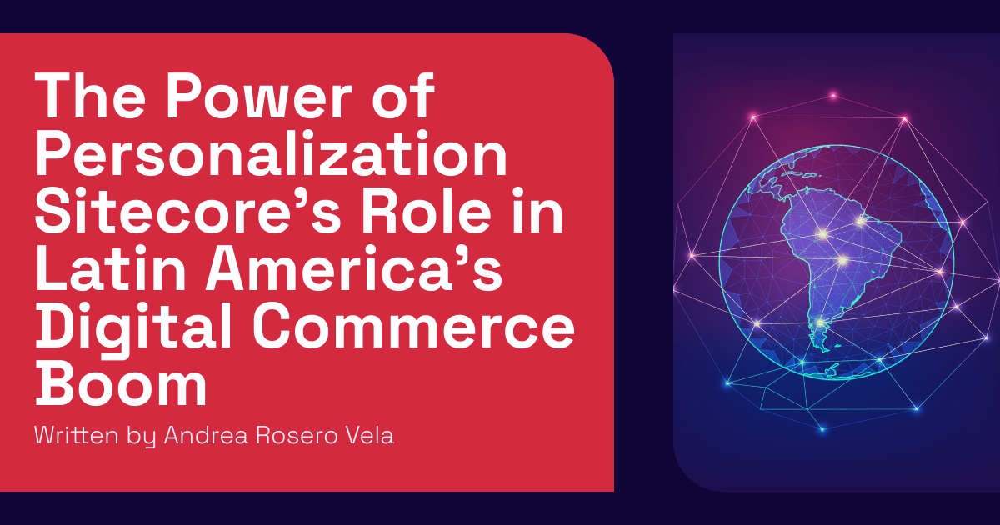

This blog post will explore how Sitecore Personalize and Customer Data Platform (CDP) helped an airline in Latin America to increase its website traffic, conversions, sales, and revenue growth.

Latin American markets have been developing and increasing their sales through e-commerce over the past few years. A primary reason for this growth is the shift from cash payments to debit and credit cards, as well as mobile payments, which grew from around 30% to 75% between 2021 and 2023. This digitalization of payment methods has accelerated the transformation of e-commerce. Additionally, sales have driven the growth of social commerce on platforms such as Facebook, Instagram, and WhatsApp, and users engage with shoppable content on social media.

In B2C commerce, major Latin American countries like Brazil, Mexico, Argentina, and Chile have seen increased revenue from local vendors and regional brands. In the B2B sector, the International Chamber of Commerce reports that 70% of businesses in Argentina, Brazil, Colombia, and Mexico are interested in exporting within Latin America, while 50% aim to export to other regions.

The Digital Experience Platform (DXP) market in Latin America is poised for significant growth, projected to surge by 13.2% over the next five years according to Cognitive Market Research. This expansion emphasizes the need for dependable and adaptable technology that can create compelling websites. As the market evolves, innovative solutions and personalized digital experiences are increasingly essential for businesses to engage customers effectively.

Sitecore, as a Digital Experience Platform, has helped businesses grow their revenue and ROI in different verticals. In the Latin American region, a recent case study for an airline based in Colombia reported an increase in passenger numbers this year after implementing Sitecore CDP and Personalize. The strategy utilized WhatsApp to send messages to customers with personalized offers. This approach was key for users in Latin America, who tend to use social media for commercial purposes.

According to [Sitecore's case study](https://www.sitecore.com/explore/customers/airlines/low-cost-airline-lands-10-million-visitors-in-one-day), "The airline estimates that these types of campaigns help drive conversion-to-purchase by 50%. In addition, click-through rates have increased by 158%, while the bounce rate has been cut by 58%."

Latin America is opening more to global trade, and the number of digital consumers has grown steadily since 2021. This makes DXPs a valuable tool for brands seeking to expand and reach new markets.

<!-- markdownlint-disable MD033 -->
<aside class="about-the-author">
  Andrea Rosero Vela is a Digital Experience Advocate at <a href="https://www.oshyn.com/" target="_blank">Oshyn</a> with over 10 years of experience in strategic communication and digital content. Recognized as a <a href="https://mvp.sitecore.com/en/Directory/Profile?id=e06958b8d3224c8ff34808dbef9b3016" target="_blank">Sitecore Ambassador MVP in 2024 and 2025</a>, she is committed to building marketing experiences that are strategic, human-centered, and adaptable. Andrea enjoys collaborating with cross-functional teams and actively contributing to the Sitecore community through content, insights, and shared learnings.
</aside>
<!-- markdownlint-enable MD033 -->
