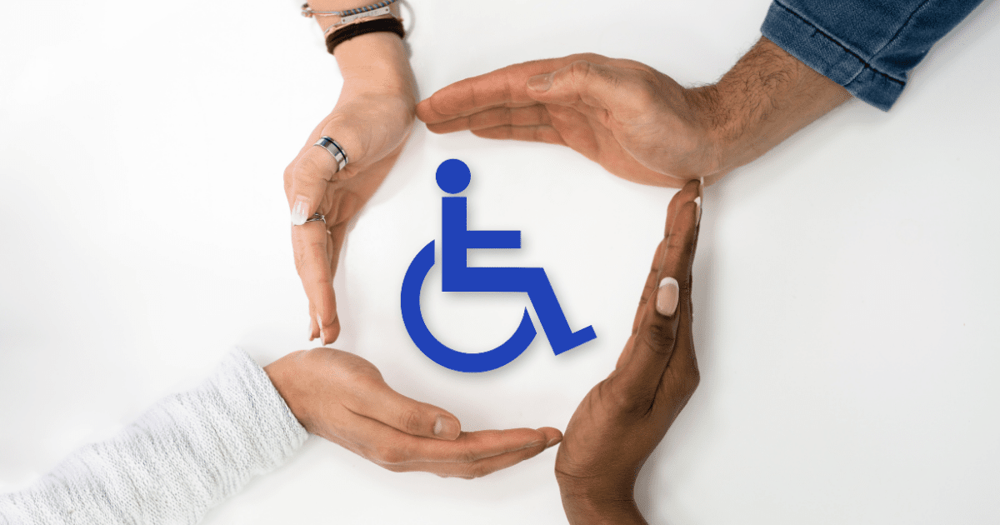
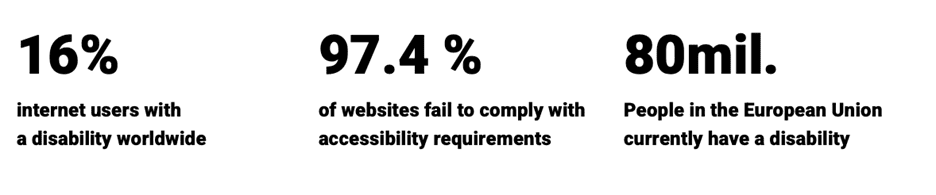
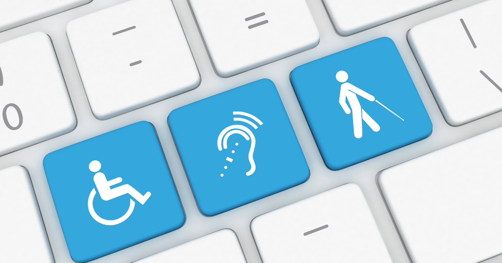
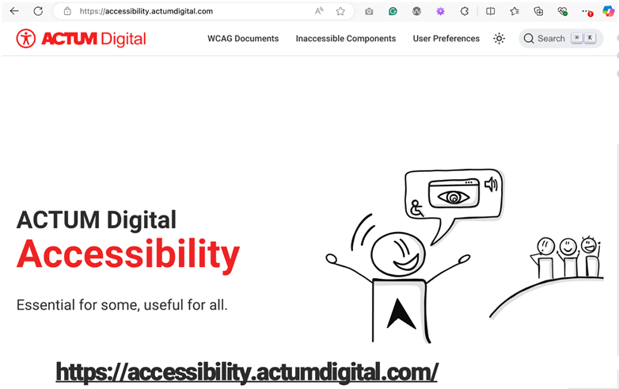
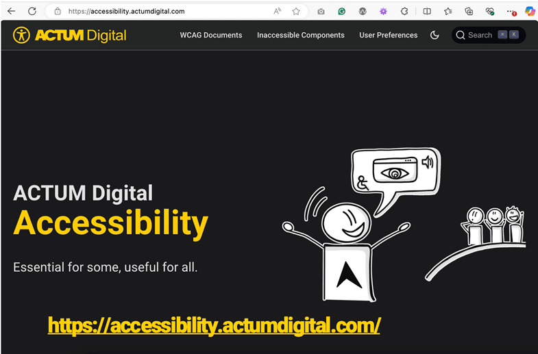

In the world where every company is competing to gain a bigger market share, small things matter. Have you ever broken your arm or dropped your phone so that your screen was hard to use? Then you temporarily experienced the inconvenience of having a disability. Some people, however, have a disability that they live with all their life, they are blind, deaf or have a mental disability. Living a "normal" life can be very challenging for them. And that could also mean moving around your company’s website or buying your company’s products. Is your Sitecore XP / XMC website accessible? Does the level of Web Accessibility also impact the experience of visitors without any disability? What is WCAG? Does your company adhere to all current legislation in your country? Where to start?

Read my blogpost to get a deeper understanding of the importance of having your Sitecore website accessible and why should you care.

Nowadays, accessibility became quite a buzzword. The Cambridge Dictionary defines accessibility as "*the fact of being able to be reached or obtained easily*". This can also be applied to the digital world, but we should not forget about the "real life" outside of the screens. We should include people with disabilities to be able to use services and products just like anyone else. Because you never know, what happens to you, your family or friends in the next 5 minutes. And then it can be you who may not be able to get to your nearest post office because the entrance was not built in an accessible way.

## Accessibility is not just a practice, it is a human right. It is a process of inclusion.

First of all, let’s have a look at the types of disabilities. We need to understand that there are three categories of disabilities: permanent, temporary and situational. Permanently disabled is someone who was e.g. born blind. On the other hand, probably all of us have at some point of our lives experienced a temporary disability, such as broken arm or leg, eye injury etc. The third type is situational disability, such as riding in a bus with lots of noise, having a small baby in one arm or a distracted driver in a motorway, who was blinded by sun or blinding lights.

On top of that, we distinguish between four main types of disabilities: visual, auditory, motor and cognitive. These four types differ by the duration as described above. People with permanent disability are usually born with the disability, e.g. blind (visual), deaf (auditory), without a limb (motor) or ADHD (cognitive). Temporary disability can be caused by an accident or an illness, such as cataract (visual), ear inflammation (auditory), twisted ankle (motor) or concussion (cognitive). I am sure you are experiencing situational disability on a daily basis, when sun shines into your screen and you cannot read an article you chose to read (visual), when you ride on a train and need to use headphones for the work call late on the way home (audio) or when you carry home a heavy box with new smart TV and you cannot easily open the door as you have your keys in the back pocket (motor).

## What is Web Accessiblity and why should you care?

Web accessibility is a set of inclusive practices that enable people with different abilities or disabilities to use the web...and it benefits everyone, including you!

What are the benefits of Web Accessibility? Let’s look into how improving Web Accessibility can benefit your business and understand the risks of overlooking these opportunities. What could you do different?

Support innovation

1. Remove digital and social barriers and promote innovation by incorporating accessibility into your processes. That will also bring extra motivation for your employees.
2. Make your product accessible and improve the user experience for everyone. Strive for greater customer satisfaction. This will benefit also the non-disabled customers and them seeing you care will bring your company positive perception & extra bonus points.
3. Learn from case studies and real-life examples so you don't repeat the mistakes of others and avoid the same consequences. Save time and learn from experts, "reinventing the wheel" never brought any extra value.

Strengthen your brand & increase your market share

1. Use your accessible product as a symbol of your commitment to equal opportunities and fair treatment. Show that you care about all users. People with disabilities are valuable customers with significant purchasing power. An accessible product will make it easier for them to buy your products or services. And it can help all of us if we get into situational disability, then that can be very highly appreciated.
2. Get positive PR. This can set you apart from the competition and attract new customers. People like things and services that work, if you show that you care, more people will follow.
3. Improve your SEO by implementing Web Accessibility features such as meaningful page titles, clear headings, and descriptive links. This will increase your rating by search engines, making your website, products and services better findable for your customers and prospects. Search engines favor alt-text and accessible structure!
4. Expand your customer base to include people with disabilities, leading to higher sales and greater loyalty. You can increase your market share by ensuring your product is accessible to everyone, including people with disabilities.

> "__Did you know that according to WHO up to 16 % of people globally have some kind of disability? It is about 1.3 billion*. And that is not a small number. Small adjustments can lead to big results.__"
>
> *Source - WHO: <https://www.who.int/health-topics/disability#tab=tab_1>

Avoid law risks

1. Ensure compliance with legislation by making your product accessible to people with disabilities. Are you aware of accessibility regulations in your country? If not, better do your research or contact Web Accessibility experts for advice, or even better, a Web Accessibility audit.
2. Avoid the risks associated with an inaccessible product or service. People with disabilities are entitled to their rights and can take legal action if they encounter barriers on your website. I have heard about such cases in the US. Also, your competitor can take advantage of that and report the issues to respective authorities. Nobody likes to pay fines, right?

Let’s look more into detail of the legal side of Web Accessibility. In the US, Web Accessibility is primarily governed by two key legal frameworks:

__The Americans with Disabilities Act (ADA)__: even though it was written before the web existed, US courts have consistently interpreted the ADA to apply to websites and mobile apps, especially for public businesses.

__Section 508 of the Rehabilitation Act__: this document specifically requires federal agencies (and organizations doing business with them) to make their electronic and information technology accessible.

While ADA doesn’t name a specific technical standard, the most courts recognize __WCAG 2.1 Level AA__ (more details & explanation in the upcoming section) as the practical benchmark for compliance. Failure to meet accessibility requirements can result in lawsuits or settlement agreements.

In the European Union, Web Accessibility is enforced through unified EU legislation including:

__The Web Accessibility Directive__ (Directive (EU) 2016/2102): this directive requires all public sector websites and mobile apps in EU member states to be accessible. It requires compliance with EN 301 549, which in turn is based on __WCAG 2.1 Level AA__. Public organisations must also publish an accessibility statement and provide a feedback mechanism for users.

__The European Accessibility Act__ (EAA): The most recent directive that has been introduced, passed in 2019 and taking effect since the end of June 2025, obligates the EU countries to incorporate Web Accessibility into their laws. It expands accessibility obligations to many private sector services and products, including e-commerce, banking, e-books, and more, __in case they sell products or services to their customers online__. It aims to harmonize accessibility requirements across the EU single market.

More about EAA: <https://commission.europa.eu/strategy-and-policy/policies/justice-and-fundamental-rights/disability/union-equality-strategy-rights-persons-disabilities-2021-2030/european-accessibility-act_en>

## What is WCAG?

This abbreviation stands for __Web Content Accessibility Guidelines__. It is a foundation and a holy grail of Web Accessibility. The goal of WCAG is to ensure that __everyone__ regardless of their abilities can:

- perceive information on your website,
- operate its interface,
- understand its content,
- access the website using various technology (including assistive tools).

That includes people with disabilities, who would use screen readers, voice input and other assistive tools to be able to scroll your website and maybe even purchase a product.

WCAG has 4 core principles:

- __Perceivable__ = information must be presented in ways users can perceive them, e.g. images have alt text, videos have captions.
- __Operable__ = users can interact with all the website’s functionalities, all actions have to be done with a keyboard. Not everyone has or is able use a mouse. Maybe you have one, but it gets broken - ups!
- __Understandable__ = content and navigation are clear and predictable. The content is not too complex, so that even people with cognitive disabilities can comprehend (or even the slower of us), form errors are explained, links make sense.
- __Robust__ = website content works well with assistive tools, it is compatible with screen readers, has valid HTML and ARIA roles.

There are also certain __versions of WCAG__ as it has evolved in time, starting with WCAG 2.0 in 2008 with 12 guidelines and 61 success criteria, moving to WCAG 2.1 in 2018 which included mobile and low vision and cognitive accessibility. In 2023, new version of WCAG 2.2 was announced adding new criteria for navigation, input and focus. WCAG 3.0 is now in progress, so there is more to come. And I believe this is natural, as the technology and the demands of the society evolve, so does the Web Accessibility.

If you heard about Web Accessibility before, you may have also heard about different __WCAG Compliance levels__. Basic level "A" stands for minimum level of accessibility with examples of alt text and keyboard navigation. Standard target is marked by "AA" and is legally required in many countries. It includes proper contrast and focus visibility. The enhanced (and most advanced) compliance level is "AAA" ensuring the highest accessibility standard. It can include extended contrast for people with visual disabilities or sign language interpretation.

Now, that we know more about types of disabilities and WCAG, let’s move on to the more practical part.

## Is your Sitecore XP / XMC website accessible?

Let’s first ask yourself another question: when was the last time you redesigned your website? If that was more than 5+ years ago, then you might have not paid too much attention to Web Accessibility. On the other hand, having a brand-new design of your website does not automatically mean that it is accessible. What matters is the way how you built the website. Did your UX/UI Designers have Web Accessibility in mind during the design process? If not, relax, it is not the end of the world, you can still do the adjustments now, just it will be more costly. The best practice is to incorporate the Web Accessibility principles during the design phase of building your website. It will save you a lot of headaches later.

### Where to start?

__Firstly, assess your current website.__ Take a first look at your site to identify potential accessibility barriers. Simple tools like WAVE can help you spot issues such as missing alt text, poor color contrast, or keyboard navigation problems.

If you are not sure if you comply to the regulations in your country or you just want your brand to be more appealing to your customers, first decide against which WCAG guidelines (or other regulations) you will evaluate your current site against. Most probably it will be WCAG 2.1 or WCAG 2.2.

For some initial "quick check" you can use automated accessibility scans. Some of them are for free such as:

1. __WAVE__ – <https://wave.webaim.org> it is an online tool, however, I use this tool as an extension to my browser.
2. __Siteimprove Accessibility Checker__ – <https://siteimprove.com> which should integrate well with Sitecore
3. __Lighthouse__ – you can access it by opening Chrome browser DevTools -> "Lighthouse" then select *Accessibility audit*. It will give you a numeric accessibility score "Lighthouse score" on a scale 0–100.

__Secondly, set priorities.__ Accessibility improvements can be overwhelming. Focus on areas that impact the user experience the most, like navigation, readability, and forms.

__Thirdly, engage with experts.__ So, now you completed the initial overview of your Sitecore site’s accessibility health, and you set your priorities, it can be overwhelming. Moreover, the automated tests catch less than half of the issues. In case your results are far from ideal, I highly recommend you contact a __Web Accessibility expert__ to help you out and provide professional guidance. Either you can find one internally or look for external sources. __Manual tests are crucial__, it can be called Web Accessibility audit. Such exercise will involve keyboard testing, screen reader testing, colour contrast testing and more.

### Sitecore website specific considerations & next steps

Is your website built on Sitecore XM/XP? Then I have bad news for you. Sitecore doesn’t enforce WCAG compliance automatically. Accessibility depends largely on __your Front-End implementation__.

What your next steps should be? If you consider keeping your monolithic __Sitecore XM/XP__ website for a few more years and / or there is a Web Accessibility legal obligation you currently have to adhere to, you should first check and pay attention to these three points:

- check your layouts and components (renderings) for semantic HTML and ARIA,
- ask content authors to read WCAG and use proper alt text, headings, etc.,
- be aware that Rich Text Editor allows accessible markup (e.g., no `` tags).

If your website is built on __SitecoreAI__ technology, the modern, composable, headless CMS, there is a high chance that your team had Web Accessibility in mind when they built the website. Also, SitecoreAI sites are usually built using Next.js with JSS. And the good news is that Next.js + React supports accessibility well if components follow best practices. You can use React ARIA or Headless UI for accessible components.

The third scenario could be, that you are considering __moving to SitecoreAI__. If that is the case, now it the right time to *think* accessible and learn more about Web Accessiblity. The costs of "retrofitting" a website to ensure accessibility are much higher than incorporating it into the initial designing phase. Potential legal costs for non-compliance with accessibility laws can significantly exceed the initial investment in accessibility.

In order to keep your website accessible you need to provide __continuous monitoring__. Web Accessibility is not a one-time project. It is a continuous process, requiring your attention, monitoring, and improvements overtime. Just like other parts or tech stack on your website.

In all 3 cases, I highly recommend you consult __Web Accessibility expert__ or at least UX/UI Designer or Senior Front-End developer who have experience with building accessible websites (and maybe even some certification). If you want, I can recommend a few such experts who can help you get started!

## ! BONUS: 4 quick tips to improve Web Accessibility

### 1. Make Everything Accessible from the Keyboard

Ensure that all interactive elements (links, buttons, forms) can be accessed and operated using the keyboard, as everything that mouse or touch users can do, keyboard users must be able to do as well. This is critical for users with motor disabilities or those who rely solely on the keyboard for navigation.

### 2. Use Real Headings

Structure content using proper HTML heading tags (e.g., `<h1>`, `<h2>`) to create a logical hierarchy, helping screen readers and users with cognitive disabilities navigate and understand the page layout.

### 3. Provide Enough Color Contrast

Ensure sufficient contrast between text and background colors to improve readability for users with low vision, color blindness, or other visual impairments.

### 4. Describe Non-text Content

Provide meaningful alternative text for images, charts, and other non-text elements to ensure blind or visually impaired users using screen readers can understand the content being conveyed.

## Conclusion

Congratulations, you read until the end of this blogpost. If you read so far, I believe you now know a bit more about Web Accessibility and understand its importance. I hope the article was interesting for you, and you learned something new.* And I also hope that more and more websites will be accessible in the future. Please remember: __Accessibility is essential for some, but useful for all__.

*Disclaimer: I am not a Web Accessibility expert, I finished a learning course, and I am a big fan of this topic. Please excuse any inconsistencies or mistakes you may find in this blog post.

## Most useful resources

1. Web Accessibility Initiative – Fundamentals: <https://www.w3.org/WAI/fundamentals/>
2. Web Accessibility Initiative - WCAG 2 Overview: <https://www.w3.org/WAI/standards-guidelines/wcag/>
3. Free learning course! W3Cx: Introduction to Web Accessibility: <https://www.edx.org/learn/web-accessibility/the-world-wide-web-consortium-w3c-introduction-to-web-accessibility>. I completed this course and highly recommend it!
4. Accessibility Explained on our company website (you can also find me in some of the videos): <https://accessibility.actumdigital.com/>
5. Be My Eyes application: <https://www.bemyeyes.com/>. Mobile application for blind or low vision users who seek assistance. You can easily accept a call (for help) and in a minute or two help the blind person on the other side. Such a rewarding feeling! I highly recommend you to install this app!
6. Web Accessibility Training for Technical Users: [Self-Paced Online Web Accessibility Course (dequeuniversity.com)](https://dequeuniversity.com/online-courses/web-accessibility)
7. WAVE Evaluation Tool extension into your browser: [WAVE Evaluation Tool](https://microsoftedge.microsoft.com/addons/detail/wave-evaluation-tool/)

<!-- markdownlint-disable MD033 -->
<aside class="about-the-author">
  For the last 4.5 years Anna has been working as a Global Alliance Manager at <a href="https://www.actumdigital.com/" target="_blank">ACTUM Digital</a>. In 2025, she was named <a href="https://mvp.sitecore.com/en/Directory/Profile?id=5e2fe7a5316f4313bb8808dd109e8001" target="_blank">Sitecore Ambassador MVP</a>. She is a proud founder of the <a href="https://www.meetup.com/sitecore-user-group-cz/" target="_blank">Sitecore User Group Czechia</a>, which unites the Central and Eastern Europe (CEE) community of Sitecore professionals and anyone interested in Sitecore technology.
</aside>
<!-- markdownlint-enable MD033 -->

