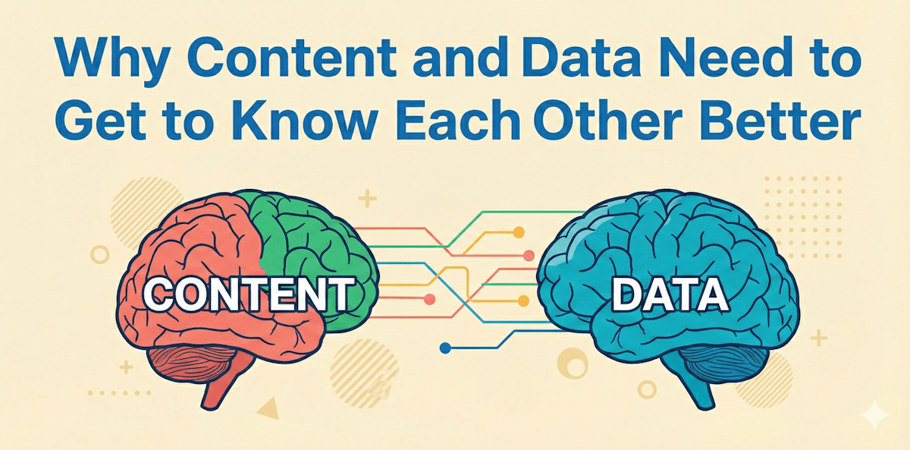

## Integrate CMS and Behavioral Data to Unlock Next-level Analytics

If you think about it, traditional website analytics --- Google Analytics, for example --- doesn't know much about content. Other than page titles, headings and link labels, Google Analytics does not know a lot about website-user context.

What if you integrate your Content Management System (CMS), for example SitecoreAI, with behavioral website user data? That is, as users browse a website, a first-party web tracker collects behavioral data and joins the data with respective SitecoreAI pages and items.

The result is context analytics.

## Many new possibilities with content and data

In this article, learn about a new way of thinking about content and analytics data. Think composable analytics powered by SitecoreAI, use of a headless frontend such as Vercel, a third-party, open-source web tracker and BI for reporting and dashboarding.

So just what are some of the things you can do with CMS-integrated, composable analytics? Here's some of the possibilities.

- Reuse CMS elements such as page names and template names in analytics
- Get insights based on named content components
- Combine web tracker events and content
- Reuse content architecture in analytics
- Incorporate CMS-based content taxonomies with analytics
- Use any available integrated data that resides in CMS
- Optimize content for better results with Large Language Models (LLMs)
- Host the web tracker with the headless front end for better data quality

## Advantages for marketers and website analytics specialists

Based on the above capabilities, some of the advantages for marketers, analytics specialists, data analysts and product owners include:

- Segment users more effectively based on user context
- Attribute campaigns more granularly based on content and clicks
- Attribute conversions based on cost to create CMS elements
- Gain sitewide insights more easily
- Reduce the cost of analytics set up by avoiding manual tagging
- Save time with less manual tagging
- Get better analytics data quality using server-side tracking
- Ensure end-to-end data protection
- Get a better understanding of the contribution of content to overall business value generation
- Reuse and get better ROI on investments in Sitecore, Vercel and Microsoft technologies

## So how does it work?

There are different ways you can integrate CMS and analytics data. Headless CMS provides a lot of great possibilities.

One way using SitecoreAI is to join page IDs with behavioral session data as a session is in progress. You can use an open-source web tracker and either do the plumbing yourself or use a ready-made composable analytics solution.

During transformation of collected session data, when you have CMS integration in place, you can use the Sitecore page ID to read other relevant information that resides in CMS, such templates, item field data and any data that may be integrated from, for example, CRM.

Sitecore CMS content and item information can be read from Sitecore in the same way that the headless front end reads content information.

Now, in BI, you can create dashboards using a combination of CMS elements and metrics from the web tracker such as page views, clicks, scrolls, view duration and even component impressions and clicks by component names.

## Now, content truly is data: component-based insights

One of the more interesting possibilities is using CMS component information with analytics. Imagine if you can automatically track component impressions and clicks by component name and component content with no manual tagging needed.

Let's say for example you have a component that communicates the site's top call to action. You place this component on several pages in different locations on the page (top, middle, bottom). And let's say you vary the heading and link text for the CTA button.

With automated component tracking, you are now able to see in your dashboard how the component performs site wide. You can get to know, by page name, the number of impressions, the number of clicks, and the number of conversions. And you can see this based on link text, heading text and where on the page the component is located.

This is just one example of conversion rate optimization (CRO) using component-based analytics decisioning.

## Organize analytics based on CMS content architecture

As many know well, a lot of effort goes into designing, implementing and maintaining CMS content architecture. The cost for organizations is significant.

Why not reuse content architecture in how you display, structure, measure, transform and filter analytics data? Here are examples of how you can increase analytics efficiency and reduce costs.

- **Page names**: use CMS page names in analytics, enabling stakeholders to more easily understand dashboards (as opposed to using page titles that can be cumbersome).
- **Template names**: use CMS template names to filter analytics insights. Pages in CMS are based on templates. For example, on a commerce site the checkout pages, or on a B2B site case story pages, or on a finance site, fund pages --- all are based on named templates. With one go and without the limits of URL paths, you can filter pages by template names to make it easy to see rich insights in analytics dashboards.
- **Content tree**: a site's content architecture is often reflected in a content tree. Using composable analytics, you can easily structure metrics and insights based on the paths and depth of the CMS content tree. For example, you can easily see the number of page views by content category based on content tree folder names. This is a big time-saver compared to using just URLs and more intuitive for marketers.

## Use CMS taxonomies for segmentation insights in analytics

Marketers often fail to notice the taxonomy feature that is freely available in platforms such as SitecoreAI.

Here is an example of how marketers can use a taxonomy with analytics. Imagine a B2B website. A content taxonomy can be created so that taxonomy tags can be added to pages based on, for example, product pages, case stories by vertical industries, content objective and target personas.

Using a composable analytics approach, when pages are rendered during website visits, the rendered taxonomy tags can be captured and used for subsequent insights.

It's often much for effective to have content authors assign meaningful content tags vs analytics specialists. This capability adds a new dimension of insights that enables marketers to better attribute the business value and ROI of content.

## Step it up with site-wide AI Power context analytics insights

At the expense of burying the lead, here is one more possibility of what you can do when you integrate CMS content with behavioral website-tracked data in a composable solution.

Imagine if you create a content taxonomy and taxonomy tags using LLM technology. Then join the taxonomy tags with the tracked behavioral data.

The result gives you the ability to use analytics metrics such as clicks, views, time active, content impressions by AI generated taxonomy tags.

For example, you can get an LLM to scan all website pages and generate a taxonomy based on content types, topics, audience, intent, and time. You can then see insights in analytics that span the site. This could be for example, what are the most engaging second level topics that result in web form abandons and conversions.

## The future of analytics is contextual, composable via CMS integration

By integrating CMS with behavioral data, you're building a foundation for AI-powered insights that go far beyond traffic counts. You enable systems --- and teams --- to understand customer context, not just metrics.

Whether it's optimizing taxonomy with LLM-generated tags, simplifying dashboards with familiar content names, or automating component-level tracking, CMS-integrated analytics helps organizations see the "why" behind performance.

For marketers ready to compete in an AI-driven world, this is how to make every piece of content work harder and every insight go deeper.

<!-- markdownlint-disable MD033 -->
<aside class="about-the-author">
  Chris Nash co-founded <a href="https://www.relevant-edge.com" target="_blank">RelevantEdge</a> to help companies unlock business value using a combination of data, content, personalization, commerce and AI technology.
</aside>
<!-- markdownlint-enable MD033 -->
